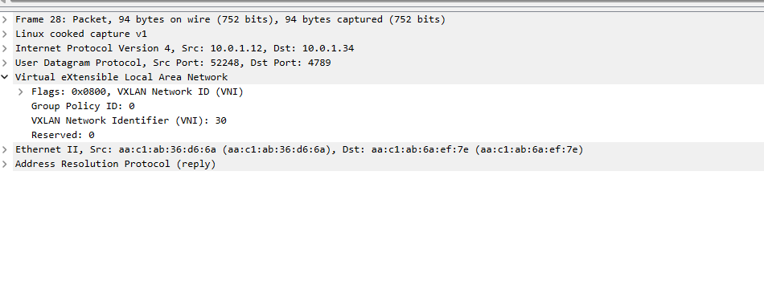
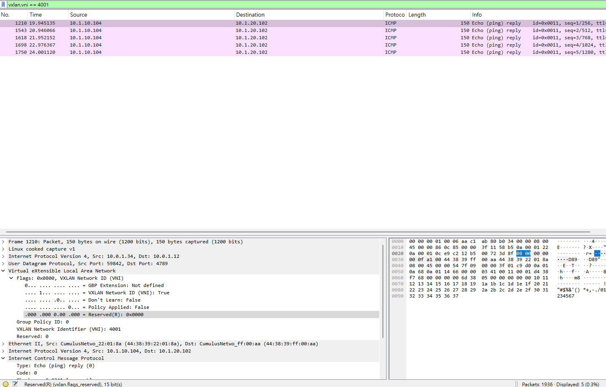

# AI DC 模擬

建置一個基於 eBGP 的 Spine-Leaf (L3 Fabric) 網路架構。在此基礎上，使用了 EVPN-VXLAN 技術來提供 L2/L3 虛擬網路服務。

Spine (骨幹層): spine01, spine02

Leaf (接入層): leaf01, leaf02, leaf03, leaf04

Border (邊界層): border01, border02 (功能與 Leaf 類似，用於連接外部)

Server (伺服器): server01 - server06

## 架構
### 1. 網路底層 (Underlay) - 實體路由
目標讓所有網路設備 (Spine, Leaf) 之間能夠互相通訊。

- 拓撲：每個 Leaf/Border 交換器都同時連接到 spine01 和 spine02。
- 路由協議： 使用 eBGP (外部 BGP) 來交換路由。
- Spine (spine01, spine02) 位於同一個 AS (自治系統)：AS 65199。
- 每個 Leaf/Border 都有自己獨立的 AS 編號 (例如 leaf01 是 AS 65101, leaf02 是 AS 65102, border01 是 AS 65253)。
- 目標： Underlay 的唯一目標，就是讓所有 Leaf 節點的 VTEP IP (例如 leaf01 的 10.10.10.1 和 leaf03 的 10.10.10.3) 彼此之間可以 Ping 通。這是建立 VXLAN 隧道的基礎。

### 2. 網路疊加層 (Overlay) - 虛擬網路 EVPN-VXLAN

- 角色：
  - Spine: 擔任 EVPN 的 Route-Reflector (RR)。它們不處理 VXLAN 封包，只負責將所有 Leaf 交換來的 EVPN 路由 (例如 MAC 位址和 IP 路由) 反射給其他所有 Leaf。
  - Leaf: 擔任 VTEP (VXLAN Tunnel Endpoint)。它們是 VXLAN 隧道的起點和終點，負責封裝 (Encapsulation) 和解封裝 (Decapsulation) 封包。

- L2 VNIs (二層橋接)： 定義了 L2 VNI 來延伸 L2 網段：
  - vni10 (VLAN 10, 網段 10.1.10.0/24)。
  - vni20 (VLAN 20, 網段 10.1.20.0/24)。
  - vni30 (VLAN 30, 網段 10.1.30.0/24)。
- L3 VNIs (三層路由)： 定義了 L3 VNI 來隔離不同的租戶：
  - vni 4001 (對應 vrf RED)。
  - vni 4002 (對應 vrf BLUE)。

### 目標一：高可用性 (MLAG + EVPN)

- 伺服器端： server01 到 server06 全部使用 bond-mode 802.3ad (LACP)。
- 交換器端：
  - leaf01 和 leaf02 組成一個 MLAG (Multi-Chassis Link Aggregation) 對。
  - leaf03 和 leaf04 組成另一個 MLAG 對。
- 效果： server01 認為自己是 LACP 連到一台「邏輯交換器」，但實際上它同時連到 leaf01 和 leaf02 兩台實體交換器
- EVPN 整合： 為了讓 MLAG 在 VXLAN 中完美運作，設定了 `clagd-vxlan-anycast-ip`。例如 leaf01 和 leaf02 共享 `10.0.1.12` 這個 IP。這使得遠端的 leaf03 只會看到一個 VTEP (10.0.1.12)，從而實現了`主動-主動 (Active-Active)` 的轉發和容錯。
  - 這就是為什麼在 leaf01 抓不到 L3 封包，但在 leaf02 卻能抓到的原因：LACP 雜湊演算法決定將 PING 請求送往 leaf02，而 PING 回覆則被 Spine 送回 leaf02。

### 目標二：多租戶隔離 (VRF)

- vrf RED (租戶 RED): 綁定了 vlan10 和 vlan20。
- vrf BLUE (租戶 BLUE): 綁定了 vlan30。
- 效果： vrf RED 內的伺服器 (如 server01, server02, server04, server05) 彼此可以通訊；vrf BLUE 內的伺服器 (server03, server06) 彼此可以通訊。但是，vrf RED 和 vrf BLUE 之間是完全隔離的，server01 預設無法 PING 到 server03。

### 目標三：高效能 L2/L3 轉發 (Symmetric IRB)

1. L2 橋接 (Server01 ping Server04)：

  - 路徑： server01 (10.1.10.101) -> server04 (10.1.10.104)。
  - 類型： 同子網路 (VLAN 10) L2 通訊。
  - 運作： leaf01/02 (Ingress VTEP) 收到封包，發現目的 MAC 在遠端，於是使用 L2 VNI 10 進行 VXLAN 封裝，發送到 leaf03/04 (Egress VTEP)。

2. L3 路由 (Server01 ping Server05)：

  - 路徑： server01 (10.1.10.101) -> server05 (10.1.20.105)。
  - 類型： 跨子網路 (VLAN 10 -> VLAN 20)，但都在 vrf RED 內。
  - 運作 (Symmetric IRB)：
    - leaf01/02 收到封包，在 vrf RED 中查找路由，發現要去 10.1.20.0/24。
    - EVPN 告訴它，10.1.20.0/24 位於 VTEP 10.0.1.34 (leaf03/04)。
    - leaf01/02 使用 L3 VNI 4001 進行 VXLAN 封裝，發送到 leaf03/04。
    - leaf03/04 收到 VNI 4001 封包，解開後在 vrf RED 中查找路由，並將其轉發給 server05。

這就是在下面範例 leaf02 抓到 VNI 4001 封包的原因。 這種在來源和目的 VTEP 都執行路由的方式稱為「對稱式路由 (Symmetric IRB)」，是最高效能的 L3 VXLAN 轉發模式。

## 驗證

### Server03 ping Server06 原理

來源 (server03):

- IP Address: 10.1.30.103/24
- default gateway: 10.1.30.1
- 實體連接: server03 透過 LACP (bond-mode 802.3ad) 形成 uplink，分別連接到 leaf01 的 swp3 和 leaf02 的 swp3。
- VLAN: 在 leaf01 和 leaf02 上，bond3 (連接 swp3) 被設定為 bridge-access 30，表示 server03 位於 VLAN 30。
- MLAG: 10.1.30.103，連接到 leaf01/leaf02 (Anycast IP: 10.0.1.12)。
目的地 (server06):

- IP Address: 10.1.30.106/24
- default gateway: 10.1.30.1
- 實體連接: server06 透過 LACP (bond-mode 802.3ad) 形成 uplink，分別連接到 leaf03 的 swp3 和 leaf04 的 swp3。
- VLAN: 在 leaf03 和 leaf04 上，bond3 (連接 swp3) 被設定為 bridge-access 30，表示 server06 位於 VLAN 30。
- MLAG: 10.1.30.106，連接到 leaf03/leaf04 (Anycast IP: 10.0.1.34)

網路環境
- VRF: 在所有四個 Leaf 交換器上，VLAN 30 上的 SVI (交換虛擬介面) 均被配置在 vrf BLUE。
- Gateway: 10.1.30.1 是所有 Leaf 交換器上為 VLAN 30 配置的虛擬閘道 IP (VRR address)

由於來源和目的地在同一個子網路 (10.1.30.0/24)，server03 不會將封包傳送給閘道 (10.1.30.1)。它會嘗試在 L2 (VLAN 30) 上直接解析 10.1.30.106 的 MAC 位址。這是一個跨越不同 Leaf 交換器的 *L2 橋接*。


#### 階段一：L2 位址解析 (ARP)

server03 (IP: 10.1.30.103) 需要知道 server06 (IP: 10.1.30.106) 的 MAC 位址。

1. ARP 請求 (Source: server03)

- `server03` 產生一個 ARP 請求，詢問「誰是 10.1.30.106？」。
- 這個 L2 廣播封包（目的 MAC: FF:FF:FF:FF:FF:FF）透過其 uplink LACP 網卡 傳送出去。
- LACP 雜湊演算法決定封包走 `eth1` 或 `eth2`。假設它走向 `eth1`。
- 封包路徑：`server03:eth1 `-> `leaf01:swp3`

2. ARP 進入 Leaf (Ingress: leaf01)

- `leaf01` 在 swp3 收到封包。此介面是 bond3 的成員，bond3 被設定為 `bridge-access 30`，因此封包被標記上 VLAN 30。
- 封包進入 `br_default` 橋接器。`leaf01` 在 bond3 (VLAN 30) 上學習到 `server03` 的 MAC 位址。
- `leaf01` 透過 BGP EVPN (Type-2 路由) 向 Spine 交換器通告它學習到的 `server03` MAC 位址，它宣告這個 MAC 的下一跳是 leaf01/leaf02 MLAG 對的 Anycast VTEP IP 10.0.1.12，並關聯起來

3. VXLAN 廣播 (BUM 流量)

- `br_default` 是一個 L2 橋接器，它會將這個廣播封包轉發到 `VLAN 30` 的所有其他埠，包括 `peerlink`（到 leaf02）和 `vxlan48`（VXLAN 通道介面）。
- 當封包到達 `vxlan48` 時，leaf01 查詢 VNI 映射表 bridge-vlan-vni-map ... 30=30 ...。
- leaf01 將這個 L2 廣播封包封裝成 `VXLAN`
    - VXLAN Header: L2 VNI 設為 30
    - Outer IP Header: 來源 IP (SIP) 10.0.1.12 (leaf01/02 的 Anycast IP)，目的 IP (DIP) 是一個多點傳播位址（用於 BUM - 廣播、未知單點傳播、多點傳播 流量），或者被複製到所有其他已宣告 VNI 30 的 VTEP。
- leaf01 透過其上行鏈路（swp51, swp52） 將此 VXLAN 封包發送到 `spine01` 和 `spine02`。

4. Spine 轉送 (Underlay)

- Spine 交換器（例如 spine01）收到這個外部 IP 封包。Spine 在這個流程中只作為 L3 路由設備（Underlay）。
- 它根據 BGP 路由表將這個 `VXLAN` 封包轉發到所有其他 Leaf 交換器，包括 leaf03 和 leaf04。

5. ARP 離開 Leaf (Egress: leaf03/leaf04)

- leaf03 (VTEP 10.10.10.3) 和 leaf04 (VTEP 10.10.10.4) 收到 VNI 30 的 VXLAN 封包。
- 它們解開 VXLAN 封裝，還原成原始的 L2 ARP 廣播封包（VLAN 30）
- 封包進入它們各自的 `br_default` 橋接器
- `leaf03` 和 `leaf04` 是一個 MLAG 對。假設 `leaf03` 是 MLAG Active (根據 nvue.yml 檔案中的 priority: 1000)。
- leaf03 上的 `br_default` 將此廣播封包轉發到 VLAN 30 的所有本地埠，這包括 bond3（server06 所連接的 MLAG 介面）。

6. ARP 回應 (Source: server06)
- `server06` 透過 `eth1`（假設 LACP 雜湊） 收到 ARP 請求。
- `server06` 產生一個 ARP 回應（L2 單點傳播），包含它自己的 MAC 位址，目的地為 server03 的 MAC。
- 封包路徑：server06:eth1 -> leaf03:swp3

7. ARP 回應的 VXLAN 封裝

- `leaf03` 在 bond3 (VLAN 30) 收到 ARP 回應。它學習到 `server06` 的 MAC 位址，並透過 EVPN 通告此 MAC 的下一跳是 leaf03/leaf04 的 Anycast VTEP IP `10.0.1.34`。
- `leaf03` 透過 EVPN (Type 2) 通告 `server06` 的 MAC，關聯 Anycast VTEP IP `10.0.1.34`。
- `leaf03` 的 `br_default` 查找 `server03` 的 MAC。它在 BGP EVPN 表中找到了（由 leaf01 在步驟 2 通告的），得知 `server03` 的 MAC 可透過 Anycast VTEP 10.0.1.12 到達。
- leaf03 將 ARP 回應封裝成 VXLAN：
    - VXLAN Header: VNI 30。
    - Outer IP Header: 10.0.1.34 (leaf03/04 的 Anycast IP), DIP 10.0.1.12 (leaf01/02 的 Anycast IP)。
- 封包經由 Spine 路由到 leaf01。

8. ARP 回應到達

- `leaf01` 收到 VXLAN 封包，解封裝 VNI 30。
- `br_default` 查找 `server03` 的 MAC，發現它位於本地的 bond3（swp3）。
- L2 封包被轉發到 leaf01:swp3 -> server03:eth1。
- server03 收到 ARP 回應，並在其 ARP 快取中記錄 server06 的 MAC。


> 在 MLAG 環境下，交換器會使用 clagd-vxlan-anycast-ip 作為 VXLAN 封裝的來源和目的 IP，而不是使用它們各自唯一的 VTEP IP>

#### 階段二：ICMP 封包傳輸 (真正的 Ping)

現在所有設備都知道彼此的 MAC 位址了，接下來的 Ping 封包將以單播方式進行。

1. server03 發送 ICMP 請求

- server03 建立一個 ICMP Echo Request 封包。
    - 來源 MAC: server03_MAC
    - 目的 MAC: server06_MAC
    - 來源 IP: 10.1.30.103
    - 目的 IP: 10.1.30.106

- 同樣，LACP bond 會選擇一條路徑，我們假設還是送到 leaf01。

2. leaf01 (Ingress VTEP) 進行封裝

- leaf01 收到封包。br_default 查找 server06_mac。
- leaf01 從 BGP EVPN 得知 server06_mac 可透過 Anycast VTEP 10.0.1.34 到達。
- leaf01 將 ICMP 封包封裝成 VXLAN (VNI 30)。：
    - 原始封包: (ICMP 請求)
    - VXLAN Header: VNI 設定為 30。
    - Outer IP Header: SIP: 10.0.1.12, DIP: 10.0.1.34。

3. Spine 交換器轉發 (Underlay)
- 封包路徑為 leaf01 -> spine01/spine02 -> leaf03。
- Spine 再次扮演 IP 路由器的角色，根據 10.0.1.34 這個目的地位址進行高速轉發。

4. leaf03 (Egress VTEP) 進行解封裝

- leaf03 收到封包，檢查 Outer IP Header，確認是給自己的 VXLAN 封包。
- 它執行 VXLAN 解封裝，還原出原始的 ICMP 請求封包。
- leaf03 收到封包。`br_default` 查找 `server03_mac`。
- leaf03 從 BGP EVPN 得知 server03_mac 可透過 Anycast VTEP 10.0.1.12 到達
- leaf03 將 ICMP 封包封裝成 VXLAN (VNI 30)。
    - Outer IP Header:
        - SIP: 10.0.1.34
        - DIP: 10.0.1.12
- 封包經由 Spine 路由到 leaf01 或 leaf02。

5. ICMP 回應
- server06 收到 ICMP 請求後，會產生一個 ICMP Echo Reply，然後沿著完全相反的路徑傳送回來。

#### 驗證

ARP:

```bash
root@server03:/# ip neigh flush fe80::4638:39ff:fe22:178
root@server03:/# ip neigh flush fe80::4638:39ff:fe22:17a
```

```bash
root@server03:/# ping 10.1.30.106 -c 4
PING 10.1.30.106 (10.1.30.106) 56(84) bytes of data.
64 bytes from 10.1.30.106: icmp_seq=1 ttl=64 time=0.572 ms
64 bytes from 10.1.30.106: icmp_seq=2 ttl=64 time=0.211 ms
64 bytes from 10.1.30.106: icmp_seq=3 ttl=64 time=0.223 ms
64 bytes from 10.1.30.106: icmp_seq=4 ttl=64 time=0.245 ms
```




1. ARP 回應 (Source: server06): server06 (IP 10.1.30.106) 發送 ARP 回應給 server03。封包透過其 uplink 進入 leaf03/leaf04 MLAG 對 (假設進入 leaf03)。
2. EVPN 查找: leaf03 查找 server03 的 MAC 位址。它透過 BGP EVPN 學習到 server03 是連接到 leaf01/leaf02 MLAG 對。
3. 封裝:
    - leaf03 將 server03 MAC 的下一跳解析為 leaf01/leaf02 MLAG 對的 Anycast VTEP IP 10.0.1.12。
    - leaf03 在建立 Outer Header 時，使用自己的 MLAG Anycast VTEP IP 10.0.1.34 作為來源 IP。

好處:

- 對稱轉送： 流量總是導向遠端的 Anycast IP，而不用管對方的 MLAG 哪一台是 Active。
- 負載平衡： Spine 交換器可以透過 ECMP 將流量負載平衡到 leaf01 和 leaf02（因為它們都宣告自己可以到達 10.0.1.12），同樣也可以平衡到 leaf03 和 leaf04。

> 在 MLAG 環境下，交換器會使用 clagd-vxlan-anycast-ip 作為 VXLAN 封裝的來源和目的 IP，而不是使用它們各自唯一的 VTEP IP>


1. 檢查 BGP EVPN 鄰居狀態

```bash
leaf01# show bgp l2vpn evpn summary
BGP router identifier 10.10.10.1, local AS number 65101 vrf-id 0
BGP table version 0
RIB entries 37, using 7400 bytes of memory
Peers 3, using 68 KiB of memory
Peer groups 1, using 64 bytes of memory

Neighbor              V         AS   MsgRcvd   MsgSent   TblVer  InQ OutQ  Up/Down State/PfxRcd   PfxSnt
leaf02(peerlink.4094) 4      65102      6385      6377        0    0    0 05:03:30           23       35
spine01(swp51)        4      65199      6335      6381        0    0    0 05:03:32           23       35
spine02(swp52)        4      65199      6331      6375        0    0    0 05:03:21           23       35

Total number of neighbors 3
```

- leaf01 也會看到來自其 MLAG 夥伴 leaf02（peerlink.4094）的鄰居狀態。
- leaf01 會從其他 Leaf（如 leaf03）收到 EVPN 路由（PrefixRcvd 欄位）。

2. 檢查本地 VNI 映射 (L2 VNI & L3 VNI)

```bash
leaf01# show evpn vni
VNI        Type VxLAN IF              # MACs   # ARPs   # Remote VTEPs  Tenant VRF                           
10         L2   vxlan48               4        2        1               RED                                  
30         L2   vxlan48               3        2        1               BLUE                                 
20         L2   vxlan48               4        1        1               RED                                  
4001       L3   vxlan48               4        4        n/a             RED                                  
4002       L3   vxlan48               4        4        n/a             BLUE  

leaf01# show evpn vni detail 
VNI: 10
 Type: L2
 Vlan: 10
 Bridge: br_default
 Tenant VRF: RED
 VxLAN interface: vxlan48
 VxLAN ifIndex: 8
 Local VTEP IP: 10.0.1.12
 Mcast group: 0.0.0.0
 Remote VTEPs for this VNI:
  10.0.1.34 flood: HER
 Number of MACs (local and remote) known for this VNI: 4
 Number of ARPs (IPv4 and IPv6, local and remote) known for this VNI: 2
 Advertise-gw-macip: No
 Advertise-svi-macip: No

VNI: 30
 Type: L2
 Vlan: 30
 Bridge: br_default
 Tenant VRF: BLUE
 VxLAN interface: vxlan48
 VxLAN ifIndex: 8
 Local VTEP IP: 10.0.1.12
 Mcast group: 0.0.0.0
 Remote VTEPs for this VNI:
  10.0.1.34 flood: HER
 Number of MACs (local and remote) known for this VNI: 3
 Number of ARPs (IPv4 and IPv6, local and remote) known for this VNI: 2
 Advertise-gw-macip: No
 Advertise-svi-macip: No

VNI: 20
 Type: L2
 Vlan: 20
 Bridge: br_default
 Tenant VRF: RED
 VxLAN interface: vxlan48
 VxLAN ifIndex: 8
 Local VTEP IP: 10.0.1.12
 Mcast group: 0.0.0.0
 Remote VTEPs for this VNI:
  10.0.1.34 flood: HER
 Number of MACs (local and remote) known for this VNI: 4
 Number of ARPs (IPv4 and IPv6, local and remote) known for this VNI: 1
 Advertise-gw-macip: No
 Advertise-svi-macip: No

VNI: 4001
  Type: L3
  Tenant VRF: RED
  Vlan: 0
  Bridge: -
  Local Vtep Ip: 10.0.1.12
  Vxlan-Intf: vxlan48
  SVI-If: vlan4024_l3
  State: Up
  VNI Filter: none
  System MAC: 44:38:39:22:01:7a
  Router MAC: 44:38:39:ff:00:aa
  L2 VNIs: 10 20 

VNI: 4002
  Type: L3
  Tenant VRF: BLUE
  Vlan: 0
  Bridge: -
  Local Vtep Ip: 10.0.1.12
  Vxlan-Intf: vxlan48
  SVI-If: vlan4036_l3
  State: Up
  VNI Filter: none
  System MAC: 44:38:39:22:01:7a
  Router MAC: 44:38:39:ff:00:aa
  L2 VNIs: 30 

```

3. 驗證 L2 映射 (Server03 ping Server06 流程)

顯示 EVPN Fabric 為 L2 VNI 30 (VLAN 30) 學到的所有 MAC 位址

```bash
leaf01# show evpn mac vni 30
Number of MACs (local and remote) known for this VNI: 4
Flags: B=bypass N=sync-neighs, I=local-inactive, P=peer-active, X=peer-proxy
MAC               Type   Flags Intf/Remote ES/VTEP            VLAN  Seq #'s
aa:c1:ab:36:d6:6a local        bond3                          30    0/0
aa:c1:ab:6a:ef:7e remote       10.0.1.34                            1/0
44:38:39:22:01:bb remote       10.0.1.34                            1/0
44:38:39:22:01:78 local        peerlink                       30    0/0
```

- Server03 的 MAC 位址，Type 為 local
- Server06 的 MAC 位址 (以及 Server03 MLAG 夥伴 leaf02 上的 MAC)，標記為 remote。


### Server02 ping Server04 (L3 VXLAN 路由 (Inter-VXLAN Routing)

來源: Server02 
- IP address: 10.1.20.102
- VLAN: 20
- VRF: RED
- MLAG(leaf01/leaf02): 作為 Server02 的閘道 (Anycast IP: 10.0.1.12)

目的地: Server04
- IP address: 10.1.10.104
- VLAN: 10
- VRF: RED
- MLAG(leaf03/leaf04): 作為 Server04 的閘道 (Anycast IP: 10.0.1.34)

雖然它們在不同的子網路（VLAN 10 和 VLAN 20），但它們位於同一個 VRF RED 中。這意味著流量將在 VXLAN Fabric 內部進行 L3 路由，而不是 L2 橋接。

此設定使用了 EVPN Symmetric IRB (整合路由與橋接) 模型，這代表路由會發生在 *ingress* (進入) Leaf 和 egress (離開) Leaf 上。

#### Ingress 橋接 (Server02 -> Ingress Leaf)

1. ICMP 請求 (Source: Server02):

- Server02 檢查其路由表，發現 `10.1.10.104` 在不同子網路，因此它必須將封包傳送到其預設閘道 `10.1.20.1`。

2. L2 封包建立

- Server02 已經透過 ARP 解析了其閘道 `10.1.20.1` 的 MAC 位址。這個 MAC 是 leaf01/leaf02 共享的 `VRR` Anycast MAC 00:00:5E:00:01:01 (在 vlan20 SVI 上設定)。
- Server02 建立一個 L2 封包
    - L2 標頭: 
        - SMAC: Server02_MAC
        - DMAC: VRR_MAC (00:00:5E:00:01:01)
    - L3 標頭: 
        - SIP: 10.1.20.102
        - DIP: 10.1.10.104

3. 封包傳送: 封包透過 Server02 的 uplink 傳送，LACP 雜湊決定將其傳送到 leaf01:swp2。

#### 階段二：Ingress 路由 (在 leaf01 上)

1. 封包進入 (leaf01): leaf01 在 swp2 (屬於 bond2, bridge-access 20) 收到封包。
2. 識別路由: leaf01 的 `br_default` 橋接器看到目的 MAC 是 `vlan20` SVI 的虛擬 MAC。這表示封包需要被路由
3. L3 VRF 查找: 封包被傳遞到 vlan20 SVI，該 SVI 位於 `vrf RED`。leaf01 在 `vrf RED` 的路由表中查找 DIP `10.1.10.104`。
4. EVPN 路由: leaf01 找到一個 BGP EVPN (Type-5) 路由，該路由宣告 10.1.10.0/24 子網路可透過 leaf03/leaf04 MLAG 對到達。
    - 下一跳 (Next-Hop): 10.0.1.34 (leaf03/leaf04 的 Anycast VTEP IP)。
    - VNI: L3 VNI 4001 (vrf RED 的 VNI)。

#### Fabric 傳輸 (L3 VNI 4001)
1. VXLAN 封裝 (leaf01): leaf01 將原始 L3 封包封裝到一個新的 VXLAN 封包中。
    - VXLAN 標頭: VNI = 4001 (L3 VNI)
    - 內部 L3 標頭 (原始): SIP: 10.1.20.102, DIP: 10.1.10.104
    - 外部 IP 標頭:
        - SIP: 10.0.1.12 (leaf01/leaf02 的 Anycast VTEP IP)
        - DIP: 10.0.1.34 (leaf03/leaf04 的 Anycast VTEP IP)
2. Spine 路由: leaf01 將此外部封包傳送到 `Spines`。`Spines` 僅根據外部 IP (DIP: 10.0.1.34) 進行路由，並將其轉發到 leaf03 或 leaf04 (假設為 leaf03)。

#### Egress 路由 (在 leaf03 上)

1. VXLAN 解封裝 (leaf03): leaf03 在其上行鏈路 (例如 swp51) 收到封包。它看到外部 DIP 是自己的 Anycast IP (10.0.1.34)。
2. 識別 L3 VNI: leaf03 解封裝並檢查 VNI 是 `4001`。這是一個 L3 VNI，因此它將內部封包傳遞到 `vrf RED` 路由表。
3. L3 VRF 查找: leaf03 在 `vrf RED` 中查找 DIP 10.1.10.104。
4. 本地路由: leaf03 發現 `10.1.10.104` 屬於其本地連接的子網路` 10.1.10.0/24` (介面 vlan10)。
5. ARP 解析: leaf03 現在需要將此封包橋接到 Server04。它在 `vlan10` 的 `ARP` 表中查找 10.1.10.104，找到 Server04_MAC (此 MAC 是 leaf03 透過本地 bond1 上的 ARP 學習到的)。

#### Egress 橋接 (Server04 收到封包)

1. L2 封包重建: leaf03 建立一個新的 L2 封包以傳送給 Server04。
    - L2 標頭: 
        - SMAC: VRR_MAC (00:00:5E:00:01:01) (vlan10 的 SVI MAC)
        - DMAC: Server04_MAC
    - L3 標頭 (原始): 
        - SIP: 10.1.20.102
        - DIP: 10.1.10.104
2. 封包傳送: leaf03 透過 `br_default` 橋接器，將此封包（VLAN 10）從 bond1 (介面 swp1) 傳送出去。
3. ICMP 到達: Server04 收到 ICMP 請求。

#### 驗證

1. 在 Ingress Leaf (例如 leaf01) 上查看

A. 驗證 VRF <-> L3 VNI 映射

```bash
root@leaf01:/# nv show vrf RED | grep "operational" -B 5 -A 10
                                       operational  applied     description
-------------------------------------  -----------  ----------  ----------------------------------------------------------------------
evpn
  enable                                            on          Turn the feature 'on' or 'off'.  This feature is disabled by default.
  vlan                                 4024         auto        VLAN ID
  [vni]                                4001         4001        L3 VNI
ptp
  enable                                            on          Turn the feature 'on' or 'off'.  This feature is enabled by default.
router
  bgp
    enable                                          on          Turn the feature 'on' or 'off'.  This feature is disabled by default.
```

```bash
root@leaf01:/# sudo vtysh -c "show vrf"
vrf BLUE id 21 table 1003 (configured)
vrf RED id 14 table 1002 (configured)
vrf mgmt id 5 table 1001 (configured)
```

B. 驗證 EVPN Type-5 路由 (L3 Prefix 路由)

```bash
leaf01# show bgp vrf RED l2vpn evpn summary 
% No BGP neighbors found
leaf01# show bgp vrf RED ipv4 unicast
BGP table version is 8, local router ID is 10.10.10.1, vrf id 14
Default local pref 100, local AS 65101
Status codes:  s suppressed, d damped, h history, * valid, > best, = multipath,
               i internal, r RIB-failure, S Stale, R Removed
Nexthop codes: @NNN nexthop's vrf id, < announce-nh-self
Origin codes:  i - IGP, e - EGP, ? - incomplete

   Network          Next Hop            Metric LocPrf Weight Path
*> 10.1.10.0/24     0.0.0.0                  0         32768 ?
*                   10.10.10.4<                            0 65199 65104 ?
*                   10.10.10.4<                            0 65199 65104 ?
*                   10.10.10.4<                            0 65102 65199 65104 ?
*                   10.10.10.2<              0             0 65102 ?
*                   10.10.10.2<                            0 65199 65102 ?
*                   10.10.10.2<                            0 65199 65102 ?
*> 10.1.20.0/24     0.0.0.0                  0         32768 ?
*                   10.10.10.4<                            0 65199 65104 ?
*                   10.10.10.4<                            0 65199 65104 ?
*                   10.10.10.4<                            0 65102 65199 65104 ?
*                   10.10.10.2<              0             0 65102 ?
*                   10.10.10.2<                            0 65199 65102 ?
*                   10.10.10.2<                            0 65199 65102 ?
*  10.1.30.0/24     10.10.10.63<                           0 65102 65199 65253 ?
*                   10.10.10.63<                           0 65199 65253 ?
*=                  10.10.10.63<                           0 65199 65253 ?
*                   10.10.10.64<                           0 65102 65199 65254 ?
*                   10.10.10.64<                           0 65199 65254 ?
*>                  10.10.10.64<                           0 65199 65254 ?

Displayed  3 routes and 20 total paths
```

```bash
// 不包含 vrf 關鍵字
leaf01# show bgp l2vpn evpn route type 5
BGP table version is 6, local router ID is 10.10.10.1
Status codes: s suppressed, d damped, h history, * valid, > best, i - internal
Origin codes: i - IGP, e - EGP, ? - incomplete
EVPN type-1 prefix: [1]:[ESI]:[EthTag]:[IPlen]:[VTEP-IP]:[Frag-id]
EVPN type-2 prefix: [2]:[EthTag]:[MAClen]:[MAC]:[IPlen]:[IP]
EVPN type-3 prefix: [3]:[EthTag]:[IPlen]:[OrigIP]
EVPN type-4 prefix: [4]:[ESI]:[IPlen]:[OrigIP]
EVPN type-5 prefix: [5]:[EthTag]:[IPlen]:[IP]

   Network          Next Hop            Metric LocPrf Weight Path
                    Extended Community
Route Distinguisher: 10.10.10.1:2
*> [5]:[0]:[24]:[10.1.10.0] RD 10.10.10.1:2
                    10.10.10.1 (leaf01)
                                             0         32768 ?
                    ET:8 RT:65101:4001 Rmac:44:38:39:22:01:7a
*> [5]:[0]:[24]:[10.1.20.0] RD 10.10.10.1:2
                    10.10.10.1 (leaf01)
                                             0         32768 ?
                    ET:8 RT:65101:4001 Rmac:44:38:39:22:01:7a
Route Distinguisher: 10.10.10.1:4
*> [5]:[0]:[24]:[10.1.30.0] RD 10.10.10.1:4
                    10.10.10.1 (leaf01)
                                             0         32768 ?
                    ET:8 RT:65101:4002 Rmac:44:38:39:22:01:7a
Route Distinguisher: 10.10.10.2:2
*  [5]:[0]:[24]:[10.1.30.0] RD 10.10.10.2:2
                    10.10.10.2 (spine02)
                                                           0 65199 65102 ?
                    RT:65102:4002 ET:8 Rmac:44:38:39:22:01:78
*  [5]:[0]:[24]:[10.1.30.0] RD 10.10.10.2:2
                    10.10.10.2 (spine01)
                                                           0 65199 65102 ?
                    RT:65102:4002 ET:8 Rmac:44:38:39:22:01:78
*> [5]:[0]:[24]:[10.1.30.0] RD 10.10.10.2:2
                    10.10.10.2 (leaf02)
                                             0             0 65102 ?
                    RT:65102:4002 ET:8 Rmac:44:38:39:22:01:78
Route Distinguisher: 10.10.10.2:3
*  [5]:[0]:[24]:[10.1.10.0] RD 10.10.10.2:3
                    10.10.10.2 (spine02)
                                                           0 65199 65102 ?
                    RT:65102:4001 ET:8 Rmac:44:38:39:22:01:78
*  [5]:[0]:[24]:[10.1.10.0] RD 10.10.10.2:3
                    10.10.10.2 (spine01)
                                                           0 65199 65102 ?
                    RT:65102:4001 ET:8 Rmac:44:38:39:22:01:78
*> [5]:[0]:[24]:[10.1.10.0] RD 10.10.10.2:3
                    10.10.10.2 (leaf02)
                                             0             0 65102 ?
                    RT:65102:4001 ET:8 Rmac:44:38:39:22:01:78
*  [5]:[0]:[24]:[10.1.20.0] RD 10.10.10.2:3
                    10.10.10.2 (spine02)
                                                           0 65199 65102 ?
                    RT:65102:4001 ET:8 Rmac:44:38:39:22:01:78
*  [5]:[0]:[24]:[10.1.20.0] RD 10.10.10.2:3
                    10.10.10.2 (spine01)
                                                           0 65199 65102 ?
                    RT:65102:4001 ET:8 Rmac:44:38:39:22:01:78
*> [5]:[0]:[24]:[10.1.20.0] RD 10.10.10.2:3
                    10.10.10.2 (leaf02)
                                             0             0 65102 ?
                    RT:65102:4001 ET:8 Rmac:44:38:39:22:01:78
Route Distinguisher: 10.10.10.4:2
*  [5]:[0]:[24]:[10.1.30.0] RD 10.10.10.4:2
                    10.10.10.4 (leaf02)
                                                           0 65102 65199 65104 ?
                    RT:65104:4002 ET:8 Rmac:44:38:39:22:01:8a
*  [5]:[0]:[24]:[10.1.30.0] RD 10.10.10.4:2
                    10.10.10.4 (spine02)
                                                           0 65199 65104 ?
                    RT:65104:4002 ET:8 Rmac:44:38:39:22:01:8a
*> [5]:[0]:[24]:[10.1.30.0] RD 10.10.10.4:2
                    10.10.10.4 (spine01)
                                                           0 65199 65104 ?
                    RT:65104:4002 ET:8 Rmac:44:38:39:22:01:8a
Route Distinguisher: 10.10.10.4:3
*  [5]:[0]:[24]:[10.1.10.0] RD 10.10.10.4:3
                    10.10.10.4 (leaf02)
                                                           0 65102 65199 65104 ?
                    RT:65104:4001 ET:8 Rmac:44:38:39:22:01:8a
*  [5]:[0]:[24]:[10.1.10.0] RD 10.10.10.4:3
                    10.10.10.4 (spine02)
                                                           0 65199 65104 ?
                    RT:65104:4001 ET:8 Rmac:44:38:39:22:01:8a
*> [5]:[0]:[24]:[10.1.10.0] RD 10.10.10.4:3
                    10.10.10.4 (spine01)
                                                           0 65199 65104 ?
                    RT:65104:4001 ET:8 Rmac:44:38:39:22:01:8a
*  [5]:[0]:[24]:[10.1.20.0] RD 10.10.10.4:3
                    10.10.10.4 (leaf02)
                                                           0 65102 65199 65104 ?
                    RT:65104:4001 ET:8 Rmac:44:38:39:22:01:8a
*  [5]:[0]:[24]:[10.1.20.0] RD 10.10.10.4:3
                    10.10.10.4 (spine02)
                                                           0 65199 65104 ?
                    RT:65104:4001 ET:8 Rmac:44:38:39:22:01:8a
*> [5]:[0]:[24]:[10.1.20.0] RD 10.10.10.4:3
                    10.10.10.4 (spine01)
                                                           0 65199 65104 ?
                    RT:65104:4001 ET:8 Rmac:44:38:39:22:01:8a
Route Distinguisher: 10.10.10.63:2
*  [5]:[0]:[24]:[10.1.10.0] RD 10.10.10.63:2
                    10.10.10.63 (leaf02)
                                                           0 65102 65199 65253 ?
                    RT:65253:4002 ET:8 Rmac:44:38:39:22:01:74
*  [5]:[0]:[24]:[10.1.10.0] RD 10.10.10.63:2
                    10.10.10.63 (spine02)
                                                           0 65199 65253 ?
                    RT:65253:4002 ET:8 Rmac:44:38:39:22:01:74
*> [5]:[0]:[24]:[10.1.10.0] RD 10.10.10.63:2
                    10.10.10.63 (spine01)
                                                           0 65199 65253 ?
                    RT:65253:4002 ET:8 Rmac:44:38:39:22:01:74
*  [5]:[0]:[24]:[10.1.20.0] RD 10.10.10.63:2
                    10.10.10.63 (leaf02)
                                                           0 65102 65199 65253 ?
                    RT:65253:4002 ET:8 Rmac:44:38:39:22:01:74
*  [5]:[0]:[24]:[10.1.20.0] RD 10.10.10.63:2
                    10.10.10.63 (spine02)
                                                           0 65199 65253 ?
                    RT:65253:4002 ET:8 Rmac:44:38:39:22:01:74
*> [5]:[0]:[24]:[10.1.20.0] RD 10.10.10.63:2
                    10.10.10.63 (spine01)
                                                           0 65199 65253 ?
                    RT:65253:4002 ET:8 Rmac:44:38:39:22:01:74
Route Distinguisher: 10.10.10.63:3
*  [5]:[0]:[24]:[10.1.30.0] RD 10.10.10.63:3
                    10.10.10.63 (leaf02)
                                                           0 65102 65199 65253 ?
                    RT:65253:4001 ET:8 Rmac:44:38:39:22:01:74
*  [5]:[0]:[24]:[10.1.30.0] RD 10.10.10.63:3
                    10.10.10.63 (spine02)
                                                           0 65199 65253 ?
                    RT:65253:4001 ET:8 Rmac:44:38:39:22:01:74
*> [5]:[0]:[24]:[10.1.30.0] RD 10.10.10.63:3
                    10.10.10.63 (spine01)
                                                           0 65199 65253 ?
                    RT:65253:4001 ET:8 Rmac:44:38:39:22:01:74
Route Distinguisher: 10.10.10.64:2
*  [5]:[0]:[24]:[10.1.10.0] RD 10.10.10.64:2
                    10.10.10.64 (leaf02)
                                                           0 65102 65199 65254 ?
                    RT:65254:4002 ET:8 Rmac:44:38:39:22:01:7c
*  [5]:[0]:[24]:[10.1.10.0] RD 10.10.10.64:2
                    10.10.10.64 (spine02)
                                                           0 65199 65254 ?
                    RT:65254:4002 ET:8 Rmac:44:38:39:22:01:7c
*> [5]:[0]:[24]:[10.1.10.0] RD 10.10.10.64:2
                    10.10.10.64 (spine01)
                                                           0 65199 65254 ?
                    RT:65254:4002 ET:8 Rmac:44:38:39:22:01:7c
*  [5]:[0]:[24]:[10.1.20.0] RD 10.10.10.64:2
                    10.10.10.64 (leaf02)
                                                           0 65102 65199 65254 ?
                    RT:65254:4002 ET:8 Rmac:44:38:39:22:01:7c
*  [5]:[0]:[24]:[10.1.20.0] RD 10.10.10.64:2
                    10.10.10.64 (spine02)
                                                           0 65199 65254 ?
                    RT:65254:4002 ET:8 Rmac:44:38:39:22:01:7c
*> [5]:[0]:[24]:[10.1.20.0] RD 10.10.10.64:2
                    10.10.10.64 (spine01)
                                                           0 65199 65254 ?
                    RT:65254:4002 ET:8 Rmac:44:38:39:22:01:7c
Route Distinguisher: 10.10.10.64:3
*  [5]:[0]:[24]:[10.1.30.0] RD 10.10.10.64:3
                    10.10.10.64 (leaf02)
                                                           0 65102 65199 65254 ?
                    RT:65254:4001 ET:8 Rmac:44:38:39:22:01:7c
*  [5]:[0]:[24]:[10.1.30.0] RD 10.10.10.64:3
                    10.10.10.64 (spine02)
                                                           0 65199 65254 ?
                    RT:65254:4001 ET:8 Rmac:44:38:39:22:01:7c
*> [5]:[0]:[24]:[10.1.30.0] RD 10.10.10.64:3
                    10.10.10.64 (spine01)
                                                           0 65199 65254 ?
                    RT:65254:4001 ET:8 Rmac:44:38:39:22:01:7c

Displayed 15 prefixes (39 paths) (of requested type)
```

C. 驗證 VRF IP 路由表

```bash
leaf01# show ip route vrf RED 10.1.10.104
Routing entry for 10.1.10.0/24
  Known via "connected", distance 0, metric 1024, vrf RED
  Last update 05:21:29 ago
  * directly connected, vlan10-v0

Routing entry for 10.1.10.0/24
  Known via "connected", distance 0, metric 0, vrf RED, best
  Last update 05:21:29 ago
  * directly connected, vlan10

```



## Data Center Terminology

- **Clos** - A multi-stage network architecture that optimizes resource allocation for bandwidth. Named after Charles Clos.
  - 一種多層網路架構，可最佳化頻寬資源分配。

- **ToR** - Top of Rack switch, where servers connect to the network.
  - "Top of Rack" (機櫃頂端) 交換器的縮寫，伺服器透過此交換器連接到網路。

- **Leaf** - Also referred to as a ToR or Access Switch. Used typically when referring to Spine-Leaf or Clos topology.
  - 也稱為 ToR 或存取交換器 (Access Switch)。通常在討論 Spine-Leaf (脊葉) 或 Clos 拓撲時使用此術語。

- **Exit-Leaf** - A leaf connected to services outside the data center, including firewalls, load balancers and internet routers.
  - 連接到資料中心外部服務（如防火牆、負載平衡器和網際網路路由器）的葉交換器。

- **Spine** - Also referred to as an aggregation switch, end-of-row switch or distribution switch. Typically referred to as a Spine switch in a Spine-Leaf or Clos topology.
  - 也稱為匯聚交換器 (Aggregation Switch)、列尾交換器 (End-of-Row Switch) 或分佈交換器 (Distribution Switch)。在 Spine-Leaf (脊葉) 或 Clos 拓撲中通常使用此名稱。

- **Super-Spine** - Sometimes referred to as a spine aggregation switch, end-of-row switch or data center core switch. Typically referred to as a Super-Spine switch in a Three-tier Clos topology.
  - 有時也稱為脊匯聚交換器、列尾交換器或資料中心核心交換器。通常在三層 (Three-tier) Clos 拓撲中使用。

- **MLAG** - Multi-Chassis Link Aggregation. Ability for a pair of switches to act redundantly in an active-active architecture and appear as a single, logical switch.
  - "Multi-Chassis Link Aggregation" 的縮寫。使一對交換器能夠以主動-主動 (active-active) 備援架構運作，並對外呈現為單一的邏輯交換器。

- **Peerlink** - Link or bonded links used to connect two switches in an MLAG pair.
  - 用於連接 MLAG 配對 (pair) 中兩台交換器的單一鏈路或綁定鏈路 (bonded links)。

- **ECMP** - Equal-Cost Multi-Path routing. Allows load sharing across multiple routed paths.
  - "Equal-Cost Multi-Path" 路由的縮寫。允許流量負載分散到多條成本相同的路由路徑上。

- **Layer 3 Fabric** - Sometimes called a routed fabric. A network with layer 3 routing between leaf and spine layers. Layer 3 fabric allows ECMP to enhance the leaf-spine bandwidth.
  - 有時也稱為 "Routed Fabric"。指在葉層和脊層之間採用第三層 (L3) 路由的網路架構。L3 Fabric 允許透過 ECMP 來增強葉脊之間的頻寬。

- **OOB** - Out of Band Management. A lower speed (generally 1Gbps or less) network dedicated to infrastructure management, outside of the high-speed leaf and spine network. Out of Band Management is also the name of the 1g switch management interface.
  - "Out of Band Management" 的縮寫。這是一個專門用於基礎設施管理的低速網路（通常 1Gbps 或更低），獨立於高速的葉脊網路之外。OOB 也常指交換器上的 1G 管理介面。

- **POD** - A unit of network, storage and compute that work together to deliver networking services. POD is a repeatable design pattern which provides scalable and easier to manage data centers.
  - 一個由網路、儲存和運算組成的協同工作單元，用於提供網路服務。POD 是一種可重複的設計模式，有助於建立可擴展且易於管理的資料中心。

## Common Data Center Architectures

### Two-Tier Clos Architecture (Leaf-Spine)


1.  **基本架構：**
    * **全互連 (Leaf to Spine)：** 每個「葉交換器」都連接到*所有*的「脊交換器」。
    * **脊層不互連：** 脊交換器之間*沒有*水平連接。
    * **單跳流量：** 伺服器間的流量路徑固定為「葉 $\rightarrow$ 脊 $\rightarrow$ 葉」，只會經過一台脊交換器。

2.  **L3 路由的優勢 (Routed Fabric)：**
    * 此架構在葉層和脊層之間採用**第三層 (L3) 路由**。
    * **啟用 ECMP：** L3 路由允許使用 **ECMP (等價多路徑)**，讓流量能平均分散到所有可用的脊交換器上，最大化頻寬利用率。
    * **無需 MLAG (Spine層)：** 因為使用了 L3 路由與 ECMP，脊層不需要部署複雜的 MLAG 來實現鏈路備援與聚合。

3.  **伺服器備援的演進 (取代 MLAG)：**
    * 傳統上可能使用 MLAG 讓伺服器連接到兩台不同的葉交換器（雙重連接）。
    * **EVPN-MH (EVPN-Multihoming)** 是更現代的替代方案，它搭配 BGP-EVPN 運作。
    * EVPN-MH 同樣能提供伺服器雙重連接的備援，但**移除了 MLAG 的複雜性**。


### Three-Tier Clos Architecture (Leaf-Spine-Super Spine)


1.  **兩層架構 (Leaf-Spine) 的擴展：**
    * 在單一 POD（或稱「叢集」）內部，擴展是「水平的」。
    * 當需要更多伺服器端口時，只需**增加更多的葉交換器 (Leaf)**，並將它們連接回現有的脊交換器 (Spine)。

2.  **三層架構 (Super-Spine) 的擴展：**
    * 當單一 POD 的規模達到上限（例如脊交換器的端口用盡），就需要「垂直擴展」。
    * 擴展方式是**複製**多個完整的 Leaf-Spine POD。
    * 接著導入一個全新的**超級脊 (Super-Spine)** 層。
    * **超級脊**的角色是連接並匯聚*所有* POD 的脊層 (Spine layer)。

3.  **結論：**
    * 兩層 Clos (Leaf-Spine) 用於單一 POD 內部。
    * 三層 Clos (Leaf-Spine-SuperSpine) 則用於連接**多個 POD**，以建構超大規模的資料中心。


## Common Host to ToR (Leaf) Network Connectivity Types

### MLAG


這兩項技術經常搭配使用，以在資料中心內同時提供 **L2 (鏈路層)** 和 **L3 (路由層)** 的備援。


##### 1. MLAG (Multi-Chassis Link Aggregation)

> MLAG 是指兩台交換器能夠建立一個單一的 LACP 或靜態-綁定 (bond)，即使這個綁定是來自兩台獨立的設備。


* **核心功能 (L2 備援)：** MLAG 允許一台下游設備（如伺服器）使用標準的 LACP (鏈路聚合)，將其網路線分別接到*兩台*不同的上游交換器。
* **優勢：** 對伺服器來說，這兩台交換器看起來就像是「一台」邏輯交換器。這提供了：
    1.  **設備備援 (Redundancy)：** 任何一台交換器故障，LACP 鏈路會繼續透過另一台交換器運作。
    2.  **全頻寬 (Active-Active)：** 伺服器可以同時使用通往兩台交換器的所有鏈路來傳送流量，頻寬加倍。

##### 2. VRR (Virtual Router-Redundancy)

> VRR (虛擬路由器備援) 使一對交換器能夠充當單一閘道 (Gateway)，以實現高可用性 (HA) 和主動-主動 (Active-Active) 的伺服器鏈路。

* **核心功能 (L3 備援)：** VRR 解決了「預設閘道 (Default Gateway)」的備援問題。在一個 MLAG 環境中，兩台交換器都需要能夠主動擔任閘道的角色。
* **優勢：** VRR 允許這兩台交換器共享同一個**虛擬 IP** 和**虛擬 MAC** 位址。兩台交換器*同時*處於 Active 狀態，都能主動回應 ARP 請求並轉發路由流量。
* **與 MLAG 協同：** 這完美補充了 MLAG。MLAG 提供了 L2 的 Active-Active 鏈路，而 VRR 提供了 L3 的 Active-Active 閘道。

### EVPN Multihoming (EVPN-MH)


1.  **標準化協定：** EVPN-MH 是**業界標準** (Standards-based)，而 MLAG 是**廠商專有** (Proprietary) 的。
2.  **跨廠商互通：** 作為標準，EVPN-MH 允許不同廠商的設備在同一個 BGP-EVPN 控制平面下協同工作，避免了被單一廠商鎖定 (vendor lock-in)。
3.  **簡化架構：** EVPN-MH **不需要**像 MLAG 那樣，在兩台交換器之間建立專用的「Peerlink」（對等鏈路），這簡化了網路佈線和設定的複雜性。
4.  **功能相同：** 它同樣能實現 MLAG 的主要優點，即「全時主動」(All-Active) 的伺服器備援連接。

### Redistribute Neighbor


1.  **核心機制：** 這是一個自動化功能（守護進程 daemon）。它會主動去「監看」交換器的 **ARP 表**。
2.  **觸發動作：** 當交換器透過 ARP 學到一個鄰居（通常是新上線的伺服器）的 IP 位址時，這個功能會被觸發。
3.  **最終目的：** 它會將該 IP 位址當作一條**主機路由 (Host Route)**，「重分發」並通告 (advertise) 到整個資料中心的光纖網路中（例如，注入 BGP 路由表）。
4.  **使用時機：** 這是一種**備用方案**。它主要用在那些**無法**使用 MLAG 或 EVPN-MH（主流的主動-主動備援技術）來連接的伺服器上。
5.  **解決的問題：** 確保那些「單一連接」(single-attached) 的伺服器 IP 也能被整個網路架構所學習到，讓其他設備知道如何訪問它們。
