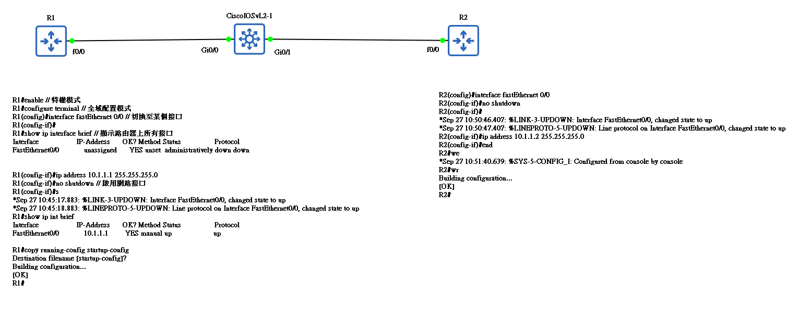

## What is an IP Address?

- layer 3 logical address assigned by an administrator
  - MAC Address - built in to NIC
  - Layer 3 of OSI Model
  - used to identity specific devices on a network
  - every device on the internet has a unique IP address

- IPv4
  - connectionless Protocol
    - TCP is connetionb oriented
      - three way handshark
  - Packets treated ondependently
    - May take different paths
      - Load Balancing
      - Bandwith  -- OSPF
      - HopCount -- RIP
  - hierarchical addressing structure
    - Network and Host partion
  - Best effort delivery
  - no data recovery features

- Network Address Portion(Network ID)
  - Identifies a specific network
  - routers maintain routing tables that contain the network
  - look at destination of IP address and match to network address
- Host Address Portion(Host ID)
  - Identifies a specific endpoint on a network
  - server、printers、PCs、Phone etc.

## Address Classes

- Unicast Traffic
  - Class A
  - Class B
  - Class C
- multicast
  - Class D
- reserved for future or experimental purposes
  - Class E

IPV6 - does not use address classes
IPV4 - address classes was replaced by CIDR

### Special Address
1. loopback address

- used to let a system send a message to itself for testing
- this is very useful to make sure that the TCP/IP stack is correctly install on a machine
- 127.0.0.1 是典型的範本

> router have lookback addresses which are not the same as the local loopback address

2. local broadcast address

- communicate with all devices on local network
- address os all binary 1s
- Example
  - host request an IP Address from a DHCP server


### Directed broadcast address
- Host sends data to all devices on a specific network
- binary 1s in the entrie host portion of the address

Network 172.31.0.0
  - directed broadcast = 172.31.255.255

Router can route directed broadcast
 - disabled by default
    - security issue
      - hacking utilities that you can download
      - DDoS Attacks

### Private Address

Non routable on the internet

Three blocks of IP addresses
- 1 class A network
- 16 class B network
- 256 class C network

private:
- 10.0.0.0 to 10.255.255.255
- 172.16.0.0 to 172.31.255.255
- 192.168.0.0 to 192.168.255.255


### IPv4 Link - Local Addresses

IPv4 鏈路本地位址 是一個在特定範圍內，由作業系統自動設定給網路介面（例如你的網卡或 Wi-Fi 卡）的 IP 位址。這種情況通常發生在設備設定為自動取得 IP (DHCP)，卻又找不到任何 DHCP 伺服器來分配位址時。

它最廣為人知的實現方式是 APIPA (Automatic Private IP Addressing)，這是微軟在 Windows 系統中的稱呼。

重點特性:

1. 特定的位址範圍 (Specific Address Range)

- 鏈路本地位址的範圍被嚴格定義在 169.254.0.0 到 169.254.255.255 之間。
- 其子網路遮罩固定為 255.255.0.0 (或寫作 /16)。
- 如果你在電腦上看到一個 169.254.x.y 開頭的 IP 位址，就幾乎可以肯定是鏈路本地位址。

2. 自動設定 (Automatic Configuration)

- 當你的電腦開機並嘗試透過 DHCP 取得 IP 位址失敗時，它不會完全放棄。
- 經過一段時間的等待後，作業系統會從 169.254.0.0/16 範圍中隨機挑選一個位址，並將其指派給自己。

3. 衝突偵測 (Conflict Detection)

- 在指派這個位址之前，電腦會先在區域網路上廣播一個 ARP (Address Resolution Protocol) 請求，詢問「有人正在使用這個 IP 位址嗎？」。
- 如果沒有收到任何回應，表示該位址是安全的，電腦就會正式使用它。如果收到了回應，表示該位址已被占用，電腦會重新挑選一個再試一次。

4. 非可路由 (Non-Routable)

- 這是最重要的一個特性。路由器 (Router) 絕對不會轉發來自或發往鏈路本地位址的封包。
- 這意味著，擁有鏈路本地位址的設備只能與連接在同一個區域網路（例如，同一個 Wi-Fi 熱點、同一個交換器）下的其他設備通訊。
- 你無法使用這個位址來上網或與其他網路的設備溝通。


### Subnet Mask

Network address
- used to determine network and host portion
- is a device remote or local ?
- allows us to determine the portion of address which is the host and the network

Determine:

1. Remote
- thus be reached via a default gateway
2. Local
- does not require a default gateway - same subnet


本地（Local）或遠端（Remote）?

要判斷另一台主機是否為本地主機：

1. 檢查該主機IP位址的「網路部分」(network portion)。
2. 與另一台主機的（網路部分）進行比較。

如果兩者的網路部分相同，它們就是本地（在同一個區域網路）。如果不相同，它們就是遠端的。

Class A、B and C networks have default masks, also know as natural masks

Class A: 255.0.0.0
Class B: 255.255.0.0
Class C: 255.255.255.0

Two simple rules:

- any address bits which have corresponding mask bit set to 1 represent the network ID
- any address bits which have corresponding mask bit set to 0 represent the node ID

```
10.1.1.1 = 00001010.00000001.00000001.00000001
255.0.0.0 = 11111111.00000000.00000000.00000000
``

Net ID = 00001010 = 10
Host ID = 00000001.00000001.00000001 = 1.1.1


```
1.1.1.1 = 00000001.00000001.00000001.00000001
255.255.0.0 = 11111111.11111111.00000000.00000000
``

Net ID = 00000001.00000001 = 1.1
Host ID = 00000001.00000001 = 1.1

## IP Subnetting

IP Address 
- Subnet Address
  - Fill the host portion of an address with bunary 0's
- 1st Host Address
  - Fill the host portion of an address with binary 0's except fot the  last bit which is set to binary 1
- last host Address
  - Fill the host portion of an address with binary 1's except fot the  last bit which is set to binary 0
- Broadcast Address
  - Fill the host portion of an address with binary 1's

When ask for the number of host: Hosts = $2^n - 2$

When ask for the number of Networks: Networks = $2^n$
##### Example 01:


有一台主機，IP 是 192.168.1.18/24

192.168.1.**18**(粗體 8 bit 是 address 的主機部分 )

subnet 是 192.168.1.**00000000** = 192.168.1.**0**
1st host 是 192.168.1.**00000001** = 192.168.1.**1**
last host 是 192.168.1.**11111110** = 192.168.1.**254**
Broadcast 是 192.168.1.**11111111** = 192.168.1.**255**


##### Example 02:

有一台主機，IP 是 172.16.35.123/20

1st Octet = 8 bits
2st Octet = 8 bits
3st Octet 會從這切分，讓其滿足 20，必須從這拿取 4 bits，因為含括主機位置

IP Address = 172.16.**0010**0011.01111011 = 172.16.**35**.123

172.16.**0010** 是 Network/Subnet；0011.01111011 是 Host 主機部分


subnet 是 172.16.**0010**0000.00000000 = 172.16.32.**0**
1st host 是 172.16.**0010**0000.00000001 = 172.16.32.**1**
last host 是 172.16.**0010**1111.11111110 = 172.16.47.**254**
Broadcast 是 172.16.**0010**1111.11111111 = 172.16.47.**255**


## Lab

### 路由器配置



R1: 
```bash
R1#enable // 特權模式
R1#configure terminal // 全域配置模式
R1(config)#interface fastEthernet 0/0 // 切換至某個接口
R1(config-if)#
R1#show ip interface brief // 顯示路由器上所有接口
Interface                  IP-Address      OK? Method Status                Protocol
FastEthernet0/0            unassigned      YES unset  administratively down down


R1(config-if)#ip address 10.1.1.1 255.255.255.0
R1(config-if)#no shutdown // 啟用網路接口
R1(config-if)#s
*Sep 27 10:45:17.883: %LINK-3-UPDOWN: Interface FastEthernet0/0, changed state to up
*Sep 27 10:45:18.883: %LINEPROTO-5-UPDOWN: Line protocol on Interface FastEthernet0/0, changed state to up
R1#show ip int brief
Interface                  IP-Address      OK? Method Status                Protocol
FastEthernet0/0            10.1.1.1        YES manual up                    up

R1#copy running-config startup-config
Destination filename [startup-config]?
Building configuration...
[OK]
R1#

```

R2:

```bash
R2(config)#interface fastEthernet 0/0
R2(config-if)#no shutdown
R2(config-if)#
*Sep 27 10:50:46.407: %LINK-3-UPDOWN: Interface FastEthernet0/0, changed state to up
*Sep 27 10:50:47.407: %LINEPROTO-5-UPDOWN: Line protocol on Interface FastEthernet0/0, changed state to up
R2(config-if)#ip address 10.1.1.2 255.255.255.0
R2(config-if)#end
R2#we
*Sep 27 10:51:40.639: %SYS-5-CONFIG_I: Configured from console by console
R2#wr
Building configuration...
[OK]
R2#
```

R1 是要可以 Ping 通 R2。