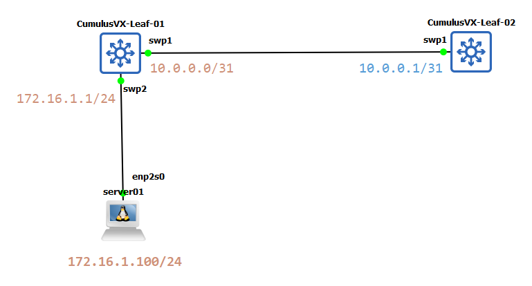

# Static Route

動態路由 (如 BGP/OSPF) 像是 Google Maps：它會自動偵測路況，路斷了會自動幫你繞路；靜態路由 (Static Route) 則是你手繪的固定地圖：你明確告訴設備「要去 A 目的地，必須走 B 路口」。它不會動，除非你拿起橡皮擦（指令）去修改它。

一個靜態路由需要以下三大元素

1. Destination(目的地): 終點站的地址
2. Next-hop: 下一個路口
3. Exit Interface: 從哪邊出去

如果路由不會經常更改，並且目的地只有一兩條路徑，則可以使用靜態路由。

## 配置靜態路由

Cumulus Linux 將靜態路由新增至 FRR 路由表，然後再加入核心路由表。下圖是本範例架構



## CumulusVX-Leaf-01

```yaml
- set:
    interface:
      lo:
        ip:
          address:
            1.1.1.1/32: {}
      swp1:
        description: to Leaf-02
        ip:
          address:
            10.0.0.0/31: {}
        type: swp
      swp2:
        description: to server
        ip:
          address:
            172.16.1.1/24: {}
        type: swp
    # Configure a Gateway or Default Route
    vrf:
      default:
        router:
          static:
            2.2.2.2/32:
              via:
                10.0.0.1: {}
    system:
      hostname: leaf01
```

定義完成後進行 `apply`。原則上 NVUE 會幫你自動的異動 OS 內的服務。

```bash
Warning: The following files have been changed since the last save, and they WILL be overwritten.
        - /etc/nsswitch.conf
        - /etc/synced/synced.conf
        - /etc/default/lldpd
        - /etc/ptp4l.conf
        - /etc/network/interfaces
        - /etc/frr/frr.conf
        - /etc/frr/daemons
        - /etc/hosts
        - /etc/dhcp/dhclient-exit-hooks.d/dhcp-sethostname
        - /etc/hostname
        - /etc/cumulus/switchd.conf
        - /etc/cumulus/switchd.d/ptp.conf
        - /etc/cumulus/datapath/qos/qos_features.conf
        - /etc/mlx/datapath/qos/qos_infra.conf
        - /etc/cumulus/switchd.d/qos.conf
        - /etc/cumulus/ports.conf
        - /etc/cumulus/ports_width.conf
        - /etc/ntp.conf
Warning: The frr service will need to be restarted because the list of router services has changed.  This will disrupt traffic for any existing routing protocols.
Warning: current hostname `cumulus` will be replaced with `leaf01`
```

驗證配置是否生效

1. IP

這邊可以看到 swp1 和 swp2 都已經配置。再此環境中 MTU 預設都是 9216，Port 也是預設 `up`。

```bash
~$ ip add
1: lo: <LOOPBACK,UP,LOWER_UP> mtu 65536 qdisc noqueue state UNKNOWN group default qlen 1000
    link/loopback 00:00:00:00:00:00 brd 00:00:00:00:00:00
    inet 127.0.0.1/8 scope host lo
       valid_lft forever preferred_lft forever
    inet 1.1.1.1/32 scope global lo
       valid_lft forever preferred_lft forever
    inet6 ::1/128 scope host
       valid_lft forever preferred_lft forever
2: eth0: <NO-CARRIER,BROADCAST,MULTICAST,UP> mtu 1500 qdisc pfifo_fast master mgmt state DOWN group default qlen 1000
    link/ether 0c:03:59:55:00:00 brd ff:ff:ff:ff:ff:ff
3: swp1: <BROADCAST,MULTICAST,UP,LOWER_UP> mtu 9216 qdisc pfifo_fast state UP group default qlen 1000
    link/ether 0c:03:59:55:00:01 brd ff:ff:ff:ff:ff:ff
    inet 10.0.0.0/31 scope global swp1
       valid_lft forever preferred_lft forever
    inet6 fe80::e03:59ff:fe55:1/64 scope link
       valid_lft forever preferred_lft forever
4: swp2: <NO-CARRIER,BROADCAST,MULTICAST,UP> mtu 9216 qdisc pfifo_fast state DOWN group default qlen 1000
    link/ether 0c:03:59:55:00:02 brd ff:ff:ff:ff:ff:ff
    inet 172.16.1.1/24 scope global swp2
       valid_lft forever preferred_lft forever
...
```

透過 `nv` 指令也可以獲取配置

```bash
$ nv show interface swp1
                          operational        applied
------------------------  -----------------  -----------
type                      swp                swp
[acl]
evpn
  multihoming
    uplink                                   off
ptp
  enable                                     off
router
  adaptive-routing
    enable                                   off
  ospf
    enable                                   off
  ospf6
    enable                                   off
  pbr
    [map]
  pim
    enable                                   off
synce
  enable                                     off
description               to Leaf-02         to Leaf-02
ip
  igmp
    enable                                   off
  ipv4
    forward                                  on
  ipv6
    enable                                   on
    forward                                  on
  neighbor-discovery
    enable                                   on
    [dnssl]
    home-agent
      enable                                 off
    [prefix]
    [rdnss]
    router-advertisement
      enable                                 on
      fast-retransmit                        on
      hop-limit                              64
      interval                               600000
      interval-option                        off
      lifetime                               1800
      managed-config                         off
      other-config                           off
      reachable-time                         0
      retransmit-time                        0
      router-preference                      medium
  vrrp
    enable                                   off
  vrf                                        default
  [address]               10.0.0.0/31        10.0.0.0/31
  [gateway]
link
  auto-negotiate          off                on
  duplex                  full               full
  speed                   1G                 auto
  fec                                        auto
  mtu                     9216               9216
  [breakout]
  state                   down               up
  stats
    carrier-transitions   1
    in-bytes              0 Bytes
    in-drops              0
    in-errors             0
    in-pkts               0
    out-bytes             0 Bytes
    out-drops             0
    out-errors            0
    out-pkts              0
  mac                     0c:03:59:55:00:01
ifindex 
```

## CumulusVX-Leaf-02

```yaml
- set:
    interface:
      lo:
        ip:
          address:
            2.2.2.2/32: {}
      swp1:
        description: to Leaf-01
        ip:
          address:
            10.0.0.1/31: {}
    system:
      hostname: leaf02
    # Configure a Gateway or Default Route
    vrf:
      default:
        router:
          static:
            1.1.1.1/32:
              via:
                10.0.0.0:
                  type: ipv4-address
```

查看路由，FRR 是可以用來設定 vrf 的軟體。

```bash
cumulus@cumulus:mgmt:~$ sudo vtysh

Hello, this is FRRouting (version 7.5+cl5.3.0u0).
Copyright 1996-2005 Kunihiro Ishiguro, et al.

leaf02# show ip route
Codes: K - kernel route, C - connected, S - static, R - RIP,
       O - OSPF, I - IS-IS, B - BGP, E - EIGRP, N - NHRP,
       T - Table, v - VNC, V - VNC-Direct, A - Babel, D - SHARP,
       F - PBR, f - OpenFabric, Z - FRR,
       > - selected route, * - FIB route, q - queued, r - rejected, b - backup
       t - trapped, o - offload failure
C>* 2.2.2.2/32 is directly connected, lo, 00:00:28
```

傳統方式也可以查看，該底層都會被設定進行異動。

```bash
$ ip route
10.0.0.0/31 dev swp1 proto kernel scope link src 10.0.0.1 linkdown
```

## 網路測試

1. 從 leaf02 -> leaf01

```bash
$ ping 1.1.1.1
vrf-wrapper.sh: switching to vrf "default"; use '--no-vrf-switch' to disable
PING 1.1.1.1 (1.1.1.1) 56(84) bytes of data.
64 bytes from 1.1.1.1: icmp_seq=1 ttl=64 time=0.441 ms
64 bytes from 1.1.1.1: icmp_seq=2 ttl=64 time=0.645 ms
64 bytes from 1.1.1.1: icmp_seq=3 ttl=64 time=0.546 ms
^C
--- 1.1.1.1 ping statistics ---
3 packets transmitted, 3 received, 0% packet loss, time 51ms
rtt min/avg/max/mdev = 0.441/0.544/0.645/0.083 ms
```

2. 從 leaf01 -> leaf02

```bash
$ ping 2.2.2.2
vrf-wrapper.sh: switching to vrf "default"; use '--no-vrf-switch' to disable
PING 2.2.2.2 (2.2.2.2) 56(84) bytes of data.
64 bytes from 2.2.2.2: icmp_seq=1 ttl=64 time=0.368 ms
64 bytes from 2.2.2.2: icmp_seq=2 ttl=64 time=0.533 ms

```

## 多新增一台 server01

在 leaf01 上的 `swp2` 是給外部主機連線，定義的網段是 `172.16.1.1/24`。將 server01 連線至 `swp2` 上。

server01 網路配置如下

```bash
# /etc/network/interfaces
auto enp2s0
iface enp2s0 inet static
        address 172.16.1.100
        netmask 255.255.255.0
        gateway 172.16.1.1
#       dns-nameservers 192.168.1.1
```

重啟網路

```bash
systemctl restart networking.service
```

`enp2s0` 網路介面要被設置

```bash
$ ip add
1: lo: <LOOPBACK,UP,LOWER_UP> mtu 65536 qdisc noqueue state UNKNOWN group default qlen 1000
    link/loopback 00:00:00:00:00:00 brd 00:00:00:00:00:00
    inet 127.0.0.1/8 scope host lo
       valid_lft forever preferred_lft forever
    inet6 ::1/128 scope host noprefixroute
       valid_lft forever preferred_lft forever
2: enp2s0: <BROADCAST,MULTICAST,UP,LOWER_UP> mtu 1500 qdisc fq_codel state UP group default qlen 1000
    link/ether 0c:e4:d4:dd:00:00 brd ff:ff:ff:ff:ff:ff
    inet 172.16.1.100/24 brd 172.16.1.255 scope global enp2s0
       valid_lft forever preferred_lft forever
    inet6 fe80::ee4:d4ff:fedd:0/64 scope link
       valid_lft forever preferred_lft forever
```

連通 Gateway，表示流量可以到 `swp2`

```bash
$ ping 172.16.1.1 -c 1
PING 172.16.1.1 (172.16.1.1) 56(84) bytes of data.
64 bytes from 172.16.1.1: icmp_seq=1 ttl=64 time=0.628 ms

$ ping 1.1.1.1
PING 1.1.1.1 (1.1.1.1) 56(84) bytes of data.
64 bytes from 1.1.1.1: icmp_seq=1 ttl=64 time=0.577 ms
64 bytes from 1.1.1.1: icmp_seq=2 ttl=64 time=0.555 ms
```

此時 server01 要連通至 server02，是沒辦法的。會發生以下問題

1. 去程 (Forward Path)： * Server-01 把封包交給網關 Leaf01。

    * Leaf01 查表，發現有靜態路由 2.2.2.2/32 指向 Leaf02，於是把封包丟過去。
    * Leaf02 成功收到了封包(去程沒問題)

2. 回程 (Return Path) - 斷在這裡：

    * Leaf02 收到後，想要回信給 172.16.1.100。
    * Leaf02 檢查自己的路由表，發現：「我不認識 172.16.1.0/24 這個網段，我不知道該把回信丟給誰。」

    於是，Leaf02 只能把這個封包丟棄 (Drop)。


要如何讓他能夠連通 ? 我們可以再 leaf02 加入一筆靜態路由

```yaml
...
  vrf:
    default:
    ...
            172.16.1.0/24:
              via:
                10.0.0.0:
                  type: ipv4-address
```

此時的 leaf02 會多一筆 `172.16.1.0/24` 的路由

```bash
$ ip route
1.1.1.1 nhid 10 proto static metric 20
10.0.0.0/31 dev swp1 proto kernel scope link src 10.0.0.1
172.16.1.0/24 nhid 10 proto static metric 20
```

最後 server01 嘗試存取 leaf02 會是通的

```bash
$ ping 2.2.2.2 -c 3
PING 2.2.2.2 (2.2.2.2) 56(84) bytes of data.
64 bytes from 2.2.2.2: icmp_seq=1 ttl=63 time=1.17 ms
64 bytes from 2.2.2.2: icmp_seq=2 ttl=63 time=0.936 ms
64 bytes from 2.2.2.2: icmp_seq=3 ttl=63 time=0.805 ms

--- 2.2.2.2 ping statistics ---
3 packets transmitted, 3 received, 0% packet loss,

$ traceroute 2.2.2.2
traceroute to 2.2.2.2 (2.2.2.2), 30 hops max, 60 byte packets
 1  _gateway (172.16.1.1)  0.826 ms  0.769 ms  0.821 ms
 2  2.2.2.2 (2.2.2.2)  1.616 ms  1.613 ms  1.609 ms

```

## NVUE YAML

1. `interface`： 這裡定義物理介面（swp）和邏輯介面（lo）。`{}` 代表該物件下沒有額外的參數需要設定。

2. `vrf.default`： 在資料中心網路中，預設所有的路由都在 `default` 這個虛擬路由表裡。

3. `router.static`： 靜態路由。

vrf.default 為何要定義 ?

傳統 Cisco 指令： `ip route 2.2.2.2 255.255.255.255 10.0.0.1` (直接寫在全域)

Nvidia NVUE： 因為 Cumulus Linux 是為了大規模雲端環境設計的，它預設「每一台交換機都可以切成好幾台虛擬交換機」。

`vrf.default`： 就是告訴系統沒有要虛擬化，請把這條路徑寫在最基本的那張預設地圖上就好。

## 參考資源

* [nvidia | cumulus 5.4](https://docs.nvidia.com/networking-ethernet-software/cumulus-linux-54/Layer-3/Routing/Static-Routing/)