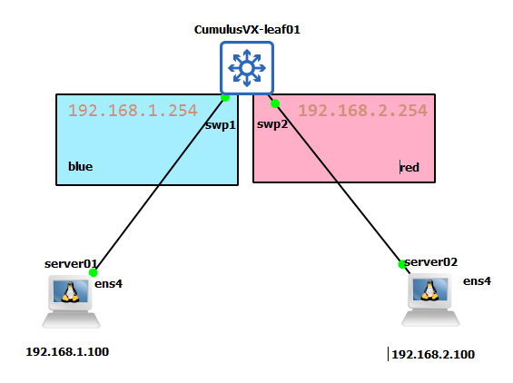

# VRF(Virtual Routing and Forwarding)

虛擬路由轉送 (VRF) 可在同一交換器上同時使用多個獨立的路由表。其他實作方式將此功能稱為 VRF-Lite。預設情況下，交換機上的應用程式和 `systemd` 啟動的服務都在 `default` VRF 中運行，除非特別指定 VRF 實例。

VRF 可以解決什麼問題?

1. 多租戶隔離 (Multi-tenancy): 確保 A 公司與 B 公司的資料在同一台硬體上完全隔離。是一個 Layer 3 的主網路設備，擁有自己獨立關聯的路由表。
2. IP 位址衝突 (Overlapping IP): 不同客戶可能都想使用 192.168.1.1。VRF 讓這兩個相同的 IP 存在於不同的路由表中。
3. 安全控制 (Security): 預設情況下 VRF 之間不互通。你可以只洩漏特定的路由（如 DNS 服務）來減少攻擊面。
4. 維運管理 (Management): 可以將「設備管理流量 (eth0)」放在單獨的 mgmt VRF，避免管理流量與客戶的業務流量混雜。

## Lab

想像一台交換器是一棟大樓。沒有 VRF 下全公司的人都在同一個開放辦公室，你能看見所有人，所有文件都在同一個佈告欄上。有了 VRF，這棟樓被切割成了藍色公司 (Blue)與紅色公司 (Red)。藍色員工看不到紅色員工。藍色辦公室的門牌號碼可以跟紅色辦公室一模一樣（IP 重疊），也不會走錯。

下圖為本實驗拓樸:



### leaf01

```yaml
- set:
    system:
      hostname: leaf01

    interface:
      swp1:
        ip:
          vrf: blue
          address:
            192.168.1.254/24: {}
      swp2:
        ip:
          vrf: red
          address:
            192.168.2.254/24: {}

    vrf:
      blue:
        router:
          static:
            192.168.2.0/24:
              via:
                swp2: {}
      red:
        router:
          static:
            192.168.1.0/24:
              via:
                swp1: {}
```

接著認識配置

1. 介面與 VRF 綁定

    ```yaml
    interface:
    swp1:
        ip:
        vrf: blue
        address:
            192.168.1.254/24: {}
    ```

    實體埠 swp1 綁訂 blue 這個 VRF。這代表所有從 swp1 進來的封包，交換器都會強制去查 blue 專用的路由表，而不是系統預設的路由表。而 `192.168.1.254` 成了 `blue` 的預設閘道。原則可以將任何 L3 介面（如 SVI、swp 物理端口、Bond 聚合介面或 VLAN 子介面）與特定 VRF 關聯。

2. 路由洩漏 (Route Leaking)

    ```yaml
    vrf:
      blue:
        router:
          static:
            192.168.2.0/24:
              via:
                swp2: {}
    ```

    預設情況下，`blue` 根本不知道 `red` 的存在。因此在 blue 的路由上建立一條路，如果要找 `192.168.2.0/24`（red 領土），請直接把封包交給 swp2 這個出口。

[NVUE | flag-onlink](https://docs.nvidia.com/networking-ethernet-software/nvue-reference/Set-and-Unset-Commands/Static-Routing/#hnv-set-vrf-vrf-id-router-static-route-id-via-via-id-flag-onlinkh)

[NVUE | static route](https://docs.nvidia.com/networking-ethernet-software/nvue-reference/Set-and-Unset-Commands/Static-Routing/#hnv-set-vrf-vrf-id-router-static-route-id-via-via-idh)

#### 控制平面檢查

```bash
$ nv show vrf blue
                      operational  applied
--------------------  -----------  --------------
evpn
  enable                           off
ptp
  enable                           on
router
  bgp
    enable                         off
  [nexthop-tracking]
  ospf
    enable                         off
  ospf6
    enable                         off
  pim
    enable                         off
  [rib]
  [static]                         192.168.2.0/24
table                 1002         auto
```

```bash
$ nv show vrf red
                      operational  applied
--------------------  -----------  --------------
evpn
  enable                           off
ptp
  enable                           on
router
  bgp
    enable                         off
  [nexthop-tracking]
  ospf
    enable                         off
  ospf6
    enable                         off
  pim
    enable                         off
  [rib]
  [static]                         192.168.1.0/24
table                 1003         auto
```

路由表:

```bash
~$ nv show vrf blue router
                    operational  applied
------------------  -----------  --------------
bgp
  enable                         off
[nexthop-tracking]
ospf
  enable                         off
ospf6
  enable                         off
pim
  enable                         off
[rib]
[static]                         192.168.2.0/24
```

```bash
$ nv show vrf red router
                    operational  applied
------------------  -----------  --------------
bgp
  enable                         off
[nexthop-tracking]
ospf
  enable                         off
ospf6
  enable                         off
pim
  enable                         off
[rib]
[static]                         192.168.1.0/24
```

所有的直連路由 (Connected) 和本地路由 (Local) 都會自動進入相應的 VRF 路由表中。VRF 路由查找邏輯，歸屬於該 VRF 的 L3 介面，其 IP 規則會強制將 FIB（轉發資訊庫）查找導向該 VRF 專屬的路由表。

#### 資料平面

1. switch to server

    ```bash
    $ ping -I red 192.168.2.100 -c 2
    vrf-wrapper.sh: switching to vrf "default"; use '--no-vrf-switch' to disable
    ping: Warning: source address might be selected on device other than red.
    PING 192.168.2.100 (192.168.2.100) from 192.168.2.254 red: 56(84) bytes of data.
    64 bytes from 192.168.2.100: icmp_seq=1 ttl=64 time=0.833 ms
    64 bytes from 192.168.2.100: icmp_seq=2 ttl=64 time=0.602 ms

    --- 192.168.2.100 ping statistics ---
    2 packets transmitted, 2 received, 0% packet loss, time 15ms
    rtt min/avg/max/mdev = 0.602/0.717/0.833/0.118 ms
    ```

    ```bash
    $ ping -I blue 192.168.1.100 -c 2
    vrf-wrapper.sh: switching to vrf "default"; use '--no-vrf-switch' to disable
    ping: Warning: source address might be selected on device other than blue.
    PING 192.168.1.100 (192.168.1.100) from 192.168.1.254 blue: 56(84) bytes of data.
    64 bytes from 192.168.1.100: icmp_seq=1 ttl=64 time=0.511 ms
    64 bytes from 192.168.1.100: icmp_seq=2 ttl=64 time=0.652 ms

    --- 192.168.1.100 ping statistics ---
    2 packets transmitted, 2 received, 0% packet loss, time 30ms
    rtt min/avg/max/mdev = 0.511/0.581/0.652/0.074 ms
    ```

2. server01 to server02


#### FRR 

此時應當要有 `S` 開頭的靜態路由。來表示在該 VRF 中有路徑可以到另外一端。

```bash
$ sudo vtysh -c "show ip route vrf blue"
Codes: K - kernel route, C - connected, S - static, R - RIP,
       O - OSPF, I - IS-IS, B - BGP, E - EIGRP, N - NHRP,
       T - Table, v - VNC, V - VNC-Direct, A - Babel, D - SHARP,
       F - PBR, f - OpenFabric, Z - FRR,
       > - selected route, * - FIB route, q - queued, r - rejected, b - backup
       t - trapped, o - offload failure

VRF blue:
K>* 0.0.0.0/0 [255/8192] unreachable (ICMP unreachable), 01:34:24
C>* 192.168.1.0/24 is directly connected, swp1, 01:34:24
S>* 192.168.2.0/24 [1/0] is directly connected, swp2 (vrf red), weight 1, 00:02:36
```


```bash
$ sudo vtysh -c "show ip route vrf red"
Codes: K - kernel route, C - connected, S - static, R - RIP,
       O - OSPF, I - IS-IS, B - BGP, E - EIGRP, N - NHRP,
       T - Table, v - VNC, V - VNC-Direct, A - Babel, D - SHARP,
       F - PBR, f - OpenFabric, Z - FRR,
       > - selected route, * - FIB route, q - queued, r - rejected, b - backup
       t - trapped, o - offload failure

VRF red:
K>* 0.0.0.0/0 [255/8192] unreachable (ICMP unreachable), 01:35:27
S>* 192.168.1.0/24 [1/0] is directly connected, swp1 (vrf blue), weight 1, 00:03:39
C>* 192.168.2.0/24 is directly connected, swp2, 01:35:27
```

### server01 與 server02

server01 和 server02 分別與 leaf01 的 swp1 和 swp2 連線。`gateway` 同時指向 leaf01 的 Port 綁定 IP 作為出口。

#### server01

```bash
auto enp2s0
iface enp2s0 inet static
        address 192.168.1.100
        netmask 255.255.255.0
        gateway 192.168.1.254

```

#### server02

```bash
auto enp2s0
iface enp2s0 inet static
        address 192.168.2.100
        netmask 255.255.255.0
        gateway 192.168.2.254
```

#### 驗證可以互通

server01 存取 server02

```bash
~$ ping 192.168.2.100 -c 1
PING 192.168.2.100 (192.168.2.100) 56(84) bytes of data.
64 bytes from 192.168.2.100: icmp_seq=1 ttl=63 time=0.851 ms

--- 192.168.2.100 ping statistics ---
1 packets transmitted, 1 received, 0% packet loss, time 0ms
rtt min/avg/max/mdev = 0.851/0.851/0.851/0.000 ms
```

可以看到路徑是 server01 -> swp1 -> swp2 -> server02。

```bash
$ traceroute 192.168.2.100
traceroute to 192.168.2.100 (192.168.2.100), 30 hops max, 60 byte packets
 1  _gateway (192.168.1.254)  0.748 ms  0.704 ms  0.762 ms
 2  192.168.2.100 (192.168.2.100)  1.323 ms  1.366 ms  1.363 ms
```