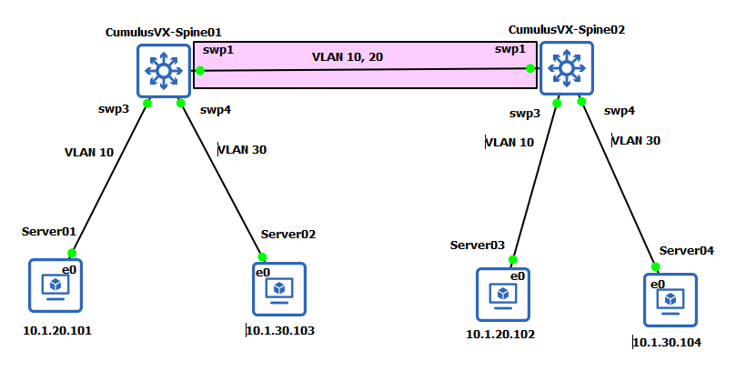

# Ethernet Bridging - VLANs

官方這段話的核心觀念很簡單，主要在說明 Bridge 是什麼和它的 MTU 如何決定：

1. **核心功能 - L2 串連**：
    * Bridge 的主要工作是*橋接*，把好幾個不同的網路介面（無論是實體的網孔，還是虛擬的介面）綁在一起。
    * 綁定後，這些介面會變成**同一個 L2 網域**（也就是同一個廣播域，Broadcast Domain）。這讓掛在這些不同介面下的裝置能像在同一個區域網路 (LAN) 裡一樣互相溝通。

2. **本身屬性 - 邏輯介面**：
    * Bridge **不是**一個實體的硬體（雖然硬體交換器 *內建* 了橋接功能），在系統中，它是一個邏輯介面。
    * 既然是介面，它就會有自己的 **MAC 位址** 和 **MTU** (最大傳輸單元) 值。

3. **MTU 決定規則**：
    * Bridge 的 MTU **不是**自己隨便設定的，也不是取最大值。
    * 它的 MTU 值取決於它底下所有成員介面中，**MTU 值最小的那一個**。
        * 如果你的 Bridge 串接了 MTU 9000 (Jumbo Frame) 和 MTU 1500 (標準) 兩個介面，那麼整個 Bridge 的 MTU 就會被拉低到 1500，以確保所有成員都能正常處理封包。

## Ethernet Bridge Types

Cumulus Linux 處理 L2 橋接 (Bridge) 的兩種方法

以下是說明 Cumulus Linux 處理 L2 橋接 (Bridge) 的兩種方法，以及官方推薦哪一種。

1. **兩種模式並存**：
    * **傳統模式 (Traditional Bridge)**：這是 Linux 系統本來就有的橋接方式 (e.g., `brctl`)。它比較單純，通常是把所有介面綁在一起，對 VLAN 的處理比較不直覺 (e.g., 需額外建立 sub-interface `eth0.10`)。
    * **VLAN 感知模式 (VLAN-aware Bridge)**：這是 Cumulus (NVIDIA) **推薦**的新模式。

2. **為什麼推薦 VLAN-aware**：
    * 關鍵字是 **VLAN Filtering**。
    * 這代表 Bridge 本身就能夠「看懂」並處理 802.1Q VLAN 標籤。可以直接在 Bridge 上設定哪些 port 是 Access Port (PVID)
        、哪些是 Trunk Port (allowed VLANs)，**這讓 Cumulus 交換器的行為和設定邏輯，幾乎等同於你我熟悉的Cisco/Arista 等專用網路設備**，管理上更直覺。

3. **相容性 (Co-existence)**：
    * 你可以在同一台 Cumulus 設備上同時使用這兩種模式的 Bridge。
        * 除非有特殊需求，官方不建議這樣混用

## Bridge MAC Addresses

當一個訊框 (frame) 透過介面進入橋接器時，交換器會學習 (learn) 該訊框的 MAC 位址，並將這個 MAC 位址記錄在橋接器表 (bridge table) 中。

橋接器透過查詢訊框的目標 MAC 位址，來將訊框轉發 (forward) 到其預定的目的地。

三件 L2 交換器最基本的工作：**學習 (Learn)**、**轉發 (Forward)** 和 **老化 (Aging)**。

1. **如何學習**
    * **時機**：當封包**進來 (Ingress)** 時。
    * **學什麼**：學習封包的**來源 MAC (Source MAC)**。
    * **動作**：把這個 MAC跟它是從哪個 Port 進來的綁定，記錄在**Bridge Table**（**MAC Address Table**）。
    * 例子：`Server01` (MAC-A) 從 `SWP3` 送出封包，交換器就學到：`MAC-A` 在 `SWP3` 上。*

2. **如何轉發**
    * **時機**：當封包需要**出去 (Egress)** 時。
    * **查什麼**：查詢封包的**目標 MAC (Destination MAC)**。
    * **動作**：去查 MAC Table。如果表裡有紀錄，就精準地從對應的 Port 送出去；如果查不到，就會執行 "Flooding"（廣播到所有 Port）。

3. **如何老化 (Cumulus Specific)**
    * **目的**：保持 MAC Table 的資料是「新鮮的」，自動清掉已經離線或搬移的裝置。
    * **Cumulus 預設值**：**1800 秒 (30 分鐘)**。
    * **刷新 (Refresh)**：如果 30 分鐘內，同一個 MAC 又從同一個 Port 發送封包，計時器就會**重置 (Reset)**，重新倒數 30 分鐘。
    * **刪除 (Delete)**：如果一筆 MAC 紀錄放了 30 分鐘都沒被刷新，系統就認定這台裝置可能不在了，會將這筆條目**刪除**。

```bash
root@spine01:/# nv show bridge domain br_default mac-table
      age   bridge-domain  entry-type  interface   last-update  mac                src-vni  vlan  vni  Summary
-  -----  ------…  ------…  ------…  -----…  ------…  -----…  ----  ---  -------
0  7      br_def…           swp1     3039    0c:a2:…          10
1  0      br_def…           swp1     10299   0c:16:…          1
2  10602  br_def…  perman…  swp1     10602   0c:ef:…          1
3  10602  br_def…  perman…  swp3     10602   0c:ef:…
4  4      br_def…           swp4     10285   0c:03:…          30
5  10602  br_def…  perman…  swp4     10602   0c:ef:…
6  10602  br_def…  perman…  br_def…  10602   0c:ef:…          1

```

## bridge fdb Command Output

Linux bridge fdb 命令與 FDB 交互，網橋(bridge)使用 FDB 來儲存其學習到的 MAC 位址以及學習這些 MAC 位址的連接埠

|Keyword|Description|
|---|---|
|self|FDB 條目屬於 FDB 中被該設備所引用的設備本身。|
|master|FDB 條目屬於該設備的主設備(Master) 上的 FDB，並且指向主設備的一個埠。<br>例如：swp1 的 FDB 條目，但它指向的是其主設備（master） br_default 橋接器(`aa:c1:ab:06:e9:89 dev swp1 master br_default permanent`)。|
|extern_learn|FDB 條目是由一個外部的控制平面（Control Plane）所管理的。<br>最常見的例子就是 BGP EVPN。這表示這個 MAC 不是經由傳統的資料平面（data-plane）學習來的，而是 BGP 協定告訴系統的。|

```bash
$ bridge fdb show
0c:a2:92:14:00:00 dev swp1 vlan 10 master br_default
0c:16:46:c4:00:01 dev swp1 vlan 1 master br_default
0c:ef:4b:1b:00:01 dev swp1 vlan 1 master br_default permanent
0c:ef:4b:1b:00:01 dev swp1 master br_default permanent
0c:ef:4b:1b:00:03 dev swp3 master br_default permanent
0c:03:d4:b3:00:00 dev swp4 vlan 30 master br_default
0c:ef:4b:1b:00:04 dev swp4 master br_default permanent
0c:ef:4b:1b:00:07 dev br_default vlan 1 master br_default permanent
0c:ef:4b:1b:00:07 dev br_default master br_default permanent
```

## 什麼是 VLAN 感知橋接模式(VLAN-aware Bridge Mode)？

這是一種現代化的橋接設定方式，它**讓一個 Linux 橋接器 (bridge) 能夠理解並處理 802.1Q VLAN 標籤**。讓整個橋接器(Bridge)只運行一個 Spanning Tree Protocol (STP) 實例。

* **核心概念：** 不再需要為 *每一個* VLAN 都建立一個獨立的橋接器（例如 `br10`, `br20`），而是**只需要建立一個單一的橋接器**（例如 `br_default`），並讓這個橋接器自己來管理所有 VLAN。

### 主要優勢

* **簡化設定：** 這是最大的優點。您只需要管理一個橋接網域 (bridge domain)，然後在各個交換器埠 (port) 上指定它們各自的 VLAN 成員資格。
* **直觀易懂：** 這種設定方式更接近傳統網路交換器 (switch) 的邏輯。

##### 子介面地獄

* **傳統模式 (Traditional)**：如果你要在 `eth1` 上 Trunk 100 個 VLAN，你必須在 Linux 系統中手動建立 100 個子介面 (e.g., `eth1.10`, `eth1.20`, `eth1.21`...)，然後再把這些子介面一個個加入 Bridge。這非常笨重、設定檔超長，且極度消耗系統資源。
* **VLAN-aware 模式 (VLAN-aware)**：你**不需要**建立任何子介面。只要告訴 Bridge：「`eth1` 是我的成員，它允許 VLAN 10-110 通過」。系統底層會用高效的「VLAN bitmaps」去處理，設定檔乾淨、效能高。

##### 2. 運作邏輯完全比照專用交換器

* 這段提到的 PVID 和 allowed VLANs，就是 L2 交換器的標準術語：
  * **PVID (Port VLAN ID)**：就是 `Access Port` 的 VLAN ID。
  * **Native VLAN**：就是 `Trunk Port` 上，允許不帶標籤 (untagged)封包通過的那個 VLAN。
  * **Allowed VLANs**：就是 `Trunk Port` 上允許通過的 VLAN 列表。
* 這代表可以用管理 Cisco/Arista 交換器的邏輯來管理 Cumulus。

##### 3. MAC Table 是 VLAN 感知的

* Bridge 知道 `VLAN 10` 裡的 `MAC_A` 和 `VLAN 20` 裡的 `MAC_A` 是**兩個完全不同的紀錄**。
* 這確保了 VLAN 之間的 L2 隔離性是真正落實的。

### 總結

雖然可以建立多個 Bridge，但它們必須是完全獨立且功能簡化的。在實務上，這代表應該盡量只用一個 Bridge。

1. 核心概念：**Bridge 之間必須完全隔離**

    * 雖然系統允許建立 bridge-A 和 bridge-B，但你必須把它們當作兩台完全獨立、互不相干的虛擬交換器。
    資源不能共享：
      * 一個實體 Port (e.g., swp1) 只能綁定到一個 Bridge。
      * 一個 VNI (VXLAN 的 ID) 只能對應到一個 Bridge。

2. 功能限制：`MLAG`

'   * MLAG 只能在*單一*Bridge 內運作。

    >這條是關鍵！如果你打算使用 Cumulus 最重要的 MLAG 功能（來做跨設備的 Port-Channel），你就不能把 Port 分配到不同的 Bridge。必須把所有 L2 介面都放在同一個預設的 Bridge 裡。

3. 高級 L2 功能受限

    一旦你啟用多個 Bridge，以下這些高級 L2 封包處理功能將無法使用：

    * VLAN Translation (VLAN 轉換)
    * Double Tagged VLANs (Q-in-Q，或稱 QinQ)

4. VXLAN 相關限制

    * SVD (Single VXLAN Device)：這是一種 VXLAN 的部署模式。限制是，你不能把多個 SVD (e.g., svd1, svd2) 同時綁到同一個 Bridge 裡面。

    除非有非常特殊的 L2 隔離需求，例如需要一個 L2 版本的 VRF，否則官方強烈建議整台 Cumulus 設備只使用一個 VLAN-aware bridge (通常是預設的 bridge 或 br_default) 來處理所有的 L2 流量。

    只有在單一 Bridge 的架構下，你才能使用 MLAG 和其他完整的 L2/VXLAN 功能。

## 運作方式與關鍵設定

1. **啟用 VLAN 感知模式：**
    * 必須在主要的橋接器（例如 `br_default`）上明確啟用此模式。
    * **指令範例：** `nv set interface br_default bridge domain vlan-aware`
    * 啟用後，這個橋接器就能夠處理 VLAN 標籤了。

2. **在埠 (Port) 上定義 VLAN：**
    * 設定的重點從「橋接器」轉移到「埠」本身。需要告訴每個埠（例如 `swp1`, `swp2`）它屬於哪個 VLAN。

3. **PVID vs. VID (重要觀念)：**
    * **`PVID` (Port VLAN ID):**
        * 這代表**原生 VLAN (Native VLAN)**。
        * 當一個 *未帶標籤* (untagged) 的封包進入這個埠時，系統會自動幫它貼上 PVID 所指定的 VLAN 標籤。
        * 這通常用於設定「**Access Port**」（存取埠）。
        * **指令範例：** `nv set interface swp1 bridge domain br_default access 10` (代表 `swp1` 的 Access Port 在 VLAN 10)。
    * **`VID` (VLAN ID):**
        * 這代表**允許的標籤 VLAN (Tagged VLANs)**。
        * 這用於設定**Trunk Port**。
        * 埠會允許 *已經帶有* 這些 VID 標籤的封包通過。
        * **指令範例：** `nv set bridge domain br_default vlan 10, 20`。

4. **在橋接器上宣告 VLAN：**
    * 最後，必須告訴**橋接器本身**（`br_default`）有哪些 VLAN 在這個橋接網域中是「有效」的。
    * **指令範例：** `nv set interface br_default vlan 10 20 30` (告訴橋接器要處理 VLAN 10, 20, 30)。

### 本實驗配置

1. Configure a VLAN-aware Bridge

    NVUE YAML:

    ```yaml
    - set:
        bridge:
        domain:
            br_default:
            vlan:
                '10': {}
                '20': {}
    ```

    以下配置是由 NVUE 系統產生。

    ```bash
    auto br_default
    iface br_default
        bridge-ports swp1 swp3 swp4
        hwaddress ce:36:78:fb:56:e2
        bridge-vlan-aware yes
        bridge-vids 10 20
        bridge-pvid 1
    ```

    `bridge-pvid` 預設為 1，不必為網橋(Bridge)或端口指定 `bridge-pvid`。儘管這不會影響配置，但它有助於其他用戶的可讀性。

    > 如果在網橋(bridge)層級指定 `bridge-vids` 或 `bridge-pvid`，則網橋中的所有連接埠都會繼承這些設定。但是，為特定連接埠指定任何這些設定都會覆蓋網橋中的設定。

2. Access Ports and Tagged Packets

    下面 swp3 允許未標記流量(untagged traffic) 進入 VLAN 10。swp4 則為 30。

    NVUE YAML

    ```yaml
    - set:
        bridge:
        domain:
            br_default:
            vlan:
                '10': {}
                '20': {}
        interface:
        ...
        swp1:
            type: swp
            bridge:
            domain:
                br_default: {} # VLAN 10、20 流量都可通過
        swp2:
            type: swp
        swp3:
            type: swp
            bridge:
            domain:
                br_default:
                access: 10
        swp4:
            type: swp
            bridge:
            domain:
                br_default:
                access: 30
    ```

    以下配置是由 NVUE 系統產生。

    ```bash
    $ cat /etc/network/interfaces
    ...
    auto swp3
    iface swp3
        bridge-access 10

    auto swp4
    iface swp4
        bridge-access 30

    auto br_default
    iface br_default
        bridge-ports swp1 swp3 swp4
        hwaddress 9e:e8:2a:e8:85:8c
        bridge-vlan-aware yes
        bridge-vids 10 20
        bridge-pvid 1
    ```

3. VLAN Bridge Binding Mode

    Cumulus Linux 中 SVI (VLAN 介面) 狀態 (Up/Down) 如何判定的重要觀念 ?

    Cumulus Linux 會將 VLAN 設備 (SVI) 的鏈路狀態 (link state) 從其底層設備（即 Bridge）繼承而來。

    因此，**只要**橋接器 (bridge) 本身處於管理上的『Up』狀態，**並且**至少有*一個*橋接器埠口 (port) 是 Up 的，那麼這個 VLAN 設備（SVI）的鏈路狀態就會是 Up - **無論那個 Up 的 Port 是不是這個 VLAN 的成員**。

    如果需要 VLAN 設備（SVI）的鏈路狀態**只**追蹤 (track) 那些同時也是該 VLAN 成員 的 Port 子集 (subset) 的狀態，而不是追蹤所有 Port，那麼你可以設定 VLAN 橋接器綁定模式 (VLAN bridge binding mode)。

    在 VLAN 橋接器綁定模式中，Cumulus Linux 不會自動從底層設備繼承鏈路狀態，而是會根據 **屬於該 VLAN 的橋接器埠口** 來決定（SVI 的）鏈路狀態。

    這段在講 SVI (L3 介面 `vlan10`) 的 Up/Down 狀態是怎麼決定的，這會直接影響到依賴這個 SVI 的路由協定 (如 OSPF, BGP) 或 HSRP/VRR。

##### 1. 預設行為 (Default Mode)

* **規則**：`vlan10` (SVI) 的狀態 = `br_default` (Bridge) 的狀態。
* **`br_default` 如何決定狀態？**：只要 Bridge 底下**任何一個 Port** (`swp1`~`swp50`) 是 Up 的，`br_default` 就是 Up。
* **問題點 (The Problem)**：
  * 假設你的 `vlan10` 介面只在 `swp1` 和 `swp2` 上運行 (Access Port)。
  * 你的 `vlan20` 介面在 `swp3` 上運行。
  * 這時，如果 `swp1` 和 `swp2` 都斷線了 (`vlan10` 實際上已經孤立)，但只要 `swp3` 還是 Up 的，`br_default` 就會是 Up。
  * 結果：`vlan10` 這個 SVI 介面**仍然會顯示為『Up』**，路由協定繼續通告這條路徑，導致流量被送到一個「黑洞」。

##### 2. 解決方案 (Binding Mode)

* **模式名稱**：`VLAN bridge binding mode`
* **規則**：`vlan10` (SVI) 的狀態是**只看**那些屬於 `vlan10` 的 Port (e.g., `swp1`, `swp2`) 的狀態。
* **運作方式**：
  * 承上個例子：`swp1` 和 `swp2` (vlan10) 斷線了。
  * 雖然 `swp3` (vlan20) 還是 Up 的。
  * 但系統在判斷 `vlan10` 的狀態時，只會去看 `swp1` 和 `swp2`。
  * **結果**：`vlan10` 這個 SVI 介面會正確地轉為**Down**，路由協定會撤銷 (withdraw) 相關路由，流量會改走備援路徑。

預設情況下，SVI (VLAN 介面) 只要有任何一個 Port 活著就會是 Up。如果希望 SVI 只關心自己 VLAN 內的 Port 是否活著，**必須手動啟用 VLAN bridge binding 模式**，這樣狀態連動才會準確。*預設的行為 `vlan-bridge-binding` 是關閉*。

### 驗證拓譜



分別在 spine01 和 spine02 配置 Vlan 和橋接介面的配置。在 spine01 和 spine02 之間，只有允許 VLAN 10 和 20 的標記流量。因此從 server01 的 10.1.20.101 去存取 server02 的 10.1.20.102 時可以成功，但針對存取 10.1.30.103 或 10.1.30.104 會因為 spine01 和 spine02 之間的 swp1 介面 VLAN 不允許 VLAN 30 而存取不到。