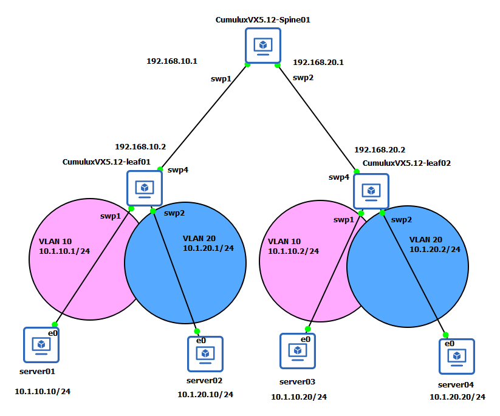
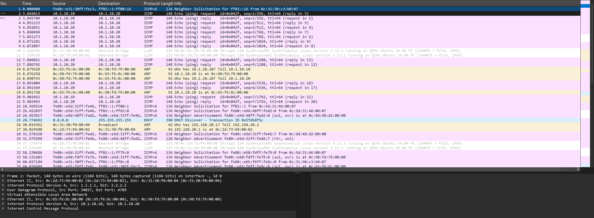
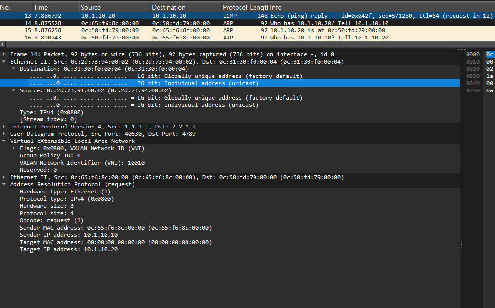

# VXLAN

傳統的區域網路分割技術，虛擬區域網路（VLAN），一直是企業網路的主流標準。VLAN 透過在 IEEE 802.1Q 幀中插入一個 12 位元的 VLAN ID（VID）來達成邏輯隔離，這在當時的網路環境下足以應付大多數需求。然而，隨著雲端運算與超大規模資料中心的興起，VLAN 的局限性開始顯現，主要體現在以下幾個維度。

首先是擴展性的瓶頸。由於 12 位元的限制，VLAN 在單一網路域中最多僅能提供 4,096 個獨立網段。對於像 AWS、Azure 或現代多租戶電信雲（Telco Cloud）而言，4,000 個標籤遠遠不足以支撐成千上萬的獨立租戶或虛擬機環境。其次是二層網路的擴展困難。VLAN 的運作依賴於生成樹協定（Spanning Tree Protocol, STP）來防止環路，但 STP 會導致網路中一半的鏈路處於阻塞狀態，造成嚴重的資源浪費，且在鏈路故障時的收斂速度極慢，無法滿足現代應用對高可用性的要求 。

VXLAN 作為一種基於三層網路（Layer 3）的二層疊加（Layer 2 Overlay）技術，正是為了徹底解決上述問題而生。透過將二層乙太網幀封裝在三層 UDP 數據包中，VXLAN 不僅將標籤空間擴展到了 24 位元（支援超過 1,600 萬個網段），更讓二層網路得以跨越物理上的路由邊界進行延伸。

## VXLAN 的核心機制與封裝結構**

理解 VXLAN 的運作必須從其封裝結構（Encapsulation）入手。VXLAN 採用的是一種名為*MAC-in-UDP*的隧道機制。其運作邏輯是在原始的二層幀外層，依次封裝 VXLAN 標頭、UDP 標頭、IP 標頭以及外層的乙太網標頭 。

**數據平面與 VTEP 節點**

在 VXLAN 架構中，*負責進行封裝與解封裝（En-capsulation/De-capsulation）的硬體或軟體實體被稱為虛擬隧道終端點（VXLAN Tunnel Endpoint, VTEP）*。VTEP 具有兩個介面：一個是面向伺服器或虛擬機的本地介面，用於接收原始的二層流量；另一個是面向核心網路的 IP 介面，用於發送封裝後的隧道數據。

當本地主機發送一個幀時，進入 VTEP 的本地介面，VTEP 會根據預先定義好的對應關係（VLAN to VNI Mapping），查找到對應的虛擬網路識別碼（Virtual Network Identifier, VNI）。隨後，VTEP 會查詢控制平面（如 BGP-EVPN）來確定遠端 VTEP 的 IP 地址，並完成封裝工作 。

VXLAN 封裝是為原始數據包增加固定的 50 位元組（或 54 位元組，若包含外層 VLAN 標籤）的額外開銷 。這一開銷對網路傳輸的效率有著直接影響，特別是在 MTU（最大傳輸單元）的規劃上。

|標頭層級|長度（Bytes|關鍵欄位與功能|
|---|---|---|
|外層乙太網標頭 (Outer Ethernet)|14|包含外層源/目的 MAC 地址，引導包在物理交換機間跳轉。|
|外層 IP 標頭 (Outer IP)|20|包含 VTEP 的 IP 地址，負責三層路由轉發。|
|外層 UDP 標頭 (Outer UDP)|8|目的端口固定為 4789（IANA 標準）；源端口通常由內部流哈希決定，以支援 ECMP。|
|VXLAN 標頭 (VXLAN Header)|8|包含 24 位元的 VNI（VXLAN Network Identifier）標誌位。|
|原始 L2 幀 (Inner Ethernet Frame)|64 - 1500+|原始的二層數據，包含 VM 的 MAC 和 IP 資訊。|

這種封裝方式外層 UDP 的源端口（Source Port）選擇。為了在三層網路中實現負載平衡，VTEP 會對原始幀的內部欄位（如五元組）進行哈希運算，並將結果映射到 UDP 源端口。這樣，物理網路中的中間交換機就可以利用現有的等價多路徑（ECMP）技術，在不拆包的情況下實現流量的負載均衡，這正是 VXLAN 比起傳統二層延伸技術更具優勢的原因之一 。

VLAN 與 VXLAN 的技術差異深度對比

|比較維度|VLAN (IEEE 802.1Q)|VXLAN (RFC 7348)|
|---|---|---|
|識別空間|12 位元 (4,096 ID)|24 位元 (1,677 萬 VNI)|
|運作層次|數據鏈路層 (Layer 2)|傳輸層之上 (Layer 2 Overlay over Layer 3)|
|防環機制|Spanning Tree Protocol (STP) - 阻塞部分鏈路|Layer 3 路由 (OSPF/BGP) - 支援 ECMP 全線速轉發|
|擴展性|局限於單一二層廣播域|可跨越機架、資料中心甚至地理區域擴展|
|封裝開銷|4 位元組 (Tagging)|50-54 位元組 (Tunneling)|
|管理複雜度|較低，適合中小型企業網路|較高，需配合 EVPN 等控制平面技術|

### Lab

本實驗拓樸如下



在 Cumulus 中可用 Single VXLAN Device，一組 VNI 代表單個設備模型。單個 VXLAN 設備具有一組屬於 VXLAN 構造的屬性。各個 VNI 包括 VLAN 到 VNI 的映射，您可以指定哪些 VLAN 映射到關聯的 VNI。單台VXLAN設備通過單台VXLAN設備替代多台傳統VXLAN設備，簡化了配置，降低了開銷。

VXLAN 路由(inter-VXLAN)提供覆蓋網路(overlay networks)中 VXLAN VNI 之間的 IP 路由。Cumulus Linux 使用內部標頭或覆蓋租戶 IP 位址來路由流量。本實驗會進行封包標頭觀察。

本實驗會透過 Static VXLAN 簡化小規模網路的配置邏輯。在實驗配置中 leaf01 與 leaf02 之間定義了明確*點對點*宣告，關鍵字是 `head-end-replication`，ˋ這表示不需要透過複雜的動態協定如 BGP、EVPN 等，而是直接告訴 leaf01: 如果收到 VLAN 10 或 20 的廣播封包，請直接複製一份給 2.2.2.2（leaf02），這就是手動映射。

在傳統網路中，如果要在兩台交換機之間延伸 10 個 VLAN，通常需要建立一個 Trunk 埠，並在中間所有的中間節點（Spine）上都允許這 10 個 VLAN 通過。實驗中 Spine01 完全不需要知道 VLAN 10 或 VLAN 20 的存在，只讓他有基本 L3 路由功能，保證 VTEP 之間的聯通。因此，無論之後在 Leaf 之間新增多少個 VLAN（VNI），只要 VTEP 之間的 L3 路由是通的，你就不需要去改動 Spine01 的配置。

本實驗可以得知以下概念:

1. 底層 (Underlay)，只要 VTEP IP 能互通，底層網路（Spine）就完成了任務。
2. 疊加層 (Overlay)，透過 VNI 將 VLAN 包裹起來，並手動指定傳送對象（HER），這在小規模實驗中是最快且最穩定的做法。

[nvidia | nvue | VXLAN](https://docs.nvidia.com/networking-ethernet-software/nvue-reference/Set-and-Unset-Commands/VXLAN/)
[nvidia | nvue | VXLAN Devices](https://docs.nvidia.com/networking-ethernet-software/cumulus-linux-512/Network-Virtualization/VXLAN-Devices/)
[nvidia | nvue | Static VXLAN Tunnels](https://docs.nvidia.com/networking-ethernet-software/cumulus-linux-512/Network-Virtualization/Static-VXLAN-Tunnels/)

#### Spine01

對於 Spine01 配置，只賦予 L3 路由功能。

```yaml
- set:
    system:
      hostname: spine01
    interface:
      swp1:
        description: to leaf01
        ip:
          address:
            192.168.10.1/30: {}
      swp2:
        description: to leaf02
        ip:
          address:
            192.168.20.1/30: {}
    vrf:
      default:
        router:
          static:
            1.1.1.1/32:
              via:
                192.168.10.2: {}
            2.2.2.2/32:
              via:
                192.168.20.2: {}
```

#### leaf01


```yaml
- set:
    system:
      hostname: leaf01
      global:
        anycast-mac: 44:38:39:FF:00:AA
    bridge:
      domain:
        br_default:
          vlan:
            '10':
              vni:
                '10010': {}
            '20':
              vni:
                '10020': {}
    interface:
      lo:
        ip:
          address:
            1.1.1.1/32: {}
      swp4:
        description: to spine01
        ip:
          address:
            192.168.10.2/30: {}
      swp1:
        description: to server01
        bridge:
          domain:
            br_default:
              access: 10
      swp2:
        description: to server02
        bridge:
          domain:
            br_default:
              access: 20
      vlan10: # VLAN 10 的 L3 閘道 (Anycast)
        ip:
          address:
            10.1.10.1/24: {}
          vrf: red
      vlan20: # VLAN 20 的 L3 閘道 (Anycast)
        ip:
          address:
            10.1.20.1/24: {}
          vrf: blue
    nve:
      vxlan:
        enable: on
        source:
          address: 1.1.1.1
        flooding:
          enable: on
          # Configures VXLAN head end replication, where the switch replicates BUM traffic and sends individual copies to remote destinations.
          head-end-replication:
            2.2.2.2: {}

    vrf:
      red: {}
      blue: {}
      default:
        router:
          static:
            2.2.2.2/32:
              via:
                192.168.10.1: {}
```

1. VXLAN

* 建立 single VXLAN device (vxlan48)
* 映射 VLAN 10 至 VNI 10010；VLAN 20 至 VNI 10020
* 將 VXLAN 設備新增至預設網橋 `br_default`

  ```yaml
      bridge:
      domain:
        br_default:
          vlan:
            '10':
              vni:
                '10010': {}
            '20':
              vni:
                '10020': {}
  ```

  這樣配置當數量一多對管理也是不方便，可參閱官方的[自動映射 VLAN 至 VXLAN](https://docs.nvidia.com/networking-ethernet-software/cumulus-linux-512/Network-Virtualization/VXLAN-Devices/#automatic-vlan-to-vni-mapping)

2. 洪水抑制 (Flooding)

  配置使用了 Head-end Replication (HER)。當 leaf01 收到 VLAN 10 的廣播包時，它會手動複製一份封裝成 VXLAN 丟給 2.2.2.2。
  可用 `nv show nve vxlan` 確保 [head-end-replication](https://docs.nvidia.com/networking-ethernet-software/nvue-reference/Set-and-Unset-Commands/VXLAN/#hnv-set-nve-vxlan-flooding-head-end-replication-hrep-idh) 列表包含對方的 Loopback IP。

3. Anycast Gateway 配置分析

  在分散式閘道（Distributed Gateway）架構中，有一些細節需要學生注意：
  Anycast MAC： leaf01 定義了 `44:38:39:FF:00:AA`，為了讓虛擬機在 Leaf 之間遷移時不需更新 ARP，兩台 Leaf 的 `anycast-mac` 必須相同。

4. VTEP 身份與底層源位址 (NVE Source)

  這定義交換機在 VXLAN 隧道中身分證的地方。來源位址，leaf01 使用 1.1.1.1；leaf02 使用 2.2.2.2 作為隧道的起點與終點。透過 `nve.vxlan.enable: on` 開啟 VXLAN 數據平面轉送功能。

#### leaf02

```yaml

- set:
    system:
      hostname: leaf02
      global:
        anycast-mac: 44:38:39:FF:00:AA
    bridge:
      domain:
        br_default:
          vlan:
            '10':
              vni:
                '10010': {}
            '20':
              vni:
                '10020': {}
    interface:
      lo:
        ip:
          address:
            2.2.2.2/32: {}
      swp4:
        description: to spine01
        ip:
          address:
            192.168.20.2/30: {}
      swp1:
        description: to server01
        bridge:
          domain:
            br_default:
              access: 10
      swp2:
        description: to server02
        bridge:
          domain:
            br_default:
              access: 20
      vlan10: # VLAN 10 的 L3 閘道 (Anycast)
        ip:
          address:
            10.1.10.2/24: {}
          vrf: red
      vlan20: # VLAN 20 的 L3 閘道 (Anycast)
        ip:
          address:
            10.1.20.2/24: {}
          vrf: blue
    nve:
      vxlan:
        enable: on
        # Configures the local tunnel IP address for VXLAN tunnels.
        source:
          address: 2.2.2.2
        flooding:
          enable: on
          head-end-replication:
            1.1.1.1: {}

    vrf:
      red: {}
      blue: {}
      default:
        router:
          static:
            1.1.1.1/32:
              via:
                192.168.20.1: {}
```

#### Server

1. Server01

  ```bash
  $ ip add
  ...
  2: enp2s0: <BROADCAST,MULTICAST,UP,LOWER_UP> mtu 1500 qdisc fq_codel state UP group default qlen 1000
    link/ether 0c:65:f6:8c:00:00 brd ff:ff:ff:ff:ff:ff
    inet 10.1.10.10/24 brd 10.1.10.255 scope global enp2s0
       valid_lft forever preferred_lft forever
    inet6 fe80::e65:f6ff:fe8c:0/64 scope link proto kernel_ll
       valid_lft forever preferred_lft forever
  ```

2. Server03

  ```bash
  $ ip add
  ...
  2: enp2s0: <BROADCAST,MULTICAST,UP,LOWER_UP> mtu 1500 qdisc fq_codel state UP group default qlen 1000
      link/ether 0c:50:fd:79:00:00 brd ff:ff:ff:ff:ff:ff
      inet 10.1.10.20/24 brd 10.1.10.255 scope global enp2s0
        valid_lft forever preferred_lft forever
      inet6 fe80::e50:fdff:fe79:0/64 scope link proto kernel_ll
        valid_lft forever preferred_lft forever

  ```

#### 配置驗證

1. Underlay 底層連通性驗證

  VXLAN 仰賴 VTEP（Virtual Tunnel Endpoints）之間的 L3 連通。
  leaf01 的 VTEP IP 為 1.1.1.1；leaf02 的 VTEP IP 為 2.2.2.2。Spine01 設定了靜態路由，將流量導向正確的 Leaf 介面（swp1/swp2）。

  ```bash
  # 使用 Loopback IP 作為來源
  $ ip vrf exec default  ping 2.2.2.2 -I 1.1.1.1
  PING 2.2.2.2 (2.2.2.2) from 1.1.1.1 : 56(84) bytes of data.
  64 bytes from 2.2.2.2: icmp_seq=1 ttl=63 time=1.02 ms
  64 bytes from 2.2.2.2: icmp_seq=2 ttl=63 time=1.13 ms

  ```

2. VXLAN 疊加層 (Overlay) 配置驗證

  驗證 VLAN 如何映射到 VNI，以及如何處理廣播/未知單播流量。根據配置 VNI 映射表如下

  |VLAN|VNI|關聯 VRF|目的|
  |---|---|---|---|
  |10|10010|red|延伸 Server01 與 Server03 的 L2 網路|
  |20|10020|blue|延伸 Server02 與 Server04 的 L2 網路|

  ```bash
  # head-end-replication 列表包含對方的 Loopback IP
  $ nv show nve vxlan
                          operational  applied
  ------------------------  -----------  -------
  enable                    on           on
  mac-learning              off          off
  port                      4789         4789
  arp-nd-suppress           on           on
  mtu                       9216         9216
  flooding
    enable                  on           on
    [head-end-replication]  2.2.2.2      2.2.2.2
  source
    address                 1.1.1.1      1.1.1.1
  mlag
    shared-address          none         none
  encapsulation
    dscp
      action                derive       derive
  decapsulation
    dscp
      action                derive       derive
  ```

3. VRF 與 L3 Gateway 整合驗證

  因 VRF 隔離性，VLAN 10 被指派給 vrf red；VLAN 20 被指派給 vrf blue。Server01 (VLAN 10) 與 Server02 (VLAN 20) 即使接在同一台 Leaf 上，也絕對無法互通，因為它們在不同的路由表（VRF）中。

  ```bash
  $ ping 10.1.20.10 -c2
  PING 10.1.20.10 (10.1.20.10) 56(84) bytes of data.
  From 10.1.10.1 icmp_seq=1 Destination Host Unreachable
  From 10.1.10.1 icmp_seq=2 Destination Host Unreachable

  --- 10.1.20.10 ping statistics ---
  2 packets transmitted, 0 received, +2 errors, 100% packet loss, time 1010ms
  ```

4. vxlan 介面學到遠端 Server 的 MAC

  vxlan48 裝置是預設系統建立的名稱，預設上所有 VXLAN 的相關映射都會關聯此 vxlan48

  ```bash
  cumulus@leaf01:mgmt:~$ bridge fdb show | grep "00:00:00:00:00:00"
  00:00:00:00:00:00 dev vxlan48 dst 2.2.2.2 src_vni 10010 self permanent
  00:00:00:00:00:00 dev vxlan48 dst 2.2.2.2 src_vni 10020 self permanent
  ```


#### Wireshark 

1. server01 (10.1.10.10) 發起 Ping 到 server03 (10.1.10.20)
  觀察 spine01 到 leaf02 線路的封包。

  

  當封包經過 Spine01 時，學生會在 Wireshark 看到以下「洋蔥式」層級：
  |層級|關鍵欄位|預期數值（根據配置）|
  |Outer Ethernet|MAC Address|source：leaf01-swp4/destination：spine01-swp1|
  |Outer IP|Source / Dest IP|1.1.1.1 -> 2.2.2.2 (VTEP 點對點)|
  |UDP Header|Dest Port|4789 (IANA 標準 VXLAN 埠號)|
  |VXLAN Header|VNI|10010 (對應 VLAN 10)|
  |Inner Ethernet|MAC Address|source：server01/destination：server03|
  |Inner IP|Source / Dest IP|10.1.10.10 -> 10.1.10.20|

  以下是第二個封包內容:

  ```bash
  Frame 2: Packet, 148 bytes on wire (1184 bits), 148 bytes captured (1184 bits) on interface -, id 0
  Ethernet II, Src: 0c:2d:73:94:00:02 (0c:2d:73:94:00:02), Dst: 0c:31:30:f0:00:04 (0c:31:30:f0:00:04)
  Internet Protocol Version 4, Src: 1.1.1.1, Dst: 2.2.2.2 # Outer IP
      0100 .... = Version: 4
      .... 0101 = Header Length: 20 bytes (5)
      Differentiated Services Field: 0x00 (DSCP: CS0, ECN: Not-ECT)
      Total Length: 134
      Identification: 0xa542 (42306)
      000. .... = Flags: 0x0
      ...0 0000 0000 0000 = Fragment Offset: 0
      Time to Live: 63
      Protocol: UDP (17)
      Header Checksum: 0xd01f [validation disabled]
      [Header checksum status: Unverified]
      Source Address: 1.1.1.1
      Destination Address: 2.2.2.2
      [Stream index: 0]
  User Datagram Protocol, Src Port: 34037, Dst Port: 4789 # UDP Header
  Virtual eXtensible Local Area Network # VXLAN Header
      Flags: 0x0800, VXLAN Network ID (VNI)
      Group Policy ID: 0
      VXLAN Network Identifier (VNI): 10010
      Reserved: 0
  Ethernet II, Src: 0c:65:f6:8c:00:00 (0c:65:f6:8c:00:00), Dst: 0c:50:fd:79:00:00 (0c:50:fd:79:00:00) # Inner Ethernet
      Destination: 0c:50:fd:79:00:00 (0c:50:fd:79:00:00)
      Source: 0c:65:f6:8c:00:00 (0c:65:f6:8c:00:00)
      Type: IPv4 (0x0800)
      [Stream index: 2]
  Internet Protocol Version 4, Src: 10.1.10.10, Dst: 10.1.10.20 # Inner IP
      0100 .... = Version: 4
      .... 0101 = Header Length: 20 bytes (5)
      Differentiated Services Field: 0x00 (DSCP: CS0, ECN: Not-ECT)
      Total Length: 84
      Identification: 0x324a (12874)
      010. .... = Flags: 0x2, Don't fragment
      ...0 0000 0000 0000 = Fragment Offset: 0
      Time to Live: 64
      Protocol: ICMP (1)
      Header Checksum: 0xe03f [validation disabled]
      [Header checksum status: Unverified]
      Source Address: 10.1.10.10
      Destination Address: 10.1.10.20
      [Stream index: 1]
  Internet Control Message Protocol
  ```

  雖然 `Outer IP` 都是 1.1.1.1 到 2.2.2.2，但 Leaf 如何區分這屬於哪個 VRF？是依靠 VNI (Virtual Network Identifier) 欄位。

2. 觀察 BUM 流量與 HER (Head-end Replication)
  
  配置開啟了 head-end-replication，可以觀察 ARP 請求（廣播流量）。會看到一個為 ARP Request (Broadcast) 的 VXLAN 封包。雖然是廣播，但在 Underlay 網路中，它被封裝成單播 (Unicast) 傳送給 2.2.2.2。這就是 HER 的運作原理，在進入隧道前由 Leaf 進行複製。
  
  

  第14個封包 Protocol 欄位顯示為 ARP，且 Info 顯示 Who has 10.1.10.20? Tell 10.1.10.10。ARP Request 在二層網路（Layer 2）中屬於廣播 (Broadcast) 流量。在傳統交換機中，這類封包會從所有介面 Flood 出去。

  HER 的定義是，*由進入隧道的入口交換機 (Ingress VTEP) 負責將廣播封包複製成多份，並以單播 (Unicast) 的方式傳送給所有遠端 VTEP*。封包結構可以看到

  1. Outer IP： 來源 IP 為 1.1.1.1 (leaf01)，目標 IP 為 2.2.2.2 (leaf02)。這證明了原本是廣播的 ARP 請求，被包裝成了一個點對點的單播封包(Unicast)。
  2. 封裝結構：可以看到 Internet Protocol Version 4 (底層路由) 封裝了 User Datagram Protocol (Port 4789)，接著是 Virtual eXtensible Local Area Network (VXLAN)，最內層才是真正的 Address Resolution Protocol。
