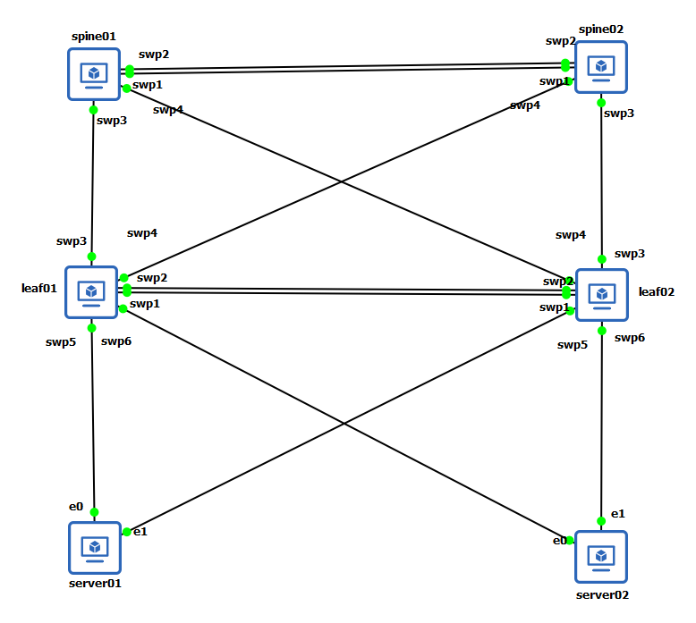
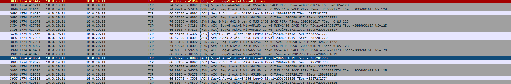
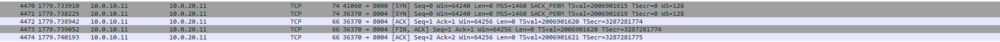

# Interface Aggregation

什麼是 Bonding (鏈路聚合) ? Linux Bonding 提供了一種將多個網路介面（Slaves）組合成單個邏輯綁定介面（Bond）的方法。好處是可用於頻寬的線性擴展、負載平衡以及故障轉移保護。

主要模式有以下:

* IEEE 802.3ad (LACP)：預設模式，將多個鏈路組合成一個鏈路聚合組 (LAG)。
* Balance-xor：根據雜湊協定標頭分配流量，適用於不支援 LACP 的 MLAG 部署。

什麼是 MLAG？ 官方說明，LACP 協定（IEEE 802.3ad）負責驗證雙連動的連接性。在 MLAG 環境中，LACP 同時運行在雙連動的設備以及兩台 MLAG 對等交換機上。每台交換機必須將連接到同一個主機的實體鏈路放入同一個 Bond 之中。

MLAG 與 LACP 的關係是相輔相成。

* LACP 是底層協議：LACP（IEEE 802.3ad）是用於管理 Bond（鏈路聚合）的標準協議，負責驗證「雙連動（Dual-connected）」的連接性。它同時運行在雙連動的伺服器以及兩台 MLAG 交換機上。
* MLAG 是邏輯擴充：MLAG 讓伺服器能透過 Bond 同時連接到兩台不同的實體交換機，並讓這兩台交換機在邏輯上看起來像一個單一交換機。
* 協作方式：MLAG 交換機會將其 LACP 合作夥伴的 MAC 地址清單發送給對等端（Peer）。如果對等交換機發現兩端的夥伴 MAC 地址匹配，且配置了相同的 clag-id，系統就會將其視為一個成功的雙連動 Bond。

[nvidia | NVUE 5.12 | MLAG](https://docs.nvidia.com/networking-ethernet-software/cumulus-linux-512/Layer-2/Multi-Chassis-Link-Aggregation-MLAG/)

[nvidia | NVUE 5.12 | Bonding](https://docs.nvidia.com/networking-ethernet-software/cumulus-linux-512/Layer-2/Bonding-Link-Aggregation/)

## Lab

實驗架構圖如下，目的是理解，LACP 和 MLAG 的協同，以及觀察封包來理解其流量。



### Spine01

```yaml
- set:
    system:
      hostname: spine01
    mlag:
      mac-address: 44:38:39:FF:EF:01
      peer-ip: linklocal
      backup:
        10.0.0.2: {} # spine02 mgm ip
      priority: 100
    bridge:
      domain:
        br_default:
          vlan:
            '10': {}
            '20': {}
    interface:
      lo:
        type: loopback
        ip:
          address:
            10.0.0.1/32: {}
      swp1:
        type: swp
      swp2:
        type: swp
      swp3:
        type: swp
      swp4:
        type: swp
      peerlink:
        description: MLAG Peer-link
        type: bond
        bond:
          mode: lacp
          member:
            swp1-2: {}
          lacp-rate: fast
        bridge:
          domain:
            br_default:
              vlan:
                10, 20: {}
      bond10:
        description: Downlink to Leaf Pair
        type: bond
        bond:
          mode: lacp
          member:
            swp3-4: {}
          mlag:
            id: 10
        bridge:
          domain:
            br_default:
              vlan:
                10, 20: {}
```

實驗中，配置有建立 `Bonding`，在配置中連接埠介面 swp1 到 swp2 是 `peerlink` 的成員，但 swp3 和 swp4 不是。

```yaml
      peerlink:
        description: MLAG Peer-link
        type: bond
        bond:
          mode: lacp
          member:
            swp1-2: {}
          lacp-rate: fast
```

當網路配置完成後，swp1-2 會是 SLAVE 模式，peerlink 是 MASTER 模式

```bash
$ ip add
1: lo: <LOOPBACK,UP,LOWER_UP> mtu 65536 qdisc noqueue state UNKNOWN group default qlen 1000
    link/loopback 00:00:00:00:00:00 brd 00:00:00:00:00:00
    inet 127.0.0.1/8 scope host lo
       valid_lft forever preferred_lft forever
    inet 1.1.1.1/32 scope global lo
       valid_lft forever preferred_lft forever
    inet6 ::1/128 scope host noprefixroute
       valid_lft forever preferred_lft forever
2: eth0: <NO-CARRIER,BROADCAST,MULTICAST,UP> mtu 1500 qdisc pfifo_fast master mgmt state DOWN group default qlen 1000
    link/ether 0c:47:9c:45:00:00 brd ff:ff:ff:ff:ff:ff
3: swp1: <BROADCAST,MULTICAST,SLAVE,UP,LOWER_UP> mtu 9216 qdisc pfifo_fast master peerlink state UP group default qlen 1000
    link/ether 0c:47:9c:45:00:01 brd ff:ff:ff:ff:ff:ff
4: swp2: <BROADCAST,MULTICAST,SLAVE,UP,LOWER_UP> mtu 9216 qdisc pfifo_fast master peerlink state UP group default qlen 1000
    link/ether 0c:47:9c:45:00:01 brd ff:ff:ff:ff:ff:ff permaddr 0c:47:9c:45:00:02
...
10: peerlink: <BROADCAST,MULTICAST,MASTER,UP,LOWER_UP> mtu 9216 qdisc noqueue master br_default state UP group default qlen 1000
    link/ether 0c:47:9c:45:00:01 brd ff:ff:ff:ff:ff:ff
...
```

Bonding (鏈路聚合) 環境中，MAC 位址的運作邏輯和對網路流量的影響是必然的。必須注意以下

1. MAC 位址的繼承與統一
    * 位址統一：在一個 Bond 介面中，所有的從屬介面（Slave interfaces）都會共用同一個與 Bond 相同的 MAC 位址。
    * 繼承來源：通常情況下，第一個加入 Bond 的從屬介面會將其 MAC 位址捐贈出來，作為整個 Bond 介面的 MAC 位址。

2. 流量轉發的角色
    * 出向流量 (Source MAC)：所有從該 Bond 介面發出的流量，都會使用這個 Bond MAC 位址作為來源 MAC。
    * 入向流量 (Destination MAC)：這個 Bond MAC 位址提供了唯一的目標位址，讓對端設備能將流量引導至該 Bond 聚合組。
3. 移除成員介面的影響
    * 介面震盪 (Interface Flapping)：如果移除的成員介面正好是當初提供 MAC 位址的那個介面，Bond 介面會為了更新 MAC 位址而產生震盪。
    * 流量中斷：在更新 MAC 位址的震盪過程中，會對目前的網路流量傳輸造成影響。

MLAG 配置，這部分定義了兩台 Spine 如何成為一個邏輯實體。MLAG 運作機制，將其對等端的 LACP Partner MAC 清單進行交換（透過 clagd 服務）。如果 Bond 兩端的夥伴 MAC 位址與 clag-id 匹配，則該 Bond 被視為雙連動成功。

* `mac-address: 44:38:39:FF:EF:01`：這是 MLAG Pair 共同對外的虛擬 MAC 位址。當下層的 Leaf 交換機透過 LACP 連接時，會認為這兩台 Spine 是同一台設備。
* `peer-ip: linklocal`：指定 MLAG 控制平面（clagd）通訊的 IP 位址。使用 linklocal 代表交換機會自動透過 Peer-link 發現對端，不需手動指定靜態 IP。
* `backup: 10.0.0.2`：這是備援心跳路徑，指向 spine02 的管理 IP。當主要的 Peer-link 斷線時，系統會透過此路徑確認對手是否還活著，防止出現「雙主機（Split-brain）」導致網路癱瘓。
* `priority: 100`：設定 MLAG 的優先級。數值越小優先權越高，因此 spine01（100）會成為 Primary 角色，而 spine02（200）則為 Secondary。

在交換器上可以注意 `interface` 配置。再配置中都將 Bond 加入 VLAN-aware Bridge (預設為 br_default)

1. peerlink
    * 將 `swp1` 與 `swp2` 綑綁成一個 LACP Bond。
    * 這是 MLAG 的核心，負責同步兩台交換機之間的 MAC 地址表、ARP 資訊以及 LACP 狀態。
    * Bridge 配置，在此處必須允許 VLAN 10 與 20 通過，否則當流量發生不對稱路徑時（例如流量從 Spine01 進但從 Spine02 出），封包會無法在兩台交換機間傳遞。
2. Downlink (bond10)
    * `mlag id: 10`：這是關鍵的設定。它告訴系統，這個連往下層 Leaf 的 Bond 是跨設備的。spine01 的 swp3-4 會與 spine02 的 swp3-4 協作，共同對下層呈現為一個單一的 LACP 聚合組。
    * 在此 Bond 上允許了 VLAN 10 與 20，確保來自 Leaf 的業務流量可以進入 Spine 層進行交換。
    * 對向連接的 Bond 必須在兩端設定相同的 clag-id (MLAG ID)

透過 `mlag id 10` 配置，Leaf 交換機可以同時使用連向 spine01 和 spine02 的所有線路，而不會被生成樹協定（STP）阻斷。這不僅頻寬加倍，更提供了設備等級的備援。

要查看 Bonding 介面的資訊可以透過以下指令或是透過 `cat /proc/net/bonding/{INTERFACE_NAME}`

```bash
$ nv show interface bond10 bond
             operational  applied
-----------  -----------  -------
down-delay   0            0
lacp-bypass  off          off
lacp-rate    fast         fast
mode         lacp         lacp
up-delay     0            0
[member]     swp3         swp3
[member]     swp4         swp4
mlag
  enable                  on
  id         10           10
  status     single
```

要查看 MLAG 配置資訊可以透過以下指令

```bash
spine01:mgmt:~$  nv show mlag
                operational            applied
--------------  ---------------------  -----------------
enable          on                     on
mac-address     44:38:39:ff:ef:01      44:38:39:FF:EF:01
peer-ip         fe80::e16:7fff:fe62:1  linklocal
priority        100                    100
init-delay      180                    180
debug           off                    off
[backup]        10.0.0.2               10.0.0.2
peer-priority   200
backup-active   False
local-id        0c:74:44:de:00:01
peer-id         0c:16:7f:62:00:01
local-role      primary
peer-role       secondary
peer-interface  peerlink.4094
peer-alive      True
backup-reason
```

以 spine 配置來看，bond10 為 MLAG 配置，主要有 `mlag.id` 配置，這代表 swp3 和 swp4 是連向下層 Leaf Pair 的成員。透過這個 ID，spine01 與 spine02 會協作將此 Bond 呈現*為一個單一的邏輯 LACP 夥伴給下層設備*。peerlink 為標準 Bonding 配置，這是兩台 MLAG 對等交換機之間的直連同步鏈路（Inter-chassis Bond）。但其用途是作為 MLAG 運作的底層通道，用於同步 MAC 位址與 LACP 狀態。

|配置特徵|標準 Bonding (LAG)|MLAG Bond (Dual-connected)|
|---|---|---|
|介面類型|type: bond|type: bond|
|mlag id / clag-id|無 (或值為 0)|必須有 (1-65535)
|對端視角|連接到單一實體交換機|連接到單一邏輯交換機 (跨兩實體設備)|
|用途|一般伺服器上聯、Peer-link|跨設備備援、伺服器雙上聯|

上述的流程和官方文件，簡單說明 MLAG 基本配置步驟:

  1. 在對端設備（伺服器或交換機）上建立 LACP Bond。
  2. 在 MLAG 對等交換機上，將連接對端設備的所有介面放入 Bond。
  3. 分配唯一的 MLAG ID：必須為每個雙連動 Bond 分配 ID（1-65535），且兩台對等交換機上的 ID 必須相同。
  4. 將 Bond 加入 VLAN-aware Bridge (預設為 br_default)。
  5. 配置 Inter-chassis Bond (Peer-link)：包含系統 MAC 位址以及備援 (Backup) IP 路徑。

  > 備援 IP 必須是 Layer 3 介面，且不可與 Peer-link IP 相同。

### Spine02

```yaml
- set:
    system:
      hostname: spine02
    mlag:
      mac-address: 44:38:39:FF:EF:01
      peer-ip: linklocal
      backup:
        10.0.0.1: {} # spine01 mgm ip
      priority: 200
    bridge:
      domain:
        br_default:
          vlan:
            '10': {}
            '20': {}
    interface:
      lo:
        type: loopback
        ip:
          address:
            10.0.0.2/32: {}
      swp1:
        type: swp
      swp2:
        type: swp
      swp3:
        type: swp
      swp4:
        type: swp
      peerlink:
        description: MLAG Peer-link
        type: bond
        bond:
          mode: lacp
          member:
            swp1-2: {}
          lacp-rate: fast
        bridge:
          domain:
            br_default:
              vlan:
                10, 20: {}
      bond10:
        description: Downlink to Leaf Pair
        type: bond
        bond:
          mode: lacp
          member:
            swp3-4: {}
          mlag:
            id: 10
        bridge:
          domain:
            br_default:
              vlan:
                10, 20: {}
```

### leaf01

```yaml
- set:
    system:
      hostname: leaf01
      global:
        fabric-mac: 00:00:5E:00:01:FF
    mlag:
      mac-address: 44:38:39:FF:EF:02
      peer-ip: linklocal
      backup:
        2.2.2.2: {}
      priority: 100
    bridge:
      domain:
        br_default:
          vlan:
            '10': {}
            '20': {}
    interface:
      lo:
        type: loopback
        ip:
          address:
            1.1.1.1/32: {}
      swp1:
        type: swp
      swp2:
        type: swp
      swp3:
        type: swp
      swp4:
        type: swp
      swp5:
        type: swp
      swp6:
        type: swp
      peerlink:
        description: MLAG Peer-link
        type: bond
        bond:
          mode: lacp
          member:
            swp1-2: {}
          lacp-rate: fast
        bridge:
          domain:
            br_default:
              vlan:
                10, 20: {}
      bond20:
        description: uplink to spine Pair
        type: bond
        bond:
          mode: lacp
          member:
            swp3-4: {}
          mlag:
            id: 20
        bridge:
          domain:
            br_default:
              vlan:
                10, 20: {}
      bond31:
        description: server01
        type: bond
        bond:
          member:
            swp5: {}
          mlag:
            id: 31
        bridge:
          domain:
            br_default:
              untagged: 10
      bond32:
        description: server02
        type: bond
        bond:
          member:
            swp6: {}
          mlag:
            id: 32
        bridge:
          domain:
            br_default:
              untagged: 20
      vlan10:
        type: svi
        vlan: 10
        ip:
          address:
            10.0.10.2/24: {}
          vrr:
            address:
              10.0.10.1/24: {}
            enable: on
            state:
              up: {}
      vlan20:
        type: svi
        vlan: 20
        ip:
          address:
            10.0.20.2/24: {}
          vrr:
            address:
              10.0.20.1/24: {}
            enable: on
            state:
              up: {}
```

leaf 中 bond20 是連至 spine 上，這邊 MLAG 是 20。會有疑問說為何不是 10 ? 匹配規則是

* 同儕間必須一致，clag-id 的核心要求是 MLAG 對等交換機（Peer Switches）之間必須相同
  * spine01 和 spine02 針對連接 Leaf 的 bond10 都必須使用 id 10
  * leaf01 和 leaf02 針對連接 Spine 的 bond20 都必須使用 id 20

跨層級不需要一致，Spine 使用的 ID（10）與 Leaf 使用的 ID（20）不需要相同。這是因為這兩對交換機分別屬於兩個獨立的邏輯系統。

### leaf02

```yaml
- set:
    system:
      hostname: leaf02
      global:
        fabric-mac: 00:00:5E:00:01:FF
    mlag:
      mac-address: 44:38:39:FF:EF:02
      peer-ip: linklocal
      backup:
        1.1.1.1: {}
      priority: 200
    bridge:
      domain:
        br_default:
          vlan:
            '10': {}
            '20': {}
    interface:
      lo:
        type: loopback
        ip:
          address:
            2.2.2.2/32: {}
      swp1:
        type: swp
      swp2:
        type: swp
      swp3:
        type: swp
      swp4:
        type: swp
      swp5:
        type: swp
      swp6:
        type: swp
      peerlink:
        description: MLAG Peer-link
        type: bond
        bond:
          mode: lacp
          member:
            swp1-2: {}
          lacp-rate: fast
        bridge:
          domain:
            br_default:
              vlan:
                10, 20: {}
      bond20:
        description: uplink to spine Pair
        type: bond
        bond:
          mode: lacp
          member:
            swp3-4: {}
          mlag:
            id: 20
        bridge:
          domain:
            br_default:
              vlan:
                10, 20: {}
      bond31:
        description: server01
        type: bond
        bond:
          member:
            swp5: {}
          mlag:
            id: 31
        bridge:
          domain:
            br_default:
              untagged: 10
      bond32:
        description: server02
        type: bond
        bond:
          member:
            swp6: {}
          mlag:
            id: 32
        bridge:
          domain:
            br_default:
              untagged: 20
      vlan10:
        type: svi
        vlan: 10
        ip:
          address:
            10.0.10.3/24: {}
          vrr:
            address:
              10.0.10.1/24: {}
            enable: on
            state:
              up: {}
      vlan20:
        type: svi
        vlan: 20
        ip:
          address:
            10.0.20.3/24: {}
          vrr:
            address:
              10.0.20.1/24: {}
            enable: on
            state:
              up: {}
```

### Server

server01:

```yaml
network:
  version: 2
  ethernets:
    enp2s0: {}
    enp2s1: {}
  bonds:
    bond0:
      interfaces: [enp2s0, enp2s1]
      addresses: [10.0.10.11/24]
      parameters:
        mode: 802.3ad
        mii-monitor-interval: 100
        lacp-rate: fast
        transmit-hash-policy: layer3+4
      routes:
        - to: default
          via: 10.0.10.1
```

server02:

```yaml
network:
  version: 2
  ethernets:
    enp2s0: {}
    enp2s1: {}
  bonds:
    bond0:
      interfaces: [enp2s0, enp2s1]
      addresses: [10.0.20.11/24]
      parameters:
        mode: 802.3ad
        mii-monitor-interval: 100
        lacp-rate: fast
        transmit-hash-policy: layer3+4
      routes:
      - to: default
        via: 10.0.20.1
```

要讓 server 之間能夠通訊，需要注意幾件事。

1. Server 路由

    透過 vrr 的方式，需要將預設路由指向 `Anycast Gateway`

    ```bash
    $ ip route
    default via 10.0.10.1 dev bond0 proto static
    10.0.10.0/24 dev bond0 proto kernel scope link src 10.0.10.11
    ```

2. Peer-link

    在 MLAG 架構中，如果 Server01 的流量發送到 Leaf01，但 Server02 當前的主路徑在 Leaf02 上，Leaf01 必須透過 Peer-link 將流量轉發給 Leaf02。如果 `bond0` 沒有允許 VLAN 10 與 20 通過，流量就會在交換機之間被丟棄。

    ```yaml
    ...
      peerlink:
        description: MLAG Peer-link
        type: bond
        bond:
          mode: lacp
          member:
            swp1-2: {}
          lacp-rate: fast
        bridge:
          domain:
            br_default:
              vlan:
                10, 20: {}
    ```

3. 交換器路由表

    ```bash
    # leaf01
    $ nv show vrf default router rib ipv4
    route
    ========

        Flags - * - selected, q - queued, o - offloaded, i - installed, S - fib-
        selected, x - failed

        Route         Protocol   Distance  ResolvedVia  ResolvedViaIntf  Uptime                NHGId  Metric  TableId  Flags
        ------------  ---------  --------  -----------  ---------------  --------------------  -----  ------  -------  -----
        1.1.1.1/32    connected  0                                       2026-02-22T02:47:34Z  4      0                *Sio
        10.0.10.0/24  connected  0                                       2026-02-22T03:00:04Z  74     1024             o
                    connected  0                                       2026-02-22T03:00:04Z  57     0                *Sio
        10.0.20.0/24  connected  0                                       2026-02-22T03:00:04Z  75     1024             o
                    connected  0                                       2026-02-22T03:00:04Z  59     0                *Sio
    ```

    > 靜態路由是用來告訴交換機如何到達非直連的網路（例如隔壁機櫃的網段）。但在本實驗中，兩個 VLAN 的介面都直接長在同一台 Leaf 上，交換機天生就知道這兩個租戶怎麼走，這叫做 Connected Routing。

4. MAC 表

    `e2:90:41:2e:f2:a0` 為 server01 的網卡 MAC，其 VLAN 要在 10，如果為 1 則配置需要修正，否則流量會被丟棄。

    ```bash
    cumulus@leaf01:mgmt:~$ nv show bridge domain br_default mac-table
    entry-id  MAC address        vlan  interface   remote-dst  src-vni  entry-type  last-update  age
    --------  -----------------  ----  ----------  ----------  -------  ----------  -----------  -------
    1         0c:3e:c2:84:c3:bb  20    peerlink                         static      2:33:33      0:02:44
    ...
    20        e2:90:41:2e:f2:a0  10    bond31                                       0:00:04      1:48:34
    21        0c:47:9c:45:00:05        bond31                           permanent   1:50:03      1:50:03
    22        06:54:a7:2d:78:9c  20    bond32                                       0:00:04      1:47:40
    23        0c:47:9c:45:00:06        bond32                           permanent   1:50:02      1:50:02
    ```

> 如果交換機說 LACP 但伺服器不說或只說簡單的靜態綑綁，連線將會失敗

### 驗證

#### Spine MLAG 驗證

```bash
    spine01:mgmt:~$ nv show mlag
                    operational            applied
    --------------  ---------------------  -----------------
    enable          on                     on
    mac-address     44:38:39:ff:ef:01      44:38:39:FF:EF:01
    peer-ip         fe80::e16:7fff:fe62:1  linklocal
    priority        100                    100
    init-delay      180                    180
    debug           off                    off
    [backup]        10.0.0.2               10.0.0.2
    peer-priority   200
    backup-active   False
    local-id        0c:74:44:de:00:01
    peer-id         0c:16:7f:62:00:01
    local-role      primary
    peer-role       secondary
    peer-interface  peerlink.4094
    peer-alive      True
    backup-reason
```

```bash
    spine02:mgmt:~$ nv show mlag
                    operational            applied
    --------------  ---------------------  -----------------
    enable          on                     on
    mac-address     44:38:39:ff:ef:01      44:38:39:FF:EF:01
    peer-ip         fe80::e74:44ff:fede:1  linklocal
    priority        200                    200
    init-delay      180                    180
    debug           off                    off
    [backup]        10.0.0.1               10.0.0.1
    peer-priority   100
    backup-active   False
    local-id        0c:16:7f:62:00:01
    peer-id         0c:74:44:de:00:01
    local-role      secondary
    peer-role       primary
    peer-interface  peerlink.4094
    peer-alive      True
    backup-reason
```

1. **角色分配正確**：

    * `spine01` 的 `priority` 為 **100**，被選為 **primary (主控)**。
    * `spine02` 的 `priority` 為 **200**，被選為 **secondary (從屬)**。

2. **連線狀態正常**：

    * 兩台設備的 `peer-alive` 均顯示為 **True**，代表兩台交換機之間已成功透過 `peerlink.4094` 建立通訊。
    * `peer-interface` 顯示為 `peerlink.4094`，這是 NVUE 自動為 Peer-link 建立的子介面，完全符合標準規範。

3. **系統 MAC 一致**：
    * 兩台設備的 `mac-address` 均為 `44:38:39:ff:ef:01`。
    * 此 MAC 地址位於 NVIDIA 保留給 MLAG 使用的合法範圍內 (`44:38:39:ff:00:00` - `44:38:39:ff:ff:ff`)。

另外，會注意到 `backup-active` 顯示為 **False**，這在目前的狀態下是**完全正確且正常的**：

* **正常運作模式**：當 Peer-link（主要通訊路徑）處於 `up` 狀態時，備援路徑（Backup path）會處於待命狀態，因此顯示為 `False`。
* **備援作用**：只有當主要 Peer-link 斷開時，`backup-active` 才會轉為 `True`，用來執行心跳檢測以防止雙主 (Split-brain) 情況發生。

Leaf 也有綁定 MLAG，驗證也是同理。下面是 leaf01 的狀態。

```bash
cumulus@leaf01:mgmt:~$ nv show mlag
                operational            applied
--------------  ---------------------  -----------------
enable          on                     on
mac-address     44:38:39:ff:ef:02      44:38:39:FF:EF:02
peer-ip         fe80::e3e:84ff:fef4:1  linklocal
priority        100                    100
init-delay      180                    180
debug           off                    off
[backup]        2.2.2.2                2.2.2.2
peer-priority   200
backup-active   False
local-id        0c:47:9c:45:00:01
peer-id         0c:3e:84:f4:00:01
local-role      primary
peer-role       secondary
peer-interface  peerlink.4094
peer-alive      True
backup-reason

```

#### LACP 協商驗證

以下使用 leaf 進行驗證，原則上 spine 可以同樣方式進行驗證。

1. 檢查 Bond 狀態

  ```bash
  cumulus@leaf01:mgmt:~$ nv show interface bond31 bond
                    operational  applied
  ----------------  -----------  -------
  down-delay        0            0
  lacp-bypass       off          off
  lacp-rate         fast         fast
  mode              lacp         lacp
  up-delay          0            0
  [member]          swp5         swp5
  mlag
    enable                       on
    id              31           31
    peer-interface  bond31
    status          dual
  ```

  * MLAG 中 `Status` 應顯示為 `dual`。這代表兩台 MLAG 對等交換機都已偵測到該 Bond 且狀態同步。
  * `mode` 為 `lacp`

2. LACP 成員細節

  ```bash
  cumulus@leaf01:mgmt:~$ nv show interface bond31 bond mlag
                  operational  applied
  --------------  -----------  -------
  enable                       on
  id              31           31
  peer-interface  bond31
  status          dual
  ```
  * 確認 id、peer-interface 是否為預期配置，在 bond31 上實驗環境是綁定 swp5 介面

#### 資料平面與轉發驗證

1. MAC 表

```bash
$ nv show bridge domain br_default mac-table
entry-id  MAC address        vlan  interface   remote-dst  src-vni  entry-type  last-update  age
--------  -----------------  ----  ----------  ----------  -------  ----------  -----------  -------
1         0c:3e:c2:84:c3:bb  20    peerlink                         static      1:18:05      0:02:04
2         0c:3e:c2:84:c3:bb  10    peerlink                         static      1:18:05      0:03:21
3         0c:47:9c:45:00:01  1     peerlink                         permanent   1:18:12      1:18:12
4         0c:47:9c:45:00:01        peerlink                         permanent   1:18:12      1:18:12
5         06:54:a7:2d:78:9c  20    bond32                                       0:02:04      0:15:40
6         0c:47:9c:45:00:06        bond32                           permanent   1:18:12      1:18:12
7         0e:16:7f:62:00:04  1     bond20                                       0:00:03      1:14:34
8         0e:16:7f:62:00:03  1     bond20                                       0:01:03      1:15:03
9         0e:74:44:de:00:04  1     bond20                                       0:01:03      1:15:03
10        0e:74:44:de:00:03  1     bond20                                       0:00:03      1:15:03
11        0c:74:44:de:00:03  1     bond20                                       0:00:00      1:15:04
12        0c:47:9c:45:00:03  1     bond20                           permanent   1:18:12      1:18:12
13        0c:47:9c:45:00:03        bond20                           permanent   1:18:12      1:18:12
14        e2:90:41:2e:f2:a0  10    bond31                                       0:03:21      0:17:35 # server01
15        0c:47:9c:45:00:05        bond31                           permanent   1:18:12      1:18:12
16        00:00:5e:00:01:ff        br_default                       permanent
17        00:00:5e:00:01:ff  20    br_default                       permanent   1:18:12      1:18:12
18        0c:47:c2:9c:45:07  20    br_default                       permanent   1:18:12      1:18:12
19        00:00:5e:00:01:ff  10    br_default                       permanent   1:18:12      1:18:12
20        0c:47:c2:9c:45:07  10    br_default                       permanent   1:18:12      1:18:12
21        0c:47:c2:9c:45:07  1     br_default                       permanent   1:18:12      1:18:12
22        0c:47:c2:9c:45:07        br_default                       permanent   1:18:12      1:18:12
```

MAC 地址透過 bond31 與 bond32 學習，並非原先的初始介面(swp5)。且 VLAN 也正確的綁定，並非預設的 1。

2. Anycast Gateway 測試

從伺服器 Ping 虛擬閘道 IP（10.0.10.1)，確認伺服器的 ARP 表中，閘道 IP 對應的是你設定的虛擬 MAC (address-virtual)

```bash
~$ ping 10.0.10.1
PING 10.0.10.1 (10.0.10.1) 56(84) bytes of data.
64 bytes from 10.0.10.1: icmp_seq=1 ttl=64 time=2.13 ms
64 bytes from 10.0.10.1: icmp_seq=2 ttl=64 time=0.351 ms
^C
--- 10.0.10.1 ping statistics ---
2 packets transmitted, 2 received, 0% packet loss, time 1002ms

$ ip neighbor show
10.0.10.3 dev bond0 lladdr 0c:3e:c2:84:c3:bb STALE
10.0.10.2 dev bond0 lladdr 0c:47:c2:9c:45:07 STALE
10.0.10.1 dev bond0 lladdr 00:00:5e:00:01:ff STALE
fe80::e3e:c2ff:fe84:c3bb dev bond0 lladdr 0c:3e:c2:84:c3:bb router STALE
fe80::e47:c2ff:fe9c:4507 dev bond0 lladdr 0c:47:c2:9c:45:07 router STALE
```

透過 `ip neighbor show` 看到 10.0.10.1 學習到了其對應設定的虛擬 MAC (00:00:5e:00:01:ff)，下面指令可以看到在 leaf01 上設定的虛擬 MAC。

```bash
cumulus@leaf01:mgmt:~$ nv show interface vlan10-v0 link
                         operational              applied
-----------------------  -----------------------  -------
admin-status             up
oper-status              up
oper-status-last-change  2026/02/27 04:25:51.003
protodown                disabled
mac-address              00:00:5e:00:01:ff
mtu                      9216
stats
  in-bytes               534 Bytes
  in-pkts                54
  in-drops               0
  in-errors              0
  out-bytes              4.17 KB
  out-pkts               67
  out-drops              0
  out-errors             0
  carrier-transitions    3
  carrier-up-count       2
  carrier-down-count     1
```

#### peerlink 為何不用 clag-id ?

簡單來說，`clag-id`（或 `mlag id`）的作用是讓兩台交換機「協作」去欺騙**第三方設備**；而 `peerlink` 是兩台交換機之間的**私有通道**，它們不需要互相欺騙。

以下是為什麼 `peerlink` 不需要也不應該定義 `clag-id` 的三個核心原因：

1. `clag-id` 是為了識別「第三方設備」

* 根據官方文件，`clag-id` 必須分配給每一個「雙連動（Dual-connected）」的 Bond。
* 當 `spine01` 和 `spine02` 同時連向 `leaf01` 時，它們需要透過相同的 `clag-id`（例如 10）來告訴彼此：「我們在 swp3/4 看到的夥伴是同一個人」。
* `peerlink` 特性是交換機對等體之間的直接連線，並不連接到第三方主機或交換機，因此不需要透過 ID 來比對夥伴身份。

2. Peer-link 角色由全域配置定義

* 交換機並不是透過 `clag-id` 來識別 `peerlink`，而是透過特定的 `mlag` 全域設定。
* 關鍵參數：
  * **`peer-ip`**：定義了透過哪個 IP 進行控制平面（`clagd`）的同步。
  * **`mac-address` (System MAC)**：定義了兩台交換機合體後的邏輯身分。
* 介面指定，在 NVUE 中，直接將介面標記為 `type: bond` 並作為 `mlag` 的 `peer-interface`（或直接命名為 `peerlink`），系統就會知道這是內部通道，而非對外業務 Bond。

3. 防止邏輯衝突與迴圈

* 控制與數據，`peerlink` 承載的是 MLAG 的控制協定（如同步 MAC 地址表、LACP 狀態）。
* 如果為 `peerlink` 定義了 `clag-id`，系統會試圖在 `peerlink` 上運行 MLAG 同步邏輯。這會產生矛盾：`peerlink` 必須先建立，MLAG 才能同步；但若 `peerlink` 變成了 MLAG Bond，它就必須等待自己同步完成才能建立，這會導致邏輯死鎖（Deadlock）。

透過下表可以更清楚比較

| 功能特性 | 標準 MLAG Bond (`bond10`) | Peer-link (`bond0`) |
| --- | --- | --- |
| 連接對象 | 外部設備 (Server/Leaf) | 另一台對等交換機 |
| 是否需 `clag-id` | 是 (用於識別同一個 Partner) | 否 (內部直連) |
| 協定 | LACP (802.3ad) | `clagd` 控制同步協議 |
| 角色目的| 頻寬翻倍與對外冗餘 | 狀態同步與防止 Split-brain |

### 封包觀察

#### LACP 控制封包

LACP 封包格式

 From https://milestone-of-se.nesuke.com/en/nw-basic/link-aggregation/lacp-format/

觀察 spine01 的 swp3 介面。以下是第二個封包資訊

```bash
Link Aggregation Control Protocol
    LACP Version: 0x01
    TLV Type: Actor Information (0x01)
    TLV Length: 0x14
    Actor System Priority: 65535
    Actor System ID: CumulusNetwo_ff:ef:01 (44:38:39:ff:ef:01) # Spine Pair 的邏輯身分
    Actor Key: 9 # 此欄位表示連接埠的鍵值。由系統根據連接埠配置生成，包括Trunk ID、介面速率、雙工模式等。該值是決定連接埠能否成為LAG成員的關鍵因素。
    Actor Port Priority: 255 # 此欄位表示介面的優先權。
    Actor Port: 1 # 此欄位表示連接埠號碼。它是根據演算法產生的，並由插槽 ID、子卡 ID 和介面連接埠號碼決定。
    Actor State: 0x3f, LACP Activity, LACP Timeout, Aggregation, Synchronization, Collecting, Distributing
    .... ...1 = LACP Activity: Active
    .... ..1. = LACP Timeout: Short Timeout
    .... .1.. = Aggregation: Aggregatable
    .... 1... = Synchronization: In Sync
    ...1 .... = Collecting: Enabled
    ..1. .... = Distributing: Enabled
    .0.. .... = Defaulted: No
    0... .... = Expired: No

    [Actor State Flags: **DCSGSA]
    Reserved: 000000
    TLV Type: Partner Information (0x02)
    TLV Length: 0x14
    Partner System Priority: 65535 # 此欄位表示對等系統的優先權
    Partner System: CumulusNetwo_ff:ef:02 (44:38:39:ff:ef:02) # Leaf Pair 的邏輯身分
    Partner Key: 9 # 此欄位表示對等連接埠的鍵值
    Partner Port Priority: 255
    Partner Port: 1 # 此欄位表示對端連接埠號碼。
    Partner State: 0x3f, LACP Activity, LACP Timeout, Aggregation, Synchronization, Collecting, Distributing
    .... ...1 = LACP Activity: Active
    .... ..1. = LACP Timeout: Short Timeout
    .... .1.. = Aggregation: Aggregatable
    .... 1... = Synchronization: In Sync
    ...1 .... = Collecting: Enabled
    ..1. .... = Distributing: Enabled
    .0.. .... = Defaulted: No
    0... .... = Expired: No
    [Partner State Flags: **DCSGSA]
    Reserved: 000000
    TLV Type: Collector Information (0x03)
    TLV Length: 0x10
    Collector Max Delay: 0
    Reserved: 000000000000000000000000
    TLV Type: Terminator (0x00)
    TLV Length: 0x00
    Pad: 0000000000000000000000000000000000000000000000000000000000000000000000000000000000000000000000000000
```

1. Actor (本地端：Spine) 資訊解析

這部分顯示了 Spine01 對外宣告的資訊

* `Actor System ID: 44:38:39:ff:ef:01`。這是你在 MLAG 全域配置中設定的虛擬 MAC 位址。
  * spine01 與 spine02 會發送完全相同的 System ID，讓下端的 Leaf 認為它只連接到一台邏輯設備。
* `Actor State: 0x3f (DCSGSA)`
  * 這代表介面處於最高運作狀態
  * Distributing (D) 與 Collecting (C)：表示此介面已經可以正常收發數據流量
  * Synchronization (S)：代表與夥伴的參數已達成一致並成功聚合

2. Partner (對端：Leaf) 資訊解析

這部分顯示了 Spine 從 Leaf 那端收到的資訊

* `Partner System: 44:38:39:ff:ef:02`。這是 Leaf Pair 的 MLAG 虛擬 MAC 位址。
  * 這說明 leaf01 與 leaf02 也成功合體，並以 ef:02 這個身分與 Spine 溝通。
* `Partner State: 0x3f`。代表 Leaf 端也已經準備好，將此鏈路視為聚合組的一部分進行收發

3. 讓 MLAG 達成 dual 原因

* System ID 一致性
* Key 匹配，雙方的 Key (9) 匹配，代表兩端的介面屬性已經達成共識。
* 狀態同步，雙方的狀態旗標都是 `0x3f`，這在 Linux Bonding 驅動程式中代表 MII Status 為 up 且協商完成，因此 nv show 才會轉為 dual。

4. 另外補充 LACP 狀態位元表 (Bit Field)

當看到 `0x3f` 時，這代表前 6 個位元全部為 1（二進制為 00111111），這是 LACP 介面達到完全運作（Fully Operational）的最理想狀態。

以下是 Actor State 各個位元的詳細描述列表:

LACP 狀態位元表 (Bit Field)

| 位元 (Bit) | 旗標名稱 (Flag) | 縮寫 | 描述 (Value = 1 時) |
| --- | --- | --- | --- |
| **Bit 0** | **LACP Activity** | **A** | **Active（啟動）**：介面會主動發送 LACPDU 封包進行協商。 |
| **Bit 1** | **LACP Timeout** | **T** | **Short Timeout (Fast)**：使用快速速率（每秒）發送封包。若為 0 則為 Slow（30秒）。 |
| **Bit 2** | **Aggregation** | **G** | **Aggregatable（可聚合）**：此鏈路被視為可以與其他鏈路組合成一個聚合組（Bond）。 |
| **Bit 3** | **Synchronization** | **S** | **In Sync（已同步）**：本地端與夥伴端的參數匹配，已經準備好進入聚合組。 |
| **Bit 4** | **Collecting** | **C** | **Collecting（收集）**：此介面已開始接收來自對端的數據流量。 |
| **Bit 5** | **Distributing** | **D** | **Distributing（分發）**：此介面已開始向對端發送數據流量。 |
| **Bit 6** | **Default** | **-** | **Defaulted**：若為 1，代表未收到對端封包，正在使用預設值（通常故障時出現）。 |
| **Bit 7** | **Expired** | **-** | **Expired**：若為 1，代表在規定的時間內沒有收到對端的 LACPDU，狀態即將失效。 |

在封包上看到的 `DCSGSA` 是

* **D (Distributing)**: 已在發送流量。
* **C (Collecting)**: 已在接收流量。
* **S (Synchronization)**: 雙方參數匹配，同步完成。
* **G (Aggregation)**: 此鏈路已成功聚合到 Bond 介面中。
* **S (Short Timeout)**: 當前使用 `lacp-rate fast` 運作。
* **A (Activity)**: 處於 Active 模式主動溝通。

#### 負載平衡 (Load Balancing)

在實驗拓樸中，leaf02 的 swp5 與 swp6 分別連接到不同的伺服器（server01 與 server02）。要從這兩個介面觀察負載平衡，需要區分*單一伺服器的流量分佈*與*整體交換機的流量分配*：

1. 單一伺服器的負載平衡 (跨設備 LACP)

對於 server01 而言，它的負載平衡是發生在 leaf01:swp5 與 leaf02:swp5 之間。當 server01 傳送大量不同連線（Flows）的流量時，伺服器的 Bonding 驅動會進行雜湊（Hash）。會發現部分流量進入 leaf01:swp5，另一部分流量進入 leaf02:swp5。這證明了伺服器端正將負載分佈到 MLAG Pair 的兩台交換機上。

在 server01 配置上設定了 `transmit-hash-policy: layer3+4`，否則預設使用 `layer2 (0)` 雜湊運算僅會參考：

* 來源 MAC 地址 (Source MAC)
* 目的 MAC 地址 (Destination MAC)

這選項會影響流量的分配，再配置時需要思考。透過下面方式檢查該網路介面是否設定為 `layer3+4`

```bash
$ cat /proc/net/bonding/bond0 | grep "Hash Policy"
Transmit Hash Policy: layer3+4 (1)
```

`layer3+4` 會透過 IP + Port 進行雜湊驗算來讓介面可以分流。因此在 server02 開多個 Port

```bash
nc -l -p 8005 > /dev/null &
nc -l -p 8004 > /dev/null &
nc -l -p 8003 > /dev/null &
nc -l -p 8002 > /dev/null &
nc -l -p 8001 > /dev/null &
```

再 Server01 進行對 server02 Port 連線

```bash
python3 -c "import socket; [socket.socket(socket.AF_INET, socket.SOCK_STREAM).connect_ex(('10.0.20.11', p)) for p in range(8000, 8005)]"
```

觀察 server01 對 leaf01 的 swp5 和 leaf02 的 swp5 分流





#### 故障切換

1. MLAG 同儕交換機故障

停止 leaf02 節點。

MLAG 角色切換，peer-alive 變為 False。server01 的所有上行流量會透過其本地的 LACP 機制，全部導向仍存活的 leaf01 的 swp5 和 leaf01 的 swp6。

```bash
cumulus@leaf01:mgmt:~$ nv show mlag
                operational            applied
--------------  ---------------------  -----------------
enable          on                     on
mac-address     44:38:39:ff:ef:02      44:38:39:FF:EF:02
peer-ip         fe80::e3e:84ff:fef4:1  linklocal
priority        100                    100
init-delay      180                    180
debug           off                    off
[backup]        2.2.2.2                2.2.2.2
peer-priority   32768
backup-active   False
local-id        0c:47:9c:45:00:01
peer-id         00:00:00:00:00:00
local-role      primary
peer-role       secondary
peer-interface  peerlink.4094
peer-alive      False
backup-reason
```

## 總結

在單一線路、單一設備的架構中，只要任何一根電纜被踢掉或一台交換機故障，整個業務就會中斷。為了達成「高可用性 (High Availability)」，我們需要：

* 頻寬加倍
* 備援容錯

所以可以透過 LACP 和 MLAG 的協同達到目標，MLAG 與 LACP 核心優勢

* 冗餘性與吞吐量：提供更高的系統冗餘，並增加整體傳輸頻寬。
* Active-Active：即使連向兩台不同的實體交換機，伺服器仍能同時使用所有線路進行轉發。
