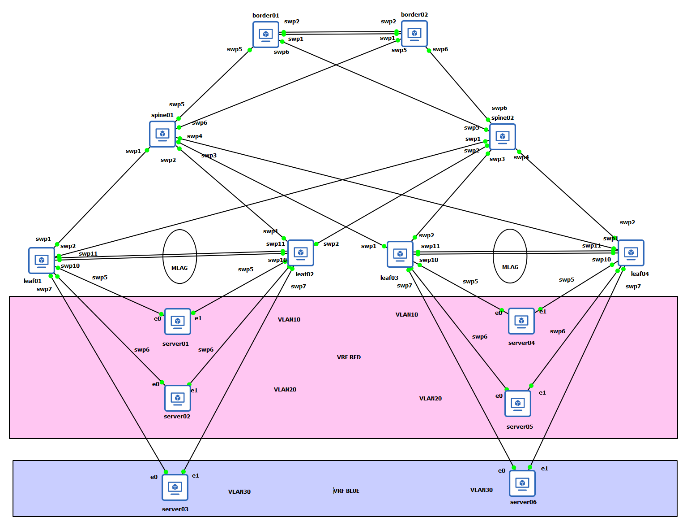

# EVPN 與 VRR (Virtual Router Redundancy)

## EVPN

1. EVPN 核心定義與目的

    * **控制層面 (Control Plane)：** EVPN 是一種基於標準（RFC 7432 / 8365）的 **VXLAN 控制層面**，用來解決傳統 VXLAN 依賴「洪水與學習 (Flood-and-Learn)」機制的擴展性問題。
    * **協定基礎：** 利用 **MP-BGP** 交換資訊，並使用 BGP-MPLS IP VPN 技術。
    * **功能：** 不僅支援同網段的 **L2 Bridging**，也支援不同網段間的 **L3 Routing**，並原生支援多租戶 (Multi-tenancy)。
    * 在 Cumulus Linux 中，EVPN 是透過 **FRR (Free Range Routing)** 軟體來運作。

2. 關鍵技術特性

    EVPN 提供了多項高級網路功能，提升了資料中心的效率與靈活性：

    * **路徑類型 (Route Types)：**
      * **Type-2 (MAC/IP)：** 用於通告主機的 MAC 與 IP 位址。
      * **Type-3 (Inclusive Multicast)：** 處理 VNI 的成員關係與 BUM 流量。
      * **Type-5 (IP Prefix)：** 用於通告外部路由或 L3 網段資訊。
    * **效率優化：**
      * **ARP/ND 抑制：** VTEP 會攔截 ARP 請求，減少 VXLAN 隧道內的廣播流量。
      * **ECMP (等價多路徑)：** 在 NVIDIA Spectrum 晶片上支援 Overlay 網路的負載平衡。
    * **主機連線性：**
      * **虛擬機遷移 (Mobility)：** 透過 MAC Mobility Extended Community 支援主機在不同 VTEP 間移動。
      * **Active-Active 模式：** 透過 MLAG 支援主機雙上聯冗餘。
    * **多租戶與 IPv6：** 原生支援 Layer 3 多租戶與 IPv6 路由。

3. 部署與網路架構

    * **對等機制 (Peering)：** 支援 **eBGP** 與 **iBGP**。
    * **2-Tier Clos 架構：**
      * **Leaf：** 作為 **VTEP** 節點。
      * **Spine：** 作為 **Route Forwarders**，不參與 VTEP 封裝，僅轉發路由訊息。
    * 預設開啟 **Head-end Replication (HER)**，用於處理多播流量。

4. EVPN 的核心元件：RD 和 RT
    這兩者是 EVPN (Overlay 控制平面) 的基石，用於在多租戶環境中管理路由。
      * **Route Distinguisher (RD - 路由區別碼)：**
          * **目的：** 讓路由**唯一**。
          * **解決問題：** 在多租戶環境中，兩個不同的客戶（租戶）可能都使用相同的 IP 網段（例如 `192.168.1.0/24`）。
          * **運作：** RD 是一個 8-byte 的值，會被**附加在 IP 路由前面**。
          * **範例：**
              * 租戶 A 的路由變成：`RD_A:192.168.1.1`
              * 租戶 B 的路由變成：`RD_B:192.168.1.1`
          * **結果：** 即使 IP 相同，這兩條路由在 BGP 網路中也會被視為**兩條完全不同的、全域唯一的路由**。

      * **Route Target (RT - 路由目標)：**

          * **目的：** 控制路由的**進出口策略(Policy)**。
          * **解決問題：** RD 只保證路由唯一，但它不管這條路由該被誰接收。RT 決定了哪些路由可以被哪些 VRF（虛擬 L3 網路）或 VNI（虛擬 L2 網路）所**接收**或**發送**。
          * **運作：** RT 是一種 BGP 擴展社群屬性（像是一個標籤）。
          * **類型：**
              * **Export RT (匯出)：** 當一個 VTEP (Leaf) 要通告一條路由時（例如 租戶 A 的路由），它會在這條路由上貼上 `Export RT_A` 的標籤。
              * **Import RT (匯入)：** 其他 VTEP 收到這條路由時，會檢查其 VRF/VNI 是否設定了要匯入 (Import) `RT_A` 這個標籤。如果匹配，BGP 就會將這條路由安裝到該租戶的路由表中。
      * **比喻：**
          * **RD (路由區別碼)** 就像是**護照號碼**。它確保即使兩個人同名（IP 位址相同），也能被唯一識別。
          * **RT (路由目標)** 就像是**簽證**。它決定了你（路由）可以進入（Import）哪些國家（VRF/VNI）。

      * 自動化 (Auto RD and RT)
          * 為了進一步簡化 EVPN 設定，系統可以為 L2 VNI (VLAN) 和 L3 VNI (VRF) **自動產生**唯一的 RD 和 RT 值，無需手動設定。

### EVPN 路由類型 (Route Types - RTs)

下表顯示了不同的 EVPN 路由類型 (RTs)。要確保 EVPN 網路正常運行，所需的**最低要求是 RT-2、RT-3 和 RT-5**。其餘類型是可選的，取決於在網路中需要的功能。

| 路由類型 | 承載內容 | 主要用途 |
| :--- | :--- | :--- |
| **Type 1** | Ethernet Segment Auto Discovery | 用於多重路徑 (multihomed) 端點的資料中心。 |
| **Type 2** | MAC, VNI IP | 通告特定 MAC 位址和/或 IP 位址的可達性。 |
| **Type 3** | Inclusive Multicast Route | Required for Broadcast, Unknown Unicast and Multicast (BUM) traffic delivery across EVPN networks - provides information about P-tunnels that should be used to send the traffic.|
| **Type 4** | Ethernet Segment Route | 用於 BUM 流量的 Designated Forwarder (指定轉發器) 選舉。 |
| **Type 5** | IP Prefix, L3 VNI | 在 L3 虛擬網路中通告 IP 前綴路由（例如 /24）。 |
| **Type 6** | Multicast group membership info | 通告多播組成員資訊。 |
| **Type 7** | Multicast Membership Report Synch Route | IGMP 同步機制，允許 PE 設備為 ES 服務以同步其 IGMP 狀態 - 此路由用於協調 IGMP 成員報告。 |
| **Type 8** | Multicast Leave Synch Route | IGMP 同步機制，允許 PE 設備為 ES 服務以同步其 IGMP 狀態 - 此路由用於協調 IGMP 離開群組。 |
| **Type 9** | Per-region I-PMSI Auto Discovery | Auto-Discovery routes used to announce the tunnels that instantiate an Inclusive PMSI - to all PEs in the same VPN. |
| **Type 10** | S-PMSI Auto Discovery | Auto-Discovery routes used to announce the tunnels that instantiate a Selective PMSI - to some of the PEs in the same VPN. |
| **Type 11** | Leaf Auto Discovery | Used for explicit leaf tracking purposes. Triggered by I/S-PMSI A-D routes and targeted at triggering route’s (re-)advertiser. |

## VTEP (Virtual Tunnel Endpoints)

VTEP 是 VXLAN 網路上的邊緣設備。它既可以是 VXLAN 隧道的起點（在此處封裝使用者資料訊框），也可以是 VXLAN 隧道的終點（在此處解封裝資料訊框）。

VTEP 可以是機架頂端 (top-of-rack) 交換器（用於裸機端點）或是伺服器虛擬交換器 (hypervisor)（用於虛擬化工作負載）。VTEP 需要一個 IP 位址（通常是 loopback 介面）作為來源/目的隧道 IP 位址。此 VTEP IP 位址必須在路由網域中被宣告，以便 VXLAN 隧道端點之間可以相互連線。可以在單一 VTEP 上擁有多個 VNI。VXLAN 為每個 VTEP 使用一個 IP 位址，這使得交換器能夠擁有一個支援 VXLAN 的晶片組。VXLAN 是一種點對多點 (point-to-multipoint) 隧道。多播 (Multicast) 或廣播 (Broadcast) 封包可以從單一 VTEP 發送到網路中的多個 VTEP。

## VRR

讓主機（Hosts）在無需重新設定的情況下，能與具備冗餘能力的交換器進行通訊。多台交換器對主機的 ARP 請求會做出完全相同的進場回應。即使其中一台交換器失效，其他交換器仍能持續處理流量。

1. 與 MLAG 的搭配使用

    VRR 通常與 MLAG (Multi-Chassis Link Aggregation) 配合使用：

    * 在 MLAG 環境下，伺服器會將流量負載平衡到兩台交換器。如果使用傳統的 VRRP（一主一備），當流量到達「備用 (Standby)」交換器時，該交換器可能無法正確處理目的地為虛擬 MAC 的流量。
    * Active-Active： 在 VRR 模式下，兩台 MLAG 交換器都擁有相同的虛擬 MAC。因此，無論流量透過哪一條鏈路到達哪一台交換器，都能被正確處理，實現真正的 Active-Active 轉發。

2. ARP 處理機制

    * 當伺服器發送 ARP 請求尋求虛擬 IP 時，冗餘組中的每一台交換器都會回覆相同的虛擬 MAC 地址。
    * 伺服器會收到多個相同的 ARP 回應，通常會忽略第一個之後的回應，或者直接覆蓋，因為內容完全一致，不會造成衝突。

> 虛擬 MAC 地址，預設使用的全結構 (Fabric-wide) MAC 地址為 00:00:5E:00:01:01

## EVPN VXLAN 與 Active-active

在 EVPN VXLAN 的 Active-active 模式下，MLAG 配對中的兩台交換器都會與其他的 EVPN 說者（EVPN speakers，例如使用 hop-by-hop eBGP 的 Spine 交換器）建立對等關係（Peering），並告知它們本地已知的 VNI 與 MAC 地址。當 MLAG 處於活動狀態時，兩台交換器會使用共享的 Anycast IP 地址來宣告這些資訊。

## VXLAN Active-Active

目的是使兩台 MLAG 交換器可作為單一 VTEP，為裸機及虛擬化工作負載提供該功能。

在傳統的二層網路中，為了避免迴圈（Loop），通常只能有一條路徑通往目的地。但在 VXLAN Active-Active 模式下：

* Anycast IP (任播 IP)： 兩台實體 Leaf 交換器在它們的 Loopback 介面上設定相同的 IP 地址(Share address)。
* 共享身分：對於網路中的其他交換器（Spine 或遠端 Leaf）來說，這兩台交換器看起來就像是一個擁有單一 IP 邏輯的 VTEP。
* 流量分擔： 無論流量進到哪一台交換器，都能進行 VXLAN 的封裝與解封裝。

為什麼它對各類工作負載都很重要？

1. 裸機伺服器 (Bare Metal)

    * 透過 LACP + MLAG，伺服器可以用兩條線連線。
    * 即使其中一台交換器掛掉，連線也不會中斷，且頻寬能達到雙倍（Active-Active）。

2. 虛擬化工作負載 (Virtualized Workloads)

    * 對於虛擬主機（Hypervisor）來說，網路路徑的透明度極高。
    * 虛擬機在進行遷移（vMotion/Live Migration）時，對外宣告的網路環境保持一致。

## Lab

本實驗會整合前面所使用的協定，但會聚焦 EVPN、VRR 和 Active-Active 模式等。

EVPN Layer 2 實作基本設定指令可以用這以下:

* 配置 VXLAN： 包含 VLAN 到 VNI 的映射，以及 VXLAN 本地隧道 IP 位址（VTEP IP）。
* 配置 BGP： 設定基礎的 BGP 路由協定。
* 啟動 EVPN 位址族 (Address Family)： 在 BGP 鄰居之間啟用 EVPN 資訊交換(L2VPN EVPN)。讓 BGP 能夠攜帶 MAC 位址和 ARP 資訊。

本實驗的配置可[導引至](#bgp-evpn-based-layer-2)。

VRR  配置:

* 連接至每台伺服器： 一個 Bond 介面或交換器連接埠（Switch port）介面。
* 連接至每台對等交換器（Peer Switch）： 一個或多個介面。為了容納交換器之間更高的頻寬並提供鏈路冗餘，通常使用 Bond 介面。VLAN 介面必須為實體和虛擬介面配置唯一的 IP 地址；交換器在發起 ARP 請求時會使用該唯一地址。

本實驗的配置可[導引至](#vrr-交換器配置)。

配置 VXLAN Active-Active 模式:

* Anycast IP
  * 核心是讓兩台實體交換器共用一個 Anycast IP（設在 Loopback 上)
* clagd
  * 負責動態管理 Anycast IP
* PROTO_DOWN 狀態
  * 為了防止網路迴圈或流量黑洞。如果兩台交換器設定不一致，介面會卡在 PROTO_DOWN。
* 對稱模式下的 MAC 地址
  * 網路環境有 L3 路由（EVPN Symmetric），除了 IP 要一樣，Anycast MAC 也要設定

> 要整合 VXLAN Active-Active 模式，需要設定：*MLAG*、*VXLAN 介面*和*路由協定（例如 OSPF 或 BGP），以及 EVPN 或靜態 VXLAN 隧道(static VXLAN tunnels)*。

本實驗的配置可[導引至](#vxlan-active-active-1)。

EVPN 與 VXLAN 的 Active-active 模式:

* `clagd-vxlan-anycast-ip` 與 `vxlan-local-tunnelip` 參數皆位於兩台對等交換器的 Loopback 區塊（Stanza）下。
* 兩台交換器都將 Anycast 地址宣告到路由架構（Routed fabric）中。
* 兩台交換器上的 VNI 配置必須完全相同。
* Peerlink 必須屬於橋接器（Bridge）的一部分。

> 針對 EVPN 對稱式（Symmetric） 配置且具備 VXLAN Active-active 模式下的 Type-5 路由，Cumulus Linux 會使用*主要 IP 地址宣告（Primary IP Address Advertisement）*。

實驗架構圖如下



針對上述詳細配置內容可跳至[leaf01 配置](#leaf01)

### Border

#### Border01

```yaml
- set:
    system:
      hostname: border01
      global:
        anycast-mac: 44:38:39:FF:00:FF
    bridge:
      domain:
        br_default:
          vlan:
            101,102: {}
    mlag:
      backup:
        10.10.10.64: {}
      peer-ip: linklocal
      priority: 1000
      init-delay: 10
    interface:
      lo:
        ip:
          address:
            10.10.10.63/32: {}
      swp1:
        type: swp
      swp2:
        type: swp
      swp5:
        type: swp
      swp6:
        type: swp
      peerlink:
        description: MLAG Peer-link with border02
        bond:
          mode: lacp
          lacp-rate: fast
          member:
            swp1-2: {}
        type: peerlink
      vlan101:
        type: svi
        vlan: 101
        ip:
          vrf: RED
          address:
            10.1.101.64/24: {}
          vrr:
            state:
              up: {}
            address:
              10.1.101.1/24: {}
      vlan102:
        type: svi
        vlan: 102
        ip:
          vrf: BLUE
          address:
            10.1.102.64/24: {}
          vrr:
            state:
              up: {}
            address:
              10.1.102.1/24: {}
    nve:
      vxlan:
        enable: on
        mlag:
          shared-address: 10.0.1.255
        source:
          address: 10.10.10.63
        arp-nd-suppress: on
    evpn:
      enable: on
    router:
      bgp:
        autonomous-system: 65253
        router-id: 10.10.10.63
    vrf:
      default:
        router:
          bgp:
            address-family:
              ipv4-unicast:
                redistribute:
                  connected:
                    enable: on
            peer-group:
              underlay:
                remote-as: external
                address-family:
                  l2vpn-evpn:
                    enable: on
            neighbor:
              swp5:
                peer-group: underlay
              swp6:
                peer-group: underlay
              peerlink.4094:
                peer-group: underlay
      RED:
        evpn:
          vni:
            '4001': {}
        router:
          bgp:
            autonomous-system: 65253
            router-id: 10.10.10.63
            address-family:
              ipv4-unicast:
                redistribute:
                  static: {}
                route-export:
                  to-evpn: {}
          static:
            10.1.30.0/24:
              via:
                10.1.101.4: {}
      BLUE:
        evpn:
          vni:
            '4002': {}
        router:
          bgp:
            autonomous-system: 65253
            router-id: 10.10.10.63
            address-family:
              ipv4-unicast:
                redistribute:
                  static: {}
                route-export:
                  to-evpn: {}
          static:
            10.1.10.0/24:
              via:
                10.1.102.4: {}
            10.1.20.0/24:
              via:
                10.1.102.4: {}
```

#### Border02

```yaml
- set:
    system:
      hostname: border02
      global:
        anycast-mac: 44:38:39:FF:00:FF
    bridge:
      domain:
        br_default:
          vlan:
            101,102: {}
    mlag:
      backup:
        10.10.10.63: {}
      peer-ip: linklocal
      priority: 2000
      init-delay: 10
    interface:
      lo:
        ip:
          address:
            10.10.10.64/32: {}
      swp1:
        type: swp
      swp2:
        type: swp
      swp5:
        type: swp
      swp6:
        type: swp
      peerlink:
        description: MLAG Peer-link with border01
        bond:
          mode: lacp
          lacp-rate: fast
          member:
            swp1-2: {}
        type: peerlink
      vlan101:
        type: svi
        vlan: 101
        ip:
          vrf: RED
          address:
            10.1.101.65/24: {}
          vrr:
            state:
              up: {}
            address:
              10.1.101.1/24: {}
      vlan102:
        type: svi
        vlan: 102
        ip:
          vrf: BLUE
          address:
            10.1.102.65/24: {}
          vrr:
            state:
              up: {}
            address:
              10.1.102.1/24: {}
    nve:
      vxlan:
        enable: on
        mlag:
          shared-address: 10.0.1.255
        source:
          address: 10.10.10.64
        arp-nd-suppress: on
    evpn:
      enable: on
    router:
      bgp:
        autonomous-system: 65254
        router-id: 10.10.10.64
    vrf:
      default:
        router:
          bgp:
            address-family:
              ipv4-unicast:
                redistribute:
                  connected:
                    enable: on
            peer-group:
              underlay:
                remote-as: external
                address-family:
                  l2vpn-evpn:
                    enable: on
            neighbor:
              swp5:
                peer-group: underlay
              swp6:
                peer-group: underlay
              peerlink.4094:
                peer-group: underlay
      RED:
        evpn:
          vni:
            '4001': {}
        router:
          bgp:
            autonomous-system: 65254
            router-id: 10.10.10.64
            address-family:
              ipv4-unicast:
                redistribute:
                  static: {}
                route-export:
                  to-evpn: {}
          static:
            10.1.30.0/24:
              via:
                10.1.101.4: {}
      BLUE:
        evpn:
          vni:
            '4002': {}
        router:
          bgp:
            autonomous-system: 65254
            router-id: 10.10.10.64
            address-family:
              ipv4-unicast:
                redistribute:
                  static: {}
                route-export:
                  to-evpn: {}
          static:
            10.1.10.0/24:
              via:
                10.1.102.4: {}
            10.1.20.0/24:
              via:
                10.1.102.4: {}
```

### Spine

#### spine01

```yaml
- set:
    system:
      hostname: spine01
    interface:
      lo:
        ip:
          address:
            10.10.10.101/32: {}
      swp1:
        type: swp
      swp2:
        type: swp
      swp3:
        type: swp
      swp4:
        type: swp
      swp5:
        type: swp
      swp6:
        type: swp
    router:
      bgp:
        autonomous-system: 65199
        router-id: 10.10.10.101
    vrf:
      default:
        router:
          bgp:
            address-family:
              ipv4-unicast:
                redistribute:
                  connected:
                    enable: on
            peer-group:
              underlay:
                remote-as: external
                address-family:
                  l2vpn-evpn:
                    enable: on
            path-selection:
              multipath:
                aspath-ignore: on
            neighbor:
              swp1:
                peer-group: underlay
              swp2:
                peer-group: underlay
              swp3:
                peer-group: underlay
              swp4:
                peer-group: underlay
              swp5:
                peer-group: underlay
              swp6:
                peer-group: underlay
```

#### spine02

```yaml
- set:
    system:
      hostname: spine02
    interface:
      lo:
        ip:
          address:
            10.10.10.102/32: {}
      swp1:
        type: swp
      swp2:
        type: swp
      swp3:
        type: swp
      swp4:
        type: swp
      swp5:
        type: swp
      swp6:
        type: swp
    router:
      bgp:
        autonomous-system: 65199
        router-id: 10.10.10.102
    vrf:
      default:
        router:
          bgp:
            address-family:
              ipv4-unicast:
                redistribute:
                  connected:
                    enable: on
            peer-group:
              underlay:
                remote-as: external
                address-family:
                  l2vpn-evpn:
                    enable: on
            path-selection:
              multipath:
                aspath-ignore: on
            neighbor:
              swp1:
                peer-group: underlay
              swp2:
                peer-group: underlay
              swp3:
                peer-group: underlay
              swp4:
                peer-group: underlay
              swp5:
                peer-group: underlay
              swp6:
                peer-group: underlay
```

### leaf

#### leaf01

```yaml
- set:
    system:
      hostname: leaf01
      global:
        anycast-mac: 44:38:39:FF:00:AA
    bridge:
      domain:
        br_default:
          vlan:
            '10':
              vni:
                '10': {}
            '20':
              vni:
                '20': {}
            '30':
              vni:
                '30': {}
    mlag:
      backup:
        10.10.10.2: {}
      peer-ip: linklocal
      priority: 1000
      init-delay: 10
    interface:
      lo:
        ip:
          address:
            10.10.10.1/32: {}
      swp1:
        type: swp
      swp2:
        type: swp
      swp5:
        type: swp
      swp6:
        type: swp
      swp7:
        type: swp
      swp10:
        type: swp
      swp11:
        type: swp
      bond1:
        bond:
          member:
            swp5: {}
          mlag:
            id: 1
          lacp-bypass: on
        link:
          mtu: 9000
        bridge:
          domain:
            br_default:
              access: 10
      bond2:
        bond:
          member:
            swp6: {}
          mlag:
            id: 2
          lacp-bypass: on
        link:
          mtu: 9000
        bridge:
          domain:
            br_default:
              access: 20
      bond3:
        bond:
          member:
            swp7: {}
          mlag:
            id: 3
          lacp-bypass: on
        link:
          mtu: 9000
        bridge:
          domain:
            br_default:
              access: 30
      peerlink:
        bond:
          member:
            swp10-11: {}
      vlan10:
        type: svi
        vlan: 10
        ip:
          vrf: RED
          address:
            10.1.10.2/24: {}
          vrr:
            state:
              up: {}
            address:
              10.1.10.1/24: {}
      vlan20:
        type: svi
        vlan: 20
        ip:
          vrf: RED
          address:
            10.1.20.2/24: {}
          vrr:
            state:
              up: {}
            address:
              10.1.20.1/24: {}
      vlan30:
        type: svi
        vlan: 30
        ip:
          vrf: BLUE
          address:
            10.1.30.2/24: {}
          vrr:
            state:
              up: {}
            address:
              10.1.30.1/24: {}
    nve:
      vxlan:
        enable: on
        mlag:
          shared-address: 10.0.1.12
        source:
          address: 10.10.10.1
        arp-nd-suppress: on
    evpn:
      enable: on
    router:
      bgp:
        autonomous-system: 65101
        router-id: 10.10.10.1
    vrf:
      default:
        router:
          bgp:
            peer-group:
              underlay:
                remote-as: external
                address-family:
                  l2vpn-evpn:
                    enable: on
            neighbor:
              swp1:
                peer-group: underlay
              swp2:
                peer-group: underlay
              peerlink.4094:
                peer-group: underlay
            address-family:
              ipv4-unicast:
                redistribute:
                  connected:
                    enable: on
      RED:
        evpn:
          vni:
            '4001': {}
        router:
          bgp:
            autonomous-system: 65101
            router-id: 10.10.10.1
            address-family:
              ipv4-unicast:
                redistribute:
                  connected:
                    enable: on
                route-export:
                  to-evpn: {}
      BLUE:
        evpn:
          vni:
            '4002': {}
        router:
          bgp:
            autonomous-system: 65101
            router-id: 10.10.10.1
            address-family:
              ipv4-unicast:
                redistribute:
                  connected:
                    enable: on
                route-export:
                  to-evpn: {}
```

##### BGP-EVPN-based layer 2

1. 配置 VXLAN (資料層面)

    建立隧道封裝資料

    * VLAN 到 VNI 的映射： 將本地 VLAN ID（如 VLAN 10）與全域 VXLAN 識別碼（如 VNI 10）綁定。

      ```yaml
      bridge:
        domain:
          br_default:
            vlan:
              '10':
                vni:
                  '10': {}
              '20':
                vni:
                  '20': {}
              '30':
                vni:
                  '30': {}    
      ```

    * 設定 VTEP IP： 指定 nve (Network Virtual Edge) 的來源位址，通常是交換器的 Loopback IP。
  
      ```yaml
      nve:
        vxlan:
          enable: on
          mlag:
            shared-address: 10.0.1.12
          source:
            address: 10.10.10.1 # VTEP IP
          arp-nd-suppress: on
      ```

    * NVUE 系統會自動建立一個 `vxlan48` 裝置並將其加入預設橋接域 (br_default)。
  
      ```bash
      $ nv show interface vxlan48
                                operational                   applied
      -------------------------  ----------------------------  -------
      type                       vxlan
      vlan                       0
      bridge
        [domain]                 br_default
      ptp
        enable                   off
      parent                     br_default
      ip
        [address]                fe80::98ca:33ff:feb0:2f76/64
      link
        mac-address              9a:ca:33:b0:2f:76
        mtu                      9216
        stats
          in-bytes               26.92 KB
          in-pkts                501
          in-drops               0
          in-errors              0
          out-bytes              158.20 KB
          out-pkts               884
          out-drops              102
          out-errors             0
          carrier-transitions    2
          carrier-up-count       1
          carrier-down-count     1
        protodown                disabled
        oper-status              up
        admin-status             up
        oper-status-last-change  2026/03/15 06:24:27.407
      ifindex                    18
      ```

2. 配置 BGP (Underlay 基礎路由)

    EVPN 依賴 BGP 來傳遞路由，這步驟是為了讓交換器之間能互相溝通。
  
    * 設定 ASN (如 65101) 與 Router ID。

      ```yaml
        router:
          bgp:
            autonomous-system: 65101
            router-id: 10.10.10.1
      ```

    * 建立鄰居，在介面上啟用 BGP 並指定對等體類型。

      ```yaml
      vrf:
        default:
          router:
            bgp:
              peer-group:
                underlay:
                  remote-as: external # 使用 eBGP
                  address-family:
                    l2vpn-evpn:
                      enable: on
              neighbor: # 鄰居資訊
                swp1: # 其接到 spine 的介面也會宣告
                  peer-group: underlay
                swp2:
                  peer-group: underlay
                peerlink.4094:
                  peer-group: underlay
                  ...
      ```

    * 通告路由，將自己的 VTEP IP (10.10.10.1/32) 加入 BGP 網路中。

      ```yaml
      vrf:
        default:
          router:
            bgp:
              peer-group:
            ...
              address-family:
                ipv4-unicast: # 將這交換器上直接連接的網段（例如 Loopback 0 的 IP，通常作為 VTEP IP）通告到 BGP 中
                  redistribute:
                    connected:
                      enable: on
      ```

3. 啟動 EVPN 位址族 (控制層面)

    這是讓 BGP 開始交換 Layer 2 資訊（MAC/IP）的關鍵。

    ```yaml
      evpn: # 全域啟用
        enable: on
    ```

    ```yaml
    ...
      vrf:
        default:
          router:
            bgp:
              peer-group:
                underlay:
                  remote-as: external
                  address-family:
                    l2vpn-evpn:
                      enable: on # BGP 啟用 l2vpn-evpn 位址族  
              neighbor:
                swp1:
                  # 鄰居下介面參考 peer-group，確保與 Spine 或其他 Leaf 的鄰居關係中，允許交換 l2vpn-evpn 類型的路由訊息。
                  peer-group: underlay
                swp2:
                  peer-group: underlay
                peerlink.4094:
                  peer-group: underlay
    ```

##### VRR 交換器配置

本實驗會是包含 VRR 的 MLAG 配置。

我們實驗類似於此圖配置，可參考此架構。


在實驗中，兩台 Leaf 交換器 (leaf01, leaf02) 透過 peer link 互連。一台伺服器 (server01) 透過 bond (鏈路聚合) 同時連接到 leaf01 和 leaf02。這兩台 Leaf 交換器在邏輯上被伺服器視為單一交換器。

1. 定義 MLAG 與 Bonding。將所有從雙連線設備（Dual-connected device）連接至 MLAG 配對（MLAG pair）的介面都納入 Bond 中，即使該 Bond 在單台實體交換器上僅包含一條鏈路。

```yaml
      bond1:
        bond:
          member: # 將介面納入 Bond
            swp5: {}
          mlag:
            id: 1
          lacp-bypass: on
        link:
          mtu: 9000
        bridge:
          domain:
            br_default:
              access: 10
```

2. 每個 MLAG 定義唯一的 MLAG ID。

```yaml
      bond1:
        bond:
          member:
            swp5: {}
          mlag:
            id: 1 # MLAG ID
          lacp-bypass: on
        link:
          mtu: 9000
        bridge:
          domain:
            br_default:
              access: 10
```

3. 將建立的 Bond 加入橋接器 (Bridge)

必須將 MLAG Bond 上配置的所有 VLAN 都加入到橋接器中。這樣一來，當 MLAG Bond 失效時，連接到下方設備的流量才能透過對等鏈路（Peerlink）進行重新定向。

```yaml
      bond1:
        bond:
          member:
            swp5: {}
          mlag:
            id: 1
          lacp-bypass: on
        link:
          mtu: 9000
        bridge: # 將實驗中定義的 VLAN 10 加至橋接器
          domain:
            br_default:
              access: 10
```

4. 建立 inter-chassis bond  與對等鏈路 VLAN

建立 inter-chassis bond  以及對等鏈路 VLAN（作為 VLAN 子介面），並提供對等鏈路 IP 地址、MLAG Bond 介面、MLAG 系統 MAC 地址以及備援介面（Backup interface）。

```yaml
...
      peerlink: # inter-chassis bond，預設是 peerlink，將對等連結 VLAN 設定為名為 peerlink.4094。使用 peerlink.4094 可確保 VLAN 獨立於橋接器和生成樹轉送決策。
        bond:
          member:
            swp10-11: {}
  ...
    mlag:
      backup: # 定義備援位置
        10.10.10.2: {}
      peer-ip: linklocal
      priority: 1000
      init-delay: 10

```

5. 定義  VLAN 10 的介面與 IP 與定義 VRR

```yaml
...
      vlan10:
        type: svi
        vlan: 10
        ip:
          vrf: RED
          address:
            10.1.10.2/24: {}
          vrr:
            state:
              up: {}
            address:
              10.1.10.1/24: {}
```

6. VRR MAC Address(本實驗沒有特別配置)

Cumulus Linux 設定了一個全網架構範圍（Fabric-wide）的 MAC 地址，以確保各個 VRR 交換器之間的一致性，這在 EVPN 多網架構環境中特別有用。實驗如下配置來全域更改 VRR MAC 地址，也可以針對特定的 VLAN 覆蓋（Override）全域設定。

設定範圍是 `00:00:5E:00:01:00` 到 `00:00:5E:00:01:FF` 之間的保留範圍內，避免衝突。指令: `nv set system global fabric-mac 00:00:5E:00:01:FF`。預設為 `00:00:5e:00:01:01`

7. Server 端配置 LACP

每台伺服器必須具備兩個網路介面。交換器端將這些介面配置為執行 LACP 的 Bond（鏈路聚合），伺服器端也必須同步將這兩個介面配置為 Teaming、連接埠聚合 (Port Aggregation)、連接埠群組 (Port Group) 或執行 LACP 的 EtherChannel。

伺服器可以透過靜態 (Static) 或 DHCP 方式進行配置，其*預設閘道 (Gateway) 必須設定為虛擬路由器 (Virtual Router) 的 IP 地址*。此預設閘道地址固定不變。此外，伺服器與交換器之間的鏈路應配置為 Active-Active（主動-主動） 模式，以支援 FHRP（第一跳備援協定）。

[](#server01) 為配置內容。

##### VXLAN Active-Active

下圖是本範例實作相似架構


1. anycast IP 配置

```yaml

    nve:
      vxlan:
        enable: on
        mlag:
          shared-address: 10.0.1.12 # anycast IP
        source:
          address: 10.10.10.1
        arp-nd-suppress: on

```

原則上要點是 anycast IP。

#### leaf02

```yaml
- set:
    system:
      hostname: leaf02
      global:
        anycast-mac: 44:38:39:FF:00:AA
    bridge:
      domain:
        br_default:
          vlan:
            '10':
              vni:
                '10': {}
            '20':
              vni:
                '20': {}
            '30':
              vni:
                '30': {}
    mlag:
      backup:
        10.10.10.1: {}
      peer-ip: linklocal
      priority: 1000
      init-delay: 10
    interface:
      lo:
        ip:
          address:
            10.10.10.2/32: {}
      swp1:
        type: swp
      swp2:
        type: swp
      swp5:
        type: swp
      swp6:
        type: swp
      swp7:
        type: swp
      swp10:
        type: swp
      swp11:
        type: swp
      bond1:
        bond:
          member:
            swp5: {}
          mlag:
            id: 1
          lacp-bypass: on
        link:
          mtu: 9000
        bridge:
          domain:
            br_default:
              access: 10
      bond2:
        bond:
          member:
            swp6: {}
          mlag:
            id: 2
          lacp-bypass: on
        link:
          mtu: 9000
        bridge:
          domain:
            br_default:
              access: 20
      bond3:
        bond:
          member:
            swp7: {}
          mlag:
            id: 3
          lacp-bypass: on
        link:
          mtu: 9000
        bridge:
          domain:
            br_default:
              access: 30
      peerlink:
        bond:
          member:
            swp10-11: {}
      vlan10:
        type: svi
        vlan: 10
        ip:
          vrf: RED
          address:
            10.1.10.3/24: {}
          vrr:
            state:
              up: {}
            address:
              10.1.10.1/24: {}
      vlan20:
        type: svi
        vlan: 20
        ip:
          vrf: RED
          address:
            10.1.20.3/24: {}
          vrr:
            state:
              up: {}
            address:
              10.1.20.1/24: {}
      vlan30:
        type: svi
        vlan: 30
        ip:
          vrf: BLUE
          address:
            10.1.30.3/24: {}
          vrr:
            state:
              up: {}
            address:
              10.1.30.1/24: {}
    nve:
      vxlan:
        enable: on
        mlag:
          shared-address: 10.0.1.12
        source:
          address: 10.10.10.2
        arp-nd-suppress: on
    evpn:
      enable: on
    router:
      bgp:
        autonomous-system: 65102
        router-id: 10.10.10.2
    vrf:
      default:
        router:
          bgp:
            peer-group:
              underlay:
                remote-as: external
                address-family:
                  l2vpn-evpn:
                    enable: on
            neighbor:
              swp1:
                peer-group: underlay
              swp2:
                peer-group: underlay
              peerlink.4094:
                peer-group: underlay
            address-family:
              ipv4-unicast:
                redistribute:
                  connected:
                    enable: on
      RED:
        evpn:
          vni:
            '4001': {}
        router:
          bgp:
            autonomous-system: 65102
            router-id: 10.10.10.2
            address-family:
              ipv4-unicast:
                redistribute:
                  connected:
                    enable: on
                route-export:
                  to-evpn: {}
      BLUE:
        evpn:
          vni:
            '4002': {}
        router:
          bgp:
            autonomous-system: 65102
            router-id: 10.10.10.2
            address-family:
              ipv4-unicast:
                redistribute:
                  connected:
                    enable: on
                route-export:
                  to-evpn: {}

```

#### leaf03


```yaml
- set:
    system:
      hostname: leaf03
      global:
        anycast-mac: 44:38:39:FF:00:BB
    bridge:
      domain:
        br_default:
          vlan:
            '10':
              vni:
                '10': {}
            '20':
              vni:
                '20': {}
            '30':
              vni:
                '30': {}
    mlag:
      backup:
        10.10.10.4: {}
      peer-ip: linklocal
      priority: 1000
      init-delay: 10
    interface:
      lo:
        ip:
          address:
            10.10.10.3/32: {}
      swp1:
        type: swp
      swp2:
        type: swp
      swp5:
        type: swp
      swp6:
        type: swp
      swp7:
        type: swp
      swp10:
        type: swp
      swp11:
        type: swp
      bond1:
        bond:
          member:
            swp5: {}
          mlag:
            id: 1
          lacp-bypass: on
        link:
          mtu: 9000
        bridge:
          domain:
            br_default:
              access: 10
      bond2:
        bond:
          member:
            swp6: {}
          mlag:
            id: 2
          lacp-bypass: on
        link:
          mtu: 9000
        bridge:
          domain:
            br_default:
              access: 20
      bond3:
        bond:
          member:
            swp7: {}
          mlag:
            id: 3
          lacp-bypass: on
        link:
          mtu: 9000
        bridge:
          domain:
            br_default:
              access: 30
      peerlink:
        bond:
          member:
            swp10-11: {}
      vlan10:
        type: svi
        vlan: 10
        ip:
          vrf: RED
          address:
            10.1.10.4/24: {}
          vrr:
            state:
              up: {}
            address:
              10.1.10.1/24: {}
      vlan20:
        type: svi
        vlan: 20
        ip:
          vrf: RED
          address:
            10.1.20.4/24: {}
          vrr:
            state:
              up: {}
            address:
              10.1.20.1/24: {}
      vlan30:
        type: svi
        vlan: 30
        ip:
          vrf: BLUE
          address:
            10.1.30.4/24: {}
          vrr:
            state:
              up: {}
            address:
              10.1.30.1/24: {}
    nve:
      vxlan:
        enable: on
        mlag:
          shared-address: 10.0.1.34
        source:
          address: 10.10.10.3
        arp-nd-suppress: on
    evpn:
      enable: on
    router:
      bgp:
        autonomous-system: 65103
        router-id: 10.10.10.3
    vrf:
      default:
        router:
          bgp:
            peer-group:
              underlay:
                remote-as: external
                address-family:
                  l2vpn-evpn:
                    enable: on
            neighbor:
              swp1:
                peer-group: underlay
              swp2:
                peer-group: underlay
              peerlink.4094:
                peer-group: underlay
            address-family:
              ipv4-unicast:
                redistribute:
                  connected:
                    enable: on
      RED:
        evpn:
          vni:
            '4001': {}
        router:
          bgp:
            autonomous-system: 65103
            router-id: 10.10.10.3
            address-family:
              ipv4-unicast:
                redistribute:
                  connected:
                    enable: on
                route-export:
                  to-evpn: {}
      BLUE:
        evpn:
          vni:
            '4002': {}
        router:
          bgp:
            autonomous-system: 65103
            router-id: 10.10.10.3
            address-family:
              ipv4-unicast:
                redistribute:
                  connected:
                    enable: on
                route-export:
                  to-evpn: {}
```

#### leaf04

```yaml
- set:
    system:
      hostname: leaf04
      global:
        anycast-mac: 44:38:39:FF:00:BB
    bridge:
      domain:
        br_default:
          vlan:
            '10':
              vni:
                '10': {}
            '20':
              vni:
                '20': {}
            '30':
              vni:
                '30': {}
    mlag:
      backup:
        10.10.10.3: {}
      peer-ip: linklocal
      priority: 1000
      init-delay: 10
    interface:
      lo:
        ip:
          address:
            10.10.10.4/32: {}
      swp1:
        type: swp
      swp2:
        type: swp
      swp5:
        type: swp
      swp6:
        type: swp
      swp7:
        type: swp
      swp10:
        type: swp
      swp11:
        type: swp
      bond1:
        bond:
          member:
            swp5: {}
          mlag:
            id: 1
          lacp-bypass: on
        link:
          mtu: 9000
        bridge:
          domain:
            br_default:
              access: 10
      bond2:
        bond:
          member:
            swp6: {}
          mlag:
            id: 2
          lacp-bypass: on
        link:
          mtu: 9000
        bridge:
          domain:
            br_default:
              access: 20
      bond3:
        bond:
          member:
            swp7: {}
          mlag:
            id: 3
          lacp-bypass: on
        link:
          mtu: 9000
        bridge:
          domain:
            br_default:
              access: 30
      peerlink:
        bond:
          member:
            swp10-11: {}
      vlan10:
        type: svi
        vlan: 10
        ip:
          vrf: RED
          address:
            10.1.10.5/24: {}
          vrr:
            state:
              up: {}
            address:
              10.1.10.1/24: {}
      vlan20:
        type: svi
        vlan: 20
        ip:
          vrf: RED
          address:
            10.1.20.5/24: {}
          vrr:
            state:
              up: {}
            address:
              10.1.20.1/24: {}
      vlan30:
        type: svi
        vlan: 30
        ip:
          vrf: BLUE
          address:
            10.1.30.5/24: {}
          vrr:
            state:
              up: {}
            address:
              10.1.30.1/24: {}
    nve:
      vxlan:
        enable: on
        mlag:
          shared-address: 10.0.1.34
        source:
          address: 10.10.10.4
        arp-nd-suppress: on
    evpn:
      enable: on
    router:
      bgp:
        autonomous-system: 65104
        router-id: 10.10.10.4
    vrf:
      default:
        router:
          bgp:
            peer-group:
              underlay:
                remote-as: external
                address-family:
                  l2vpn-evpn:
                    enable: on
            neighbor:
              swp1:
                peer-group: underlay
              swp2:
                peer-group: underlay
              peerlink.4094:
                peer-group: underlay
            address-family:
              ipv4-unicast:
                redistribute:
                  connected:
                    enable: on
      RED:
        evpn:
          vni:
            '4001': {}
        router:
          bgp:
            autonomous-system: 65104
            router-id: 10.10.10.4
            address-family:
              ipv4-unicast:
                redistribute:
                  connected:
                    enable: on
                route-export:
                  to-evpn: {}
      BLUE:
        evpn:
          vni:
            '4002': {}
        router:
          bgp:
            autonomous-system: 65104
            router-id: 10.10.10.4
            address-family:
              ipv4-unicast:
                redistribute:
                  connected:
                    enable: on
                route-export:
                  to-evpn: {}
```

### server

#### server01

```yaml
network:
  version: 2
  ethernets:
    enp2s0: {}
    enp2s1: {}
  bonds:
    bond0:
      interfaces: [enp2s0, enp2s1]
      addresses: [10.1.10.101/24]
      parameters:
        mode: 802.3ad
        mii-monitor-interval: 100
        lacp-rate: fast
        transmit-hash-policy: layer3+4
      routes:
        - to: default
          via: 10.1.10.1 # vrr
```

#### server02

```yaml
network:
  version: 2
  ethernets:
    enp2s0: {}
    enp2s1: {}
  bonds:
    bond0:
      interfaces: [enp2s0, enp2s1]
      addresses: [10.1.20.102/24]
      parameters:
        mode: 802.3ad
        mii-monitor-interval: 100
        lacp-rate: fast
        transmit-hash-policy: layer3+4
      routes:
        - to: default
          via: 10.1.20.1
```

#### server03

```yaml
network:
  version: 2
  ethernets:
    enp2s0: {}
    enp2s1: {}
  bonds:
    bond0:
      interfaces: [enp2s0, enp2s1]
      addresses: [10.1.30.103/24]
      parameters:
        mode: 802.3ad
        mii-monitor-interval: 100
        lacp-rate: fast
        transmit-hash-policy: layer3+4
      routes:
        - to: default
          via: 10.1.30.1
```

#### server04

```yaml
network:
  version: 2
  ethernets:
    enp2s0: {}
    enp2s1: {}
  bonds:
    bond0:
      interfaces: [enp2s0, enp2s1]
      addresses: [10.1.10.104/24]
      parameters:
        mode: 802.3ad
        mii-monitor-interval: 100
        lacp-rate: fast
        transmit-hash-policy: layer3+4
      routes:
        - to: default
          via: 10.1.10.1
```

#### server05

```yaml
network:
  version: 2
  ethernets:
    enp2s0: {}
    enp2s1: {}
  bonds:
    bond0:
      interfaces: [enp2s0, enp2s1]
      addresses: [10.1.20.105/24]
      parameters:
        mode: 802.3ad
        mii-monitor-interval: 100
        lacp-rate: fast
        transmit-hash-policy: layer3+4
      routes:
        - to: default
          via: 10.1.20.1
```

#### server06

```yaml
network:
  version: 2
  ethernets:
    enp2s0: {}
    enp2s1: {}
  bonds:
    bond0:
      interfaces: [enp2s0, enp2s1]
      addresses: [10.1.30.106/24]
      parameters:
        mode: 802.3ad
        mii-monitor-interval: 100
        lacp-rate: fast
        transmit-hash-policy: layer3+4
      routes:
        - to: default
          via: 10.1.30.1
```

## 驗證

### MLAG 與 VXLAN Active-Active 狀態驗證

1. MLAG 配置資訊

    確認 local-role（為 primary 或 secondary）以及 peer-alive 是否為 True。同時確認 anycast-ip 是否正確顯示為設定的共享 IP。兩台對等 Leaf 間必須顯示完全相同的 Anycast IP。如果這裡不一致，遠端 VTEP 將無法把這兩台交換器視為同一個邏輯節點。

    交換器是否共用同一個虛擬 MAC，這是 Active-Active 環境中避免 MAC 震盪（Flapping）的關鍵。

    ```bash
    ~$ nv show mlag
                    operational            applied
    --------------  ---------------------  ----------
    enable          on                     on
    mac-address     44:38:39:ff:00:aa      auto
    peer-ip         fe80::e86:d2ff:fe61:a  linklocal # Peer Ip Address
    priority        1000                   1000 # Mlag Priority
    init-delay      10                     10
    debug           off                    off # Enable MLAG debugging ? (是否啟用 debugging)
    [backup]        10.10.10.2             10.10.10.2 # Set of MLAG backups (設定備援)
    peer-priority   1000
    backup-active   True
    local-id        0c:11:bb:5e:00:0a
    peer-id         0c:86:d2:61:00:0a
    local-role      primary
    peer-role       secondary
    peer-interface  peerlink.4094
    peer-alive      True
    backup-reason
    anycast-ip      10.0.1.12  # Vxlan Anycast Ip address
    ```

2. 顯示交換器上的 MLAG 鄰居訊息:

    確認交換器是否正確學到對等交換器的 MAC 與 IP 資訊。

    ```bash
    $ nv show mlag neighbor
    dynamic
    ==========
          interface  ip-address                 MAC address        vlan-id
        -  ---------  -------------------------  -----------------  -------
        1  vlan30     10.1.30.1                  00:00:5e:00:01:01  30
        2  vlan20     fe80::e032:a2ff:fe76:2b81  e2:32:a2:76:2b:81  20
        3  vlan30     fe80::70c9:fdff:fe06:8397  72:c9:fd:06:83:97  30
        4  vlan10     fe80::84d8:28ff:fefa:90a2  86:d8:28:fa:90:a2  10


    permanent
    ============
            address-family  interface    ip-address                MAC address        vlan-id
        --  --------------  -----------  ------------------------  -----------------  -------
        1   2               vlan30       10.1.30.2                 0c:11:c2:bb:5e:0c  30
        2   2               vlan10       10.1.10.2                 0c:11:c2:bb:5e:0c  10
        3   2               vlan20       10.1.20.2                 0c:11:c2:bb:5e:0c  20
        4   10              vlan30       fe80::e11:c2ff:febb:5e0c  0c:11:c2:bb:5e:0c  30
        5   10              vlan4006_l3  fe80::e11:c2ff:febb:5e0c  0c:11:c2:bb:5e:0c  4006
        6   10              vlan10       fe80::e11:c2ff:febb:5e0c  0c:11:c2:bb:5e:0c  10
        7   10              vlan20       fe80::e11:c2ff:febb:5e0c  0c:11:c2:bb:5e:0c  20
        8   10              vlan4063_l3  fe80::e11:c2ff:febb:5e0c  0c:11:c2:bb:5e:0c  4063
        9   2               vlan30       10.1.30.3                 0c:c2:86:c3:92:6d  30
        10  2               vlan10       10.1.10.3                 0c:c2:86:c3:92:6d  10
        11  2               vlan20       10.1.20.3                 0c:c2:86:c3:92:6d  20
        12  10              vlan30       fe80::ec2:86ff:fec3:926d  0c:c2:86:c3:92:6d  30
        13  10              vlan4006_l3  fe80::ec2:86ff:fec3:926d  0c:c2:86:c3:92:6d  4006
        14  10              vlan10       fe80::ec2:86ff:fec3:926d  0c:c2:86:c3:92:6d  10
        15  10              vlan20       fe80::ec2:86ff:fec3:926d  0c:c2:86:c3:92:6d  20
        16  10              vlan4063_l3  fe80::ec2:86ff:fec3:926d  0c:c2:86:c3:92:6d  4063
    ```

3. 顯示 MLAG 行為以及 MLAG 對之間的有無任何不一致之處:

    檢查 Conflicts 欄位是否為 `-`。如果出現 Proto-Down，通常代表兩台交換器的配置（如 VLAN 或 VNI）不一致。在 VXLAN Active-Active 模式下，兩台 Leaf 交換器必須共用一個 Anycast IP，且 clagd 服務必須正常管理此 IP。

    ```bash
    ~$ clagctl
    The peer is alive
        Our Priority, ID, and Role: 1000 0c:11:bb:5e:00:0a primary
        Peer Priority, ID, and Role: 1000 0c:86:d2:61:00:0a secondary
              Peer Interface and IP: peerlink.4094 fe80::e86:d2ff:fe61:a (linklocal)
                  VxLAN Anycast IP: 10.0.1.12 # 必須顯示設定的共享 IP
                          Backup IP: 10.10.10.2 (active) # 需顯示 active 表示有運作
                        System MAC: 44:38:39:ff:00:aa # MAC 共用

    CLAG Interfaces
    Our Interface      Peer Interface     CLAG Id   Conflicts              Proto-Down Reason
    ----------------   ----------------   -------   --------------------   -----------------
              bond1   bond1              1         -                      -
              bond2   bond2              2         -                      -
              bond3   bond3              3         -                      -
            vxlan48   vxlan48            -         -                      -
    ```

4. EVPN 路由通告

    在 Active-Active 模式下，兩台 MLAG 交換器都會向 Spine 通告相同的 VNI 資訊，但會使用 Anycast IP 作為下一跳（Next-hop）。

    觀察遠端交換器收到的路由。如果 Active-Active 運作正常，遠端交換器看到的 Type-2（MAC/IP）或 Type-3 路由，其 Next-hop 應該是那組 Anycast IP(10.0.1.12)，而不是單台交換器的實體 IP(10.10.10.1)。

    簡單說明帶有 MAC 地址的是 Type-2（主機路由），帶有網段資訊（如 10.1.30.0/24）的是 Type-5（網路預置路由）。

    ```bash
    ~$ sudo vtysh -c "show bgp l2vpn evpn route" | grep "10.0.1.12" -B 5 -A 5
                        10.10.10.1 (leaf01)
                                                0         32768 ?
                        ET:8 RT:65101:4001 Rmac:0c:11:c2:bb:5e:0c
    Route Distinguisher: 10.10.10.1:4
    *> [2]:[0]:[48]:[0c:c2:86:c3:92:6d] RD 10.10.10.1:4
                        10.0.1.12 (leaf01)
                                                          32768 i
                        ET:8 RT:65101:20
    *> [2]:[0]:[48]:[e2:32:a2:76:2b:81] RD 10.10.10.1:4
                        10.0.1.12 (leaf01)
                                                          32768 i
                        ET:8 RT:65101:20
    *> [2]:[0]:[48]:[e2:32:a2:76:2b:81]:[128]:[fe80::e032:a2ff:fe76:2b81] RD 10.10.10.1:4
                        10.0.1.12 (leaf01)
                                                          32768 i
                        ET:8 RT:65101:20
    *> [3]:[0]:[32]:[10.0.1.12] RD 10.10.10.1:4
                        10.0.1.12 (leaf01)
                                                          32768 i
                        ET:8 RT:65101:20
    Route Distinguisher: 10.10.10.1:5
    *> [2]:[0]:[48]:[0c:c2:86:c3:92:6d] RD 10.10.10.1:5
                        10.0.1.12 (leaf01)
                                                          32768 i
                        ET:8 RT:65101:30
    *> [2]:[0]:[48]:[72:c9:fd:06:83:97] RD 10.10.10.1:5
                        10.0.1.12 (leaf01)
                                                          32768 i
                        ET:8 RT:65101:30
    *> [2]:[0]:[48]:[72:c9:fd:06:83:97]:[128]:[fe80::70c9:fdff:fe06:8397] RD 10.10.10.1:5
                        10.0.1.12 (leaf01)
                                                          32768 i
                        ET:8 RT:65101:30
    *> [3]:[0]:[32]:[10.0.1.12] RD 10.10.10.1:5
                        10.0.1.12 (leaf01)
                                                          32768 i
                        ET:8 RT:65101:30
    Route Distinguisher: 10.10.10.1:6
    *> [2]:[0]:[48]:[0c:c2:86:c3:92:6d] RD 10.10.10.1:6
                        10.0.1.12 (leaf01)
                                                          32768 i
                        ET:8 RT:65101:10
    *> [2]:[0]:[48]:[86:d8:28:fa:90:a2] RD 10.10.10.1:6
                        10.0.1.12 (leaf01)
                                                          32768 i
                        ET:8 RT:65101:10
    *> [2]:[0]:[48]:[86:d8:28:fa:90:a2]:[128]:[fe80::84d8:28ff:fefa:90a2] RD 10.10.10.1:6
                        10.0.1.12 (leaf01)
                                                          32768 i
                        ET:8 RT:65101:10
    *> [3]:[0]:[32]:[10.0.1.12] RD 10.10.10.1:6
                        10.0.1.12 (leaf01)
                                                          32768 i
                        ET:8 RT:65101:10
    Route Distinguisher: 10.10.10.2:2
    *> [5]:[0]:[24]:[10.1.30.0] RD 10.10.10.2:2
                        10.10.10.2 (leaf02)
    ```

### BGP 與 EVPN 控制層面驗證

EVPN 依賴 BGP 傳遞 MAC 與 IP 路由，必須確認鄰居關係與路由交換是否正常。

1. VNI 資訊

    ```bash
    leaf01# show evpn vni
    VNI        Type VxLAN IF              # MACs   # ARPs   # Remote VTEPs  Tenant VRF      VLAN       BRIDGE
    10         L2   vxlan48               5        2        1               RED             10         br_default
    30         L2   vxlan48               5        2        1               BLUE            30         br_default
    20         L2   vxlan48               5        2        1               RED             20         br_default
    4001       L3   vxlan48               5        5        n/a             RED
    4002       L3   vxlan48               5        5        n/a             BLUE
    ```

2. EVPN 資訊

    ```bash
    $ nv show evpn
                          operational   applied
    ---------------------  ------------  -------------
    enable                               on
    route-advertise
      nexthop-setting                    system-ip-mac
      svi-ip               off           off
      default-gateway      off           off
    dad
      enable               on            on
      mac-move-threshold   5             5
      move-window          180           180
      duplicate-action     warning-only  warning-only
    [vni]
    multihoming
      enable                             off
      mac-holdtime         1080
      neighbor-holdtime    1080
      startup-delay        180
      startup-delay-timer  --:--:--
      uplink-count         0
      uplink-active        0
    l2vni-count            3
    l3vni-count            2
    ```

3. 檢查 BGP 鄰居摘要 (IPv4 Underlay)

    確認通往 Spine 或 Peerlink 的 BGP 狀態為 Established。

    ```bash
    leaf01# show bgp summary

    IPv4 Unicast Summary (VRF default):
    BGP router identifier 10.10.10.1, local AS number 65101 vrf-id 0
    BGP table version 16
    RIB entries 21, using 4704 bytes of memory
    Peers 3, using 60 KiB of memory
    Peer groups 1, using 64 bytes of memory

    Neighbor              V         AS   MsgRcvd   MsgSent   TblVer  InQ OutQ  Up/Down State/PfxRcd   PfxSnt Desc
    leaf02(peerlink.4094) 4      65102       569       568        0    0    0 00:24:39           25       11 N/A
    spine01(swp1)         4      65199       579       567        0    0    0 00:24:42           23       11 N/A
    spine02(swp2)         4      65199       577       567        0    0    0 00:24:39           23       11 N/A

    Total number of neighbors 3

    L2VPN EVPN Summary (VRF default):
    BGP router identifier 10.10.10.1, local AS number 65101 vrf-id 0
    BGP table version 0
    RIB entries 47, using 10528 bytes of memory
    Peers 3, using 60 KiB of memory
    Peer groups 1, using 64 bytes of memory

    Neighbor              V         AS   MsgRcvd   MsgSent   TblVer  InQ OutQ  Up/Down State/PfxRcd   PfxSnt Desc
    leaf02(peerlink.4094) 4      65102       569       568        0    0    0 00:24:39           39       54 N/A
    spine01(swp1)         4      65199       579       567        0    0    0 00:24:42           39       54 N/A
    spine02(swp2)         4      65199       577       567        0    0    0 00:24:39           39       54 N/A

    Total number of neighbors 3
    ```

4. 檢查 EVPN 位址族 (L2VPN EVPN) 狀態

    確認 BGP 鄰居是否已成功啟動 l2vpn-evpn 能力，並有收發路由紀錄。

    ```bash
    leaf01# show bgp l2vpn evpn summary
    BGP router identifier 10.10.10.1, local AS number 65101 vrf-id 0
    BGP table version 0
    RIB entries 47, using 10528 bytes of memory
    Peers 3, using 60 KiB of memory
    Peer groups 1, using 64 bytes of memory

    Neighbor              V         AS   MsgRcvd   MsgSent   TblVer  InQ OutQ  Up/Down State/PfxRcd   PfxSnt Desc
    leaf02(peerlink.4094) 4      65102       683       682        0    0    0 00:30:23           39       54 N/A
    spine01(swp1)         4      65199       694       682        0    0    0 00:30:26           39       54 N/A
    spine02(swp2)         4      65199       691       682        0    0    0 00:30:23           39       54 N/A

    Total number of neighbors 3
    ```

5. 查看特定的 EVPN 路由 (Type-2/Type-5)
    檢查是否有通告本地的 MAC/IP (Type-2) 或網路段資訊 (Type-5)

    ```bash
    # show bgp l2vpn evpn route
    BGP table version is 3, local router ID is 10.10.10.1
    Status codes: s suppressed, d damped, h history, * valid, > best, i - internal
    Origin codes: i - IGP, e - EGP, ? - incomplete
    EVPN type-1 prefix: [1]:[EthTag]:[ESI]:[IPlen]:[VTEP-IP]:[Frag-id]
    EVPN type-2 prefix: [2]:[EthTag]:[MAClen]:[MAC]:[IPlen]:[IP]
    EVPN type-3 prefix: [3]:[EthTag]:[IPlen]:[OrigIP]
    EVPN type-4 prefix: [4]:[ESI]:[IPlen]:[OrigIP]
    EVPN type-5 prefix: [5]:[EthTag]:[IPlen]:[IP]

      Network          Next Hop            Metric LocPrf Weight Path
                        Extended Community
    Route Distinguisher: 10.10.10.1:2
    *> [5]:[0]:[24]:[10.1.30.0] RD 10.10.10.1:2
                        10.10.10.1 (leaf01)
                                                0         32768 ?
                        ET:8 RT:65101:4002 Rmac:0c:11:c2:bb:5e:0c
    Route Distinguisher: 10.10.10.1:3
    *> [5]:[0]:[24]:[10.1.10.0] RD 10.10.10.1:3
                        10.10.10.1 (leaf01)
                                                0         32768 ?
                        ET:8 RT:65101:4001 Rmac:0c:11:c2:bb:5e:0c
    ...
    *> [2]:[0]:[48]:[0c:c2:b6:52:c2:bc] RD 10.10.10.3:4
                        10.0.1.34 (spine01)
                                                              0 65199 65103 i
                        RT:65103:20 ET:8 MM:0, sticky MAC
    *  [2]:[0]:[48]:[0c:c2:b6:52:c2:bc] RD 10.10.10.3:4
                        10.0.1.34 (spine02)
                                                              0 65199 65103 i
                        RT:65103:20 ET:8 MM:0, sticky MAC
    *  [2]:[0]:[48]:[0c:c2:b6:52:c2:bc] RD 10.10.10.3:4
                        10.0.1.34 (leaf02)
                                                              0 65102 65199 65103 i
                        RT:65103:20 ET:8 MM:0, sticky MAC
    ...
    *> [3]:[0]:[32]:[10.0.1.34] RD 10.10.10.3:4
                        10.0.1.34 (spine01)
                                                              0 65199 65103 i
                        RT:65103:20 ET:8
    *  [3]:[0]:[32]:[10.0.1.34] RD 10.10.10.3:4
                        10.0.1.34 (spine02)
                                                              0 65199 65103 i
                        RT:65103:20 ET:8
    *  [3]:[0]:[32]:[10.0.1.34] RD 10.10.10.3:4
                        10.0.1.34 (leaf02)
                                                              0 65102 65199 65103 i
                        RT:65103:20 ET:8
    Route Distinguisher: 10.10.10.3:5
    *> [2]:[0]:[48]:[0c:c2:b6:52:c2:bc] RD 10.10.10.3:5
                        10.0.1.34 (spine01)
                                                              0 65199 65103 i
                        RT:65103:30 ET:8 MM:0, sticky MAC
    ...
    *  [5]:[0]:[24]:[10.1.30.0] RD 10.10.10.64:3
                        10.10.10.64 (leaf02)
                                                              0 65102 65199 65254 ?
                        RT:65254:4001 ET:8 Rmac:0c:06:c2:84:c2:b7

    Displayed 54 prefixes (132 paths)
    ```

### VXLAN 與 Bridge 資料層面驗證

確認封裝介面是否啟動，以及 MAC 位址是否透過隧道正確學習。

1. 檢查 NVE (Network Virtual Edge) 狀態
    source address 應為本地 Loopback IP，而 mlag shared-address 應為 Anycast IP。

    ```bash
    $ nv show nve vxlan
                              operational  applied
    ------------------------  -----------  ----------
    enable                    on           on
    mac-learning              off          off
    port                      4789         4789
    arp-nd-suppress           on           on
    mtu                       9216         9216
    flooding
      enable                  on           on
      [head-end-replication]  evpn         evpn
    source
      address                 10.10.10.1   10.10.10.1
    mlag
      shared-address          10.0.1.12    10.0.1.12
    encapsulation
      dscp
        action                derive       derive
    decapsulation
      dscp
        action                derive       derive
    ```

2. 查看 Bridge 內的 MAC 位址表
    來自遠端 VTEP 的主機 MAC 應顯示在 `vxlan48` (或對應的隧道介面) 後方。

    `Interface` 欄位下值是 `vxlan48`，表示出現在 vxlan48 後方的 MAC，代表這些主機位於遠端機櫃，是透過 VXLAN 隧道學過來的。如果是 `peerlink`，通常代表該流量是為了繞過失效鏈路而走交換器間的通道。顯示在 `bond1` 或 `bond2` 等的 MAC，代表是本地直接連線的伺服器。

    ```bash
    $ nv show bridge domain br_default mac-table
    entry-id  MAC address        vlan  interface   remote-dst   src-vni  entry-type    last-update  age
    --------  -----------------  ----  ----------  -----------  -------  ------------  -----------  -------
    1         72:c9:fd:06:83:97  30    bond3                                           0:01:34      0:44:40
    2         0c:11:bb:5e:00:07        bond3                             permanent     0:45:11      0:45:11
    3         86:d8:28:fa:90:a2  10    bond1                                           0:00:17      0:42:54
    4         0c:11:bb:5e:00:05        bond1                             permanent     0:45:11      0:45:11
    5         e2:32:a2:76:2b:81  20    bond2                                           0:00:56      0:44:32
    6         0c:11:bb:5e:00:06        bond2                             permanent     0:45:11      0:45:11
    7         0c:c2:86:c3:92:6d  30    peerlink                          static        0:44:48      0:01:34
    8         0c:c2:86:c3:92:6d  20    peerlink                          static        0:44:48      0:44:48
    9         0c:c2:86:c3:92:6d  10    peerlink                          static        0:44:48      0:44:48
    10        0c:11:bb:5e:00:0a        peerlink                          permanent     0:45:11      0:45:11
    11        02:83:b3:ec:79:d9  10    vxlan48                           extern_learn  0:42:51      0:42:51
    12        7a:7a:fa:91:e7:df  30    vxlan48                           extern_learn  0:42:55      0:42:55
    13        ce:c1:ef:d4:cd:3e  20    vxlan48                           extern_learn  0:43:17      0:43:17
    14        0c:06:c2:84:c2:b7  4063  vxlan48                           extern_learn  0:44:49      0:44:49
    15        0c:c2:b4:c3:bd:83  4063  vxlan48                           extern_learn  0:44:49      0:44:49
    16        0c:c2:b6:52:c2:bc  4063  vxlan48                           extern_learn  0:44:49      0:44:49
    17        0c:20:c3:ab:c3:c6  4063  vxlan48                           extern_learn  0:44:49      0:44:49
    18        0c:c2:86:c3:92:6d  4063  vxlan48                           extern_learn  0:44:49      0:44:49
    19        0c:06:c2:84:c2:b7  4006  vxlan48                           extern_learn  0:44:49      0:44:49
    20        0c:c2:b4:c3:bd:83  4006  vxlan48                           extern_learn  0:44:49      0:44:49
    21        0c:c2:b6:52:c2:bc  4006  vxlan48                           extern_learn  0:44:49      0:44:49
    22        0c:20:c3:ab:c3:c6  4006  vxlan48                           extern_learn  0:44:49      0:44:49
    23        0c:c2:86:c3:92:6d  4006  vxlan48                           extern_learn  0:44:49      0:44:49
    24        0c:c2:b6:52:c2:bc  10    vxlan48                           static        0:44:48      0:44:48
    25        0c:c2:b6:52:c2:bc  30    vxlan48                           static        0:44:48      0:44:48
    26        0c:c2:b6:52:c2:bc  20    vxlan48                           static        0:44:48      0:44:48
    27        0c:20:c3:ab:c3:c6  10    vxlan48                           extern_learn  0:44:48      0:44:48
    28        0c:20:c3:ab:c3:c6  30    vxlan48                           extern_learn  0:44:48      0:44:48
    29        0c:20:c3:ab:c3:c6  20    vxlan48                           extern_learn  0:44:48      0:44:48
    30        0e:84:8e:b2:fe:ff        vxlan48                           permanent     0:45:11      0:45:11
    31        0c:20:c3:ab:c3:c6        vxlan48     10.0.1.34    20       static        0:44:48      0:44:50
    32        0c:c2:b4:c3:bd:83        vxlan48     10.10.10.63  4002     extern_learn  0:44:49      0:44:49
    33        7a:7a:fa:91:e7:df        vxlan48     10.0.1.34    30       extern_learn  0:42:55      0:42:55
    34        0c:c2:b4:c3:bd:83        vxlan48     10.10.10.63  4001     extern_learn  0:44:49      0:44:49
    35        0c:c2:b6:52:c2:bc        vxlan48     10.10.10.4   4001     extern_learn  0:44:49      0:44:49
    36        00:00:00:00:00:00        vxlan48     10.0.1.34    20       permanent     0:44:50      0:07:57
    37        0c:c2:b6:52:c2:bc        vxlan48     10.10.10.4   4002     extern_learn  0:44:49      0:44:49
    38        0c:20:c3:ab:c3:c6        vxlan48     10.10.10.3   4001     extern_learn  0:44:49      0:44:49
    39        02:83:b3:ec:79:d9        vxlan48     10.0.1.34    10       extern_learn  0:42:51      0:42:51
    40        0c:06:c2:84:c2:b7        vxlan48     10.10.10.64  4002     extern_learn  0:44:49      0:44:49
    41        0c:20:c3:ab:c3:c6        vxlan48     10.0.1.34    10       static        0:44:48      0:44:50
    42        0c:c2:86:c3:92:6d        vxlan48     10.10.10.2   4002     extern_learn  0:44:49      0:44:49
    43        0c:c2:b6:52:c2:bc        vxlan48     10.0.1.34    30       static        0:44:48      0:44:50
    44        0c:20:c3:ab:c3:c6        vxlan48     10.0.1.34    30       static        0:44:48      0:44:50
    45        0c:c2:86:c3:92:6d        vxlan48     10.10.10.2   4001     extern_learn  0:44:49      0:44:49
    46        0c:c2:b6:52:c2:bc        vxlan48     10.0.1.34    10       static        0:44:48      0:44:50
    47        0c:20:c3:ab:c3:c6        vxlan48     10.10.10.3   4002     extern_learn  0:44:49      0:44:49
    48        00:00:00:00:00:00        vxlan48     10.0.1.34    10       permanent     0:44:50      0:13:47
    49        ce:c1:ef:d4:cd:3e        vxlan48     10.0.1.34    20       extern_learn  0:43:17      0:43:11
    50        0c:06:c2:84:c2:b7        vxlan48     10.10.10.64  4001     extern_learn  0:44:49      0:44:49
    51        0c:c2:b6:52:c2:bc        vxlan48     10.0.1.34    20       static        0:44:48      0:44:50
    52        00:00:00:00:00:00        vxlan48     10.0.1.34    30       permanent     0:44:50      0:44:50
    53        00:00:5e:00:01:01        br_default                        permanent
    54        44:38:39:ff:00:aa        br_default                        permanent
    55        44:38:39:ff:00:aa  4063  br_default                        permanent     0:45:11      0:45:11
    56        0c:11:c2:bb:5e:0c  4063  br_default                        permanent     0:45:11      0:45:11
    57        00:00:5e:00:01:01  20    br_default                        permanent     0:45:11      0:45:11
    58        0c:11:c2:bb:5e:0c  20    br_default                        permanent     0:45:11      0:45:11
    59        00:00:5e:00:01:01  10    br_default                        permanent     0:45:11      0:45:11
    60        0c:11:c2:bb:5e:0c  10    br_default                        permanent     0:45:11      0:45:11
    61        44:38:39:ff:00:aa  4006  br_default                        permanent     0:45:11      0:45:11
    62        0c:11:c2:bb:5e:0c  4006  br_default                        permanent     0:45:11      0:45:11
    63        00:00:5e:00:01:01  30    br_default                        permanent     0:45:11      0:45:11
    64        0c:11:c2:bb:5e:0c  30    br_default                        permanent     0:45:11      0:45:11
    65        0c:11:c2:bb:5e:0c  1     br_default                        permanent     0:45:11      0:45:11
    66        0c:11:c2:bb:5e:0c        br_default                        permanent     0:45:11      0:45:11
    ```

3. 確認 VNI 映射狀態
    確保本地 VLAN (如 10, 20) 已正確綁定至對應的 VNI

    ```bash
    ~$ nv show bridge domain br_default vlan
    Vlan  Ptp State  Source IP  VNI
    ----  ---------  ---------  ---
    10    off        0.0.0.0    10
    20    off        0.0.0.0    20
    30    off        0.0.0.0    30
    4006
    4063
    ```

### VRR 與 L3 路由驗證

確保主機能學到虛擬 MAC，且不同 VRF 間的路由正確。

1. 檢查 SVI 上的 VRR 狀態

    認 `state` 為 up，且虛擬 IP address 正確，以 `vlan10` 來看是 `10.1.10.1`。

    ```bash
    cumulus@leaf01:mgmt:~$ nv show interface vlan10 ip vrr
                operational                 applied
    -----------  --------------------------  ------------
    enable                                   on
    mac-id                                   none
    mac-address  00:00:5e:00:01:01           auto
    [address]    10.1.10.1/24                10.1.10.1/24
    [address]    fe80::200:5eff:fe00:101/64
    state        up                          up
    cumulus@leaf01:mgmt:~$ nv show interface vlan30 ip vrr
                operational                 applied
    -----------  --------------------------  ------------
    enable                                   on
    mac-id                                   none
    mac-address  00:00:5e:00:01:01           auto
    [address]    10.1.30.1/24                10.1.30.1/24
    [address]    fe80::200:5eff:fe00:101/64
    state        up                          up
    ```

2. 檢查特定 VRF 的路由表 (如 RED 或 BLUE)

    確認是否有透過 EVPN 學到的遠端網段路由，以及本地靜態路由 (Static) 是否已重分佈 (Redistribute) 進 BGP。

    ```bash
    $ nv show vrf RED router bgp address-family ipv4-unicast route

    PathCount - Number of paths present for the prefix, MultipathCount - Number of
    paths that are part of the ECMP, DestFlags - * - bestpath-exists, w - fib-wait-
    for-install, s - fib-suppress, i - fib-installed, x - fib-install-failed

    Prefix        PathCount  MultipathCount  DestFlags
    ------------  ---------  --------------  ---------
    10.1.10.0/24  10         1               *
    10.1.20.0/24  10         1               *
    10.1.30.0/24  6          2               *
    ```

## Packet Analysis

### 控制層面 (Control Plane) - BGP EVPN 路由交換

抓取封包位置 leaf01:swp1 與 spine01:swp1 之間的鏈路。驗證方式，將 Server進行關機，抓包時啟用 srever01。觀察重點，

* BGP UPDATE Message： 尋找 Multiprotocol Reachable NLRI。
* EVPN Route Type 2： 確認是否包含 server01 的 MAC 地址與 IP 地址。
* EVPN Route Type 5： 檢查 Border 是否通告了外部網路或靜態路由網段（如 10.1.30.0/24）。

觀察封包 31。是一個 BGP - UPDATE Message。說明 leaf01 如何將該主機的連線資訊通告給 spine01。

```bash
...
Border Gateway Protocol - UPDATE Message
    Marker: ffffffffffffffffffffffffffffffff
    Length: 158
    Type: UPDATE Message (2)
    Withdrawn Routes Length: 0
    Total Path Attribute Length: 135
    Path attributes
        Path Attribute - MP_REACH_NLRI
            Flags: 0x90, Optional, Extended-Length, Non-transitive, Complete
                1... .... = Optional: Set
                .0.. .... = Transitive: Not set
                ..0. .... = Partial: Not set
                ...1 .... = Extended-Length: Set
                .... 0000 = Unused: 0x0
            Type Code: MP_REACH_NLRI (14)
            Length: 98
            Address family identifier (AFI): Layer-2 VPN (25)
            Subsequent address family identifier (SAFI): EVPN (70)
            Next hop: 10.0.1.12
                IPv4 Address: 10.0.1.12
            Number of Subnetwork points of attachment (SNPA): 0
            Network Layer Reachability Information (NLRI)
                EVPN NLRI: MAC Advertisement Route
                    Route Type: MAC Advertisement Route (2)
                    Length: 33
                    Route Distinguisher: 00010a0a0a010006 (10.10.10.1:6)
                    ESI: 00:00:00:00:00:00:00:00:00:00
                        ESI Type: ESI 9 bytes value (0)
                        ESI Value: 00 00 00 00 00 00 00 00 00
                        ESI 9 bytes value: 00 00 00 00 00 00 00 00 00
                    Ethernet Tag ID: 0
                    MAC Address Length: 48
                    MAC Address: 86:d8:28:fa:90:a2 (86:d8:28:fa:90:a2)
                    IP Address Length: 0
                    IP Address: NOT INCLUDED
                        [Expert Info (Note/Protocol): IP Address: NOT INCLUDED]
                            [IP Address: NOT INCLUDED]
                            [Severity level: Note]
                            [Group: Protocol]
                    VNI: 10
                EVPN NLRI: MAC Advertisement Route
                    Route Type: MAC Advertisement Route (2)
                    Length: 52
                    Route Distinguisher: 00010a0a0a010006 (10.10.10.1:6)
                    ESI: 00:00:00:00:00:00:00:00:00:00
                        ESI Type: ESI 9 bytes value (0)
                        ESI Value: 00 00 00 00 00 00 00 00 00
                        ESI 9 bytes value: 00 00 00 00 00 00 00 00 00
                    Ethernet Tag ID: 0
                    MAC Address Length: 48
                    MAC Address: 86:d8:28:fa:90:a2 (86:d8:28:fa:90:a2)
                    IP Address Length: 128
                    IPv6 address: fe80::84d8:28ff:fefa:90a2
                    VNI: 10
                    VNI: 4001
        Path Attribute - ORIGIN: IGP
            Flags: 0x40, Transitive, Well-known, Complete
                0... .... = Optional: Not set
                .1.. .... = Transitive: Set
                ..0. .... = Partial: Not set
                ...0 .... = Extended-Length: Not set
                .... 0000 = Unused: 0x0
            Type Code: ORIGIN (1)
            Length: 1
            Origin: IGP (0)
        Path Attribute - AS_PATH: 65101 
            Flags: 0x50, Transitive, Extended-Length, Well-known, Complete
                0... .... = Optional: Not set
                .1.. .... = Transitive: Set
                ..0. .... = Partial: Not set
                ...1 .... = Extended-Length: Set
                .... 0000 = Unused: 0x0
            Type Code: AS_PATH (2)
            Length: 6
            AS Path segment: 65101
        Path Attribute - EXTENDED_COMMUNITIES
            Flags: 0xc0, Optional, Transitive, Complete
                1... .... = Optional: Set
                .1.. .... = Transitive: Set
                ..0. .... = Partial: Not set
                ...0 .... = Extended-Length: Not set
                .... 0000 = Unused: 0x0
            Type Code: EXTENDED_COMMUNITIES (16)
            Length: 16
            Carried extended communities: (2 communities)
```

1. 驗證 VXLAN Active-Active：關鍵的 Next Hop
    * `Next hop: 10.0.1.12`: 封包顯示下一跳（Next Hop）位址是 10.0.1.12
    * 在設定中，leaf01 的實體 IP 是 10.10.10.1，但它卻通告 Anycast IP。這證明 leaf01 成功處於 Active-Active 模式，讓 Spine 以為這條路由來自於那個邏輯上的單一 VTEP。
2. 驗證 EVPN 控制層面：Route Type 2 (MAC Advertisement)
    * `Route Type: MAC Advertisement Route (2)`
    * 封包中有兩筆此宣告
      * 第一筆： 僅通告 MAC 位址 86:d8:28:fa:90:a2（Server01）與 VNI 10。
      * 第二筆： 同時通告了 MAC 與 IPv6 Link-local 位址 (fe80::84d8...)
    * 這證明了 EVPN 正在執行 MAC/IP 學習。當伺服器啟動並發送流量時，Leaf 立即攔截資訊並透過 BGP 通知全網*這個 MAC 現在在我這裡*。
3. 驗證對稱式路由 (Symmetric IRB)：雙 VNI 封裝
    * 同一筆路由中出現了 `VNI: 10` 與 `VNI: 4001`
      * VNI 10： 是主機所屬的 L2 網段 (L2VNI)。
      * VNI 4001： 是對應到 VRF RED 的 L3 轉發網域 (L3VNI)。
    * 這證明了架構支援 Symmetric IRB。當遠端 VTEP（如 leaf03）要傳送不同網段的流量給 server01 時，它會直接封裝在 VNI 4001 中，實現更有效率的跨網段路由。
4. 驗證 BGP Underlay 與來源識別
    * `Route Distinguisher: 10.10.10.1:6` 與 `AS Path segment: 65101`
      * `RD`： 雖然 Next Hop 是共享的，但 RD 包含了 leaf01 的實體 ID (10.10.10.1)，這讓 BGP 能區分這條路由是由 MLAG Pair 中的哪一台發出的。
      * `AS_PATH`： 顯示了發起者的 ASN 為 65101。
    * 確認了 Underlay 的 eBGP 鄰居關係正常，且 Leaf 正確地將其自治系統資訊附加在路由上。

### 資料層面 (Data Plane) —— VXLAN 封裝與 Anycast VTEP

Active-Active 模式下，流量是使用 Anycast IP 進行封裝轉發，Spine 可以實現流向兩台 MLAG 交換器的負載平衡。以下封包中 VXLAN 封裝成功，原始 ICMP 封包被完整包覆在 UDP/VXLAN 標頭內。

抓包位置是 `spine01` 的任何上聯或下聯介面。驗證動作從 `server01` ping `server04`。

以下是封包 102，來自 leaf01:swp1 至 spine01:swp01

```bash
Ethernet II, Src: 0c:02:00:22:00:01 (0c:02:00:22:00:01), Dst: 0c:11:bb:5e:00:01 (0c:11:bb:5e:00:01)
Internet Protocol Version 4, Src: 10.0.1.34, Dst: 10.0.1.12
User Datagram Protocol, Src Port: 55766, Dst Port: 4789
Virtual eXtensible Local Area Network
    Flags: 0x0800, VXLAN Network ID (VNI)
        0... .... .... .... = GBP Extension: Not defined
        .... 1... .... .... = VXLAN Network ID (VNI): True
        .... .... .0.. .... = Don't Learn: False
        .... .... .... 0... = Policy Applied: False
        .000 .000 0.00 .000 = Reserved(R): 0x0000
    Group Policy ID: 0
    VXLAN Network Identifier (VNI): 10
    Reserved: 0
Ethernet II, Src: 02:83:b3:ec:79:d9 (02:83:b3:ec:79:d9), Dst: 86:d8:28:fa:90:a2 (86:d8:28:fa:90:a2)
Internet Protocol Version 4, Src: 10.1.10.104, Dst: 10.1.10.101
```

1. 外部標頭 (Outer Header)：Underlay 與 Anycast VTEP 的證明
    這是交換器在 Underlay 網路上傳輸封包時使用的標頭
    * `Source IP: 10.0.1.34`
      * 這正是 leaf03 與 leaf04 設定的 Anycast IP (shared-address)
      * 它證明了無論流量是從 leaf03 還是 leaf04 送出，對外顯示的來源都是這個共享 IP。這就是 Active-Active 的核心指標
    * `Destination IP: 10.0.1.12`
      * 這是 leaf01 與 leaf02 的 Anycast IP
      * 目的地指向一個共享 IP，代表 Spine 交換器可以透過 ECMP 將此封包隨機送往 leaf01 或 leaf02 處理
    * `UDP Port: 4789`
      * 標準的 VXLAN 目的連接埠
2. VXLAN 標頭：VNI 的識別
    分負責將 Overlay 的二層流量對應到正確的虛擬網路。
    * `VXLAN Network Identifier (VNI): 10`
      * 封包正確地帶上了 VNI 10 的標籤。
      * 這和配置設定中 vlan 10 映射到 vni 10 完全吻合，確保流量到達目的地後能進到正確的橋接網域。
3. 內部標頭 (Inner Header)：Overlay 的原始流量
    被封裝在裡面的原始 Ethernet 封包。可看 Ethernet II。
    * `Inner Src IP: 10.1.10.104` (Server04)
    * `Inner Dst IP: 10.1.10.101` (Server01)
    * `Inner Src MAC: 02:83:b3:ec:79:d9`
    * `Inner Dst MAC: 86:d8:28:fa:90:a2`
    * 證明了 EVPN-VXLAN 實現了 L2 的透明傳輸，伺服器完全不知道中間經過了複雜的隧道封裝。

### 閘道冗餘 (L3 Gateway) —— VRR ARP 回應

證明 VRR 提供了虛擬 MAC 回應，實現真正的 Active-Active 轉發。透過 server01 連接 leaf01/02 的介面（如 server01:e0），執行 `arping -I bond0 10.1.10.1` 這邊使用 Server01 環境進行觀察

```bash
~$ ping -c 2 10.1.10.1
PING 10.1.10.1 (10.1.10.1) 56(84) bytes of data.
64 bytes from 10.1.10.1: icmp_seq=1 ttl=64 time=1.35 ms
64 bytes from 10.1.10.1: icmp_seq=2 ttl=64 time=0.516 ms

--- 10.1.10.1 ping statistics ---
2 packets transmitted, 2 received, 0% packet loss, time 1003ms
rtt min/avg/max/mdev = 0.516/0.932/1.348/0.416 ms
ubuntu@ubuntu-cloud:~$ ip neigh show 10.1.10.1
10.1.10.1 dev bond0 lladdr 00:00:5e:00:01:01 REACHABLE
```

1. Virtual MAC

MAC 為 Fabric-wide MAC `00:00:5e:00:01:01`

## 結論

1. **EVPN 的核心定位：VXLAN 的大腦**
    * **問題：** VXLAN 本身只定義了如何**封裝**流量（資料平面），但它**沒有**定義 VTEP (Leaf) 之間如何交換彼此的資訊（例如：VM 2 在哪台 Leaf 後面？）。
    * **EVPN 的解答：** EVPN 使用 **MP-BGP (多協定 BGP)** 作為控制平面，讓 VTEP 之間可以互相「通告」L2 和 L3 的可達性資訊（例如 MAC 和 IP 位址）。

2. **為什麼用 BGP？**
    * 在 Leaf-Spine 架構中，**Underlay (底層網路)** 已經在使用 BGP (eBGP) 來交換 VTEP (Leaf) 的 IP 位址。
    * EVPN 只是**「擴展」**了 BGP 的功能，讓 BGP **同時**也能攜帶 **Overlay (覆蓋網路)** 的資訊（例如 VM 的 MAC 位址）。
    * **最終好處：** 只需維護 **BGP 這一種協定**，即可同時管理 L3 實體網路和 L2/L3 虛擬網路，極大簡化了網路架構。

3. **EVPN 的關鍵好處 (Benefits)：**
    * **取代傳統控制平面：** 它取代了傳統 L2 網路的「動態 MAC 學習」和「廣播泛洪」，改用 BGP 精準通告。
    * **無控制器 (Controller-less)：** VTEP (Leaf) 之間透過 BGP **自動發現**彼此，不需要依賴中央控制器或複雜的多播設定。
    * **抑制 ARP/BUM 流量：** EVPN 最大的優點之一。
        * **ARP 抑制：** Leaf 會代理回應 ARP 請求，不需將 ARP 廣播到整個網路。
        * **BUM 減少：** 由於所有 MAC 和 IP 都透過 BGP 預先學習，未知單播 (Unknown Unicast) 流量會大幅減少。
    * **原生支援多租戶：** 利用 BGP 的 RD 和 RT 屬性來完美隔離不同租戶的 L2/L3 網路。
    * **主機移動性：** 當 VM 從一台 Leaf 遷移到另一台時，新的 Leaf 只需發送一條 BGP 更新，所有 VTEP 就能立即知道 VM 的新位置，收斂速度極快。
    * **高可用性 (Active-Active)：** 能與 MLAG 等技術結合，實現真正的雙活 (Active-Active) 備援。
    * **標準化：** EVPN 是 IETF 標準，可實現不同供應商設備之間的互通。

4. **EVPN 的核心運作：路由類型 (Route Types)**
    EVPN 透過 BGP 定義了多種「路由類型」來通告不同資訊。其中最關鍵的是：
    * **Type 2 (MAC/IP 路由)：**
        * **用途：** 這是最核心的路由，用於**通告主機 (VM/伺服器) 的 MAC 和 IP 位址**。
        * **內容：** 「VNI 10000 中的 `MAC-A` 和 `IP-A`，位於 VTEP `1.1.1.1` 後面」。
        * **取代：** 它取代了傳統 L2 交換器的動態 MAC 學習。
    * **Type 5 (IP 前綴路由)：**
        * **用途：** 用於**通告 L3 路由 (IP 網段)**，實現 VNI 之間的路由（稱為 **VXLAN 路由**）。
        * **內容：** 「VNI 50000 (VRF Red) 中的 `192.168.10.0/24` 網段，位於 VTEP `1.1.1.1` 後面」。
        * **取代：** 它取代了傳統的 VRF-Lite + L3 介面。
    * **Type 3 (Inclusive Multicast 路由)：**
        * **用途：** 用於**處理 BUM (廣播/未知單播/多播) 流量**。
        * **內容：** 「VTEP `1.1.1.1` 也加入了 VNI 10000。如果你有該 VNI 的 BUM 流量，請複製一份給我」。
        * **取代：** 它取代了傳統的 L2 泛洪 (flooding)。
